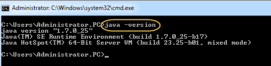
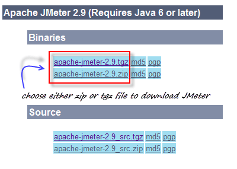
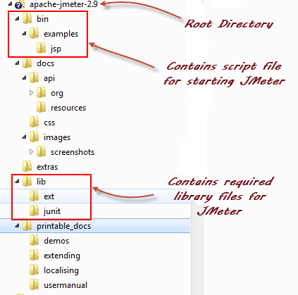
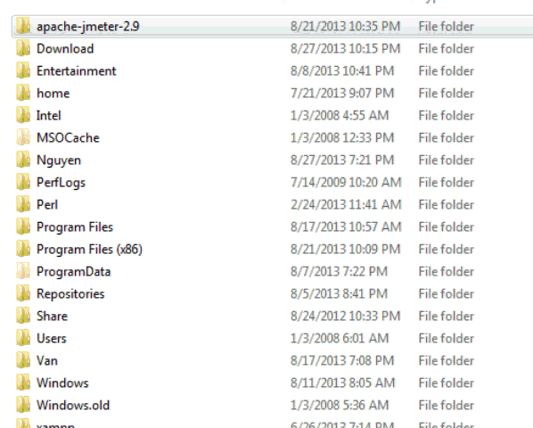
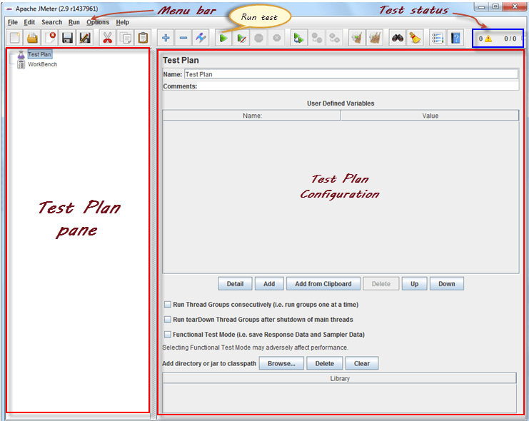
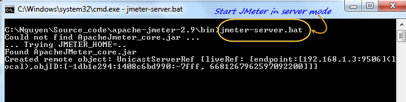
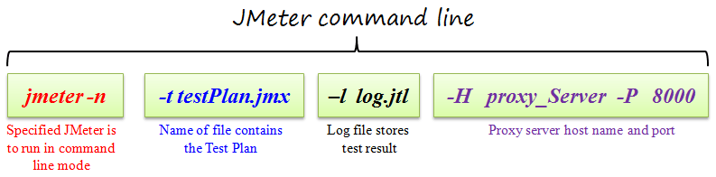
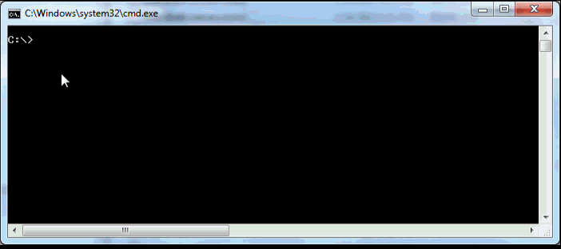

# 如何安装 Jmeter

## JMeter 支持的操作系统

JMeter 是一个纯 Java 编写的应用程序，可以运行在任何操作系统上，只要该操作系统有兼容的 Java 实现。

JMeter 支持的操作系统列表如下：

| 操作系统  | Java 虚拟机  | 体系结构 |
| -------  | ------------- | ------- |
| Free BSD 9.0 | Open JDK 6 | amd64  |
| Linux 2.4， 2.6， 3.1 |	Sun JDK 5， 6， 7 和 Open JDK 6 | i386， amd64 |
| Mac OS  | JDK6  | |
| windows XP | Sun JDK6， Sun JDK 7 | 32/64 位 |
| windows 7  | Sun JDK 5， 6， 7  | 32 位  |

本課程中，我们在 windows 操作系統上运行 JMeter

## 安装 JMeter 的步骤

### 步骤一：安装 Java

因为 JMeter 是纯 Java 桌面应用程序，它需要一个完全兼容的 JVM 7 或更高。你可以下载并安装最新版本的 Java SE 开发工具包。


[Java 平台(JDK)](http://www.oracle.com/technetwork/java/javase/downloads/index.html)

安装完成后，你可以使用下面的步驟来检查，Java JDK 是否成功的安裝在你的系统上

- 在 Window/Linux 系统中打开终端  
- 输入命令 java -version  

如果 Java 运行环境安装成功，你将看到下图的输出



如果没有显示，请重新安装 Java SE 运行时环境

### 步骤二：下载 Jmeter

在本课程录制时，最新版本的 JMeter 是3.1。 你可以在 JMeter 的官网下载它。

选择二进制的压缩文件 zip 格式下载，如下图所示



### 步骤三：安装

JMeter 安装非常简单容易。只需将 zip 文件解压缩到您希望 JMeter 安装的目录即可。没有繁琐的安装向导，只要简单的解压缩就 OK！

一旦完成了解压缩，安装目录结构应该类似下图所示：



下面是 JMeter 安装后文件目录的介绍

- /bin：包含启动 JMeter 的脚本文件  
- /docs：JMeter 文档文件  
- /extras：ant 相关的额外文件  
- /lib/：JMeter 需要调用的所有 Java 库  
- /lib/ext：包含核心 JMeter jar 文件和协议  
- /lib/junit 用于 JMeter 的 JUnit 库  
- /printable_docs：可以打印的文档资料

### 步骤四：启动 JMeter

有三种启动 JMeter 的模式

- GUI模式
- 服务器模式
- 命令行模式

#### 启动 JMeter 进入 GUI 模式

如果你使用的是 windows 系统，运行文件 /bin/jmeter.bat 启动 JMeter 进入 GUI 模式，如图所示



以图中注释了 JMeter 图形界面中的各个组件



#### 启动 JMeter 进入服务模式

服务模式用于分布式测试。这种测试以客户机-服务器模式运行。在这种模式下，JMeter 在服务器计算机上以服务模式运行。在客户端电脑上，JMeter 以 GUI 模式运行。

启动服务模式，运行 bin\jmeter-server.bat 如下图所示：



#### 启动 JMeter 进入命令行模式

JMeter GUI 模式消耗很多计算机内存。为节约资源，可以选择运行 JMeter 没有 GUI。 为此，使用下面的命令行选项



这是一个命令行的例子
```bash
jmeter -n -t testPlan.jmx -l log.jtl -H 127.0.0.1 -P 8000
```


## 额外的包

根据你的要求，你可能需要以下一个或多个可选包。

- Java 编译器

  Java 编译器允许开发者编译 JMeter 源代码和其他 JMeter 插件

- SAX XML解析器

  SAX 是简单的 XML API，最初是一个纯 Java API。你可以使用 SAX XML 解析器替代 JMeter 自带的 XML 解析器

- 电子邮件支持

  JMeter 有丰富的电子邮件功能。它可以根据测试结果来发送电子邮件，他有一个 POP3/IMAP 的取样器。还有一个 SMTP 取样器。

- JDBC 驱动程序

  果你想测试数据库服务器，您必须安装 JDBC 驱动程序

## 在 Linux 中使用 JMeter（略）

- 在 Linux 中使用 JMeter 和 Windows 中的窗口相同，只需运行以下 shell 脚本。
- 运行脚本文件 jmeter (这个文件没有扩展名) 运行 JMeter （默认在 GUI 模式）。
- 运行脚本文件 jmeter-server 开始 JMeter 服务器模式（与合适的参数调用 JMeter 脚本）
- jmeter.sh 非常基本的 JMeter 脚本没有 JVM 选项指定。
- mirror-server.sh 在非 GUI 运行 JMeter 镜像服务器模式
- shutdown.sh 非 GUI 运行关闭客户端停止实例优雅
- stoptest.sh 运行关闭客户端突然停止非 GUI 实例
