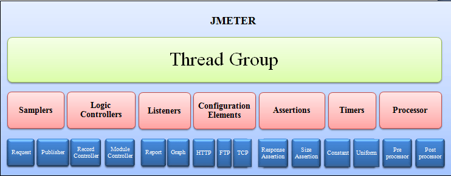
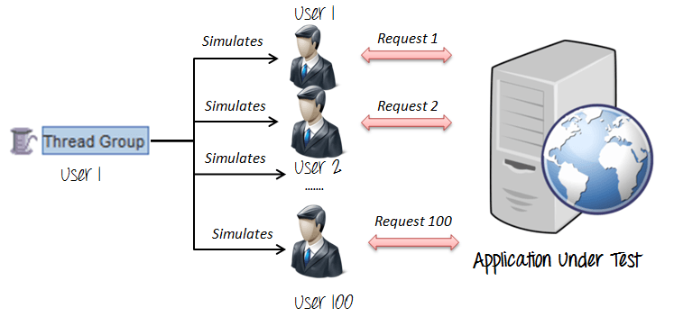

# JMeter 的完整元素参考

JMeter 中不同的组件被称为元素。每个元素是为特定目的而设计的。

下图给出了一些常见的JMeter的元素。

一口气学习完所有的组件会导致混乱和崩溃。在这里，我们将讨论一些必要的组件，以便你能快速的开展测试。

其余的组件将在课程的后续部分进行讲解。本次课程将讨论的元素包括：
- 线程组
- 取样器
- 监听器
- 配置

## 线程组

线程组是线程的集合。每个线程代表一个用户正在使用被测试的程序。基本上每个线程模拟一个真实的用户发送请求到服务器。

可以为每个线程组设置线程的数量。

例如，如果线程数量设置为 100，JMeter 将创建并模拟 100 个用户向服务器发送请求

 
## 取样器

大家都知道，JMeter 支持 HTTP、FTP、JDBC 和许多其他的协议。大家也已经知道线程组模拟用户请求到服务器。但是一个线程组怎么知道应该发送哪种类型的请求呢？（例如：HTTP、FTP 等）

答案是取样器。

用户请求可以 FTP 请求，HTTP 请求，JDBC 请求，等。

### FTP请求:

假设你希望测试 FTP 服务器的性能。 可以在 JMeter 中使用 FTP 请求取样器完成此任务。该控制器可以向 FTP 服务器发送一个 FTP“下载文件”或“上传文件”的要求。

例如，如果你想下载一个文件”测试。 txt”测试从FTP服务器，您需要配置JMeter的一些参数如下图
 
Complete Element reference for Jmeter

JMeter将FTP命令FTP服务器 ftp.example.com ，然后再下载一个文件测试。 txt从服务器。
HTTP请求:

这种取样器允许您发送一个HTTP / HTTPS请求到一个web服务器。

考虑下面的例子。 JMeter发送一个HTTP请求到谷歌网站，从这个网站检索HTML文件或图像。

Complete Element reference for Jmeter

在本教程中 JMeter性能测试 ，我们将解释更多关于这个HTTP请求。
JDBC的要求:

这种取样器允许您执行数据库性能测试。 它发送一个JDBC请求到一个数据库(SQL查询)。

Complete Element reference for Jmeter

例如，一个数据库服务器字段test_result test_tbl存储在一个表的名字。 你想查询这些数据从数据库服务器;您可以配置JMeter发送一个SQL查询服务器检索数据。

Complete Element reference for Jmeter
净水器取样器:

该取样器允许您编写一个取样器使用 净水器 脚本语言。

这是一个例子的JMeter BSFA取样器

Complete Element reference for Jmeter
访问日志取样器:

该取样器允许您并生成http请求读访问日志。 日志可以beA形象，html，css ....

Complete Element reference for Jmeter
SMTP取样器:

如果你想测试邮件服务器，您可以使用SMTP取样器。 这种取样器使用SMTP协议用于发送电子邮件消息。

Complete Element reference for Jmeter
听众

听众:显示了测试执行的结果。 他们可以用不同的格式显示结果如树，表格，图表或日志文件

Complete Element reference for Jmeter

图结果听众显示服务器响应时间图

Complete Element reference for Jmeter

视图结果树显示基本的HTML格式的用户请求的结果

Complete Element reference for Jmeter

表结果显示测试结果总结在表的格式

Complete Element reference for Jmeter

日志显示汇总测试结果的文本文件

Complete Element reference for Jmeter

 
配置元素

设置默认值和变量采样以备后用。

下图显示了一些常用的JMeter的配置元素

Complete Element reference for Jmeter
CSV数据集配置:

假设你想要测试网站100用户登录不同的凭证。 你不需要记录脚本100倍! 你可以参数化脚本输入不同的登录凭证。 登录信息(如用户名、密码)可以存储在一个文本文件。 JMeter的元素允许您从文本文件读取不同的参数。 “CSV数据集配置”，用于从文件读取行，并将它们分为变量。

Complete Element reference for Jmeter

这是一个例子的CSV数据。 这是一个文本文件包含用户名和密码登录你的目标网站

Complete Element reference for Jmeter
HTTP Cookie经理

让我们明白这一点——一个例子

你用你的浏览器(Firefox、IE等)来浏览 www.google.com

你和你的用户名和密码登录。

您的用户名和密码将被存储在您的计算机上的饼干。

下一次，当你访问 www.google.com ，你不需要重新登录，因为浏览器将使用你的饼干作为登录的用户数据。

HTTP Cookie经理也有同样的功能像一个web浏览器。 如果你有一个HTTP请求和响应包含一个饼干，饼干的饼干管理器自动存储并使用它为未来所有请求特定的网站。
HTTP请求违约

这个元素允许您设置HTTP请求控制器使用的默认值。

例如，

你发送100 HTTP请求到服务器google.com

你必须手动输入服务器名称= google.com，所有这些100个请求

相反，您可以添加一个HTTP请求违约“服务器名称或IP”字段= google.com

不需要输入100倍!

Complete Element reference for Jmeter

这个元素将在教程中详细解释 JMeter性能测试
登录配置元素

登录配置元素允许您添加或覆盖的用户名和密码设置采样。

例如，你想模拟一个用户登录到网站 www.facebook.com 与用户和密码。 您可以使用添加这些用户和密码登录配置元素设置在用户请求

Complete Element reference for Jmeter

登录配置元素和CSV数据配置

登录配置元素
	

CSV数据配置

用来模拟一个用户登录
	

用于模拟多个用户登录

只适用于登录参数(用户名和密码)
	

适用于大量的参数 