# 在 JMeter 如何使用控制器

如果你想控制**“何时”**向测试中的 Web 服务器发送用户请求，你会怎么做？

JMeter 拥有一个特性 - **逻辑控制器(Logic Controllers)**。

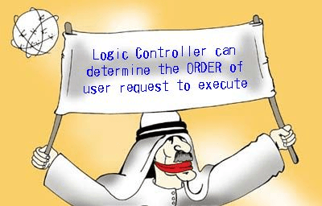

### 逻辑控制器

逻辑控制器允许你在线程中定义处理请求的顺序，例如，你可以使用随机控制器将 HTTP 请求发送到服务器。

逻辑控制器用来确定执行用户请求的**顺序**。

一些常用的逻辑控制器如下所示:

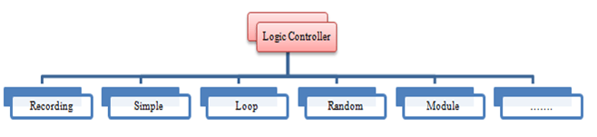

### 记录控制器(Recording Controller):

JMeter 可以**记录**你的测试步骤；记录控制器用来存储这些记录步骤的是一个**占位符**。

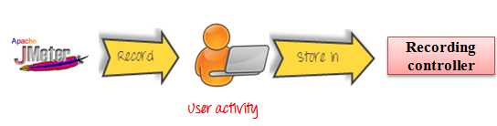

### 简单的控制器(Simple Controller):

简单的控制器只是一个用户请求的**容器**。

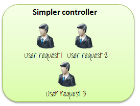

### 循环控制器(Loop Controller):

循环控制器使得用户请求运行**指定的次数**或**永久运行**，如图所示

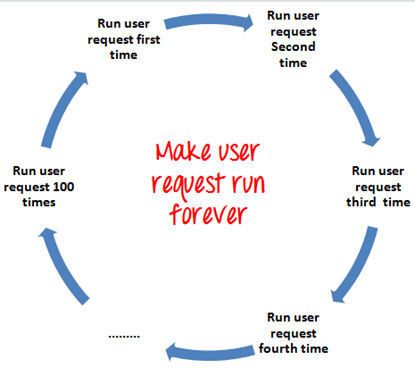

### 随机控制器(Random Controller):

随机控制器使所有的用户请求在每个循环周期中按**随机**顺序运行。

例如，你有 3 个用户请求按照以下顺序发送到谷歌网站：

    1. HTTP 请求
    2. FTP 请求
    3. JDBC 请求

这 3 个请求每个都会跑 5 次；所以共有 15(5×3)个用户请求通过 JMeter 用户请求被发送到谷歌服务器。 

若按照**顺序**，每一个循环都会按下列顺序**依次**发送请求：

HTTP 请求- > FTP 请求- > JDBC 请求

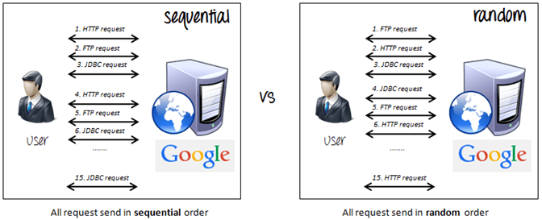

若按照**随机**，请求都会被**随机**发送：

FTP 请求- > HTTP 请求- > JDBC 请求

或者：

JDBC 请求- > FTP 请求- > HTTP 请求

### 模块控制器:

模块控制器的目的是增强 JMeter 的模块化。

总的想法是，Web 应用程序包括小单位的功能(如登录、创建帐户、注销等)，这些功能可以存储在简单的控制器(Simple Controller)作为一个“模块”，模块控制器会选择哪些模块需要运行。

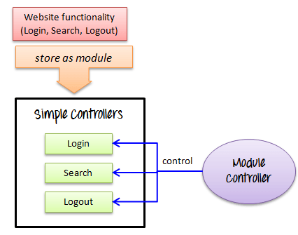

考虑以下场景

你想模拟:

   - 50 个用户**注销**
   - 100 个用户**登录**
   - 30 个用户**搜索**谷歌

你可以使用 JMeter 创建 3 个模块， 每个模块模拟用户活动：登录、注销和搜索。

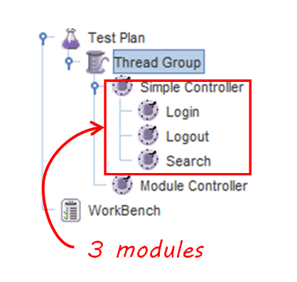

该模块控制器会选择哪些模块需要运行。

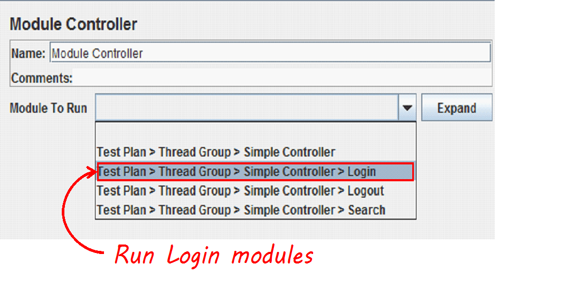

### 其他重要的控制器:

   - **交错**控制器：拿起并使**一个**用户请求运行在**每个**线程循环。
   - **运行时长**控制器：控制它的孩子可以运行**多长时间**。

例如，如果你设置运行时长控制器为 10 秒，则 JMeter 运行测试 10 秒。 

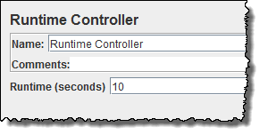

   - **事务**控制器：测量**完成**测试所需的**总时间**。
   - **包含**控制器：设计使用外部测试计划，该控制器允许你在 JMeter 使用多个测试计划，看到 [JMeter 性能测试 ](http://www.guru99.com/jmeter-performance-testing.html)细节。

### 手动操作循环控制器

本节将向你展示如何设置当前性能测试计划的**循环控制器**的分步指令。

循环控制器使取样器运行一定次数，然后乘上你设置的线程组循环值。

例如，如果你：

   - 添加一个 HTTP 请求到一个循环计数为 50 的循环环控制器
   - 配置线程组循环值为 2
   - 然后，JMeter 将发送 50 x 2 = 100 个 HTTP 请求。

这是这个例子的**路线图**:

.png)

### 步骤 1)配置线程组

我们**调用** [JMeter 性能测试 ](http://www.guru99.com/jmeter-performance-testing.html)教程中的步骤 1、2。

**1. 添加线程组**

右击测试计划并添加新的线程组：**Add-> Threads (Users) ->Thread Group**

在线程组控制面板中，输入线程属性如下图：

它将使**一个**发送到 Web 服务器谷歌的用户请求跑 **2** 次。 

**2. 添加JMeter元素**

默认添加 HTTP 请求到谷歌。

**3. 添加循环控制器**

右击 Thread Group -> Logic Controller -> Loop Controller 

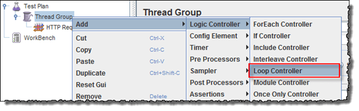

### 步骤 2)配置循环控制器

如下图所示将循环计数设置为 50，它将使**一个**发送到Web服务器谷歌的请求跑 **50** 次，乘上你指定的线程组循环值 2，所以 JMeter 将发送 **2 x 50 = 100** 个 HTTP 请求。

.png)

右击循环控制器，Add -> Sampler -> HTTP request 

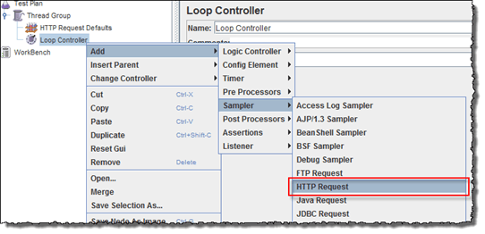

### 步骤 3)添加视图结果表

我们重复调用 [Timer](http://www.guru99.com/timers-jmeter.html) 教程中的步骤 2 来在表中添加视图结果。

测试计划如下图所示。

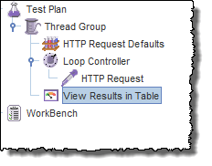

### 步骤 4)运行你的测试

现在返回查看结果表中，单击菜单栏上的开始键（Ctrl + R）运行测试。

如下图所示，JMeter 将模拟**一个用户请求**，并发送 100 次到 Web 服务器谷歌，在发送用户请求 100 次后停止测试。

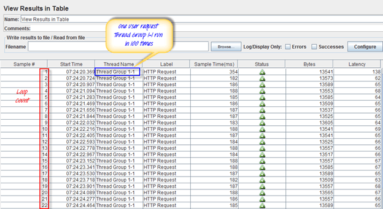

### 故障排除:

如果你在运行上述方案时面临问题…… 请执行以下操作:

   1. 检查一下你是否通过代理连接到互联网，如果是，删除代理。
   2. 打开 JMeter 的一个新实例。
   3. 在 Jmeter 打开 [ControllerTestPlan.jmx](https://drive.google.com/uc?export=download&id=0B_vqvT0ovzHcS255MmNOWldQaXc)。
   4. 双击线程组(Thread Group)- >表中查看结果(View Result in Table)。
   5. 运行测试。
