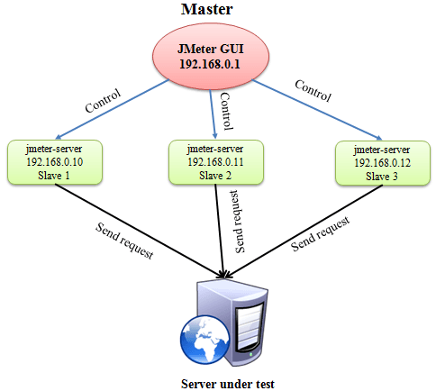
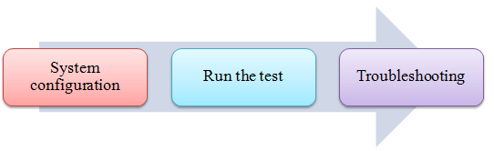
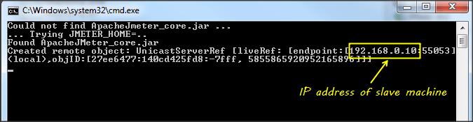
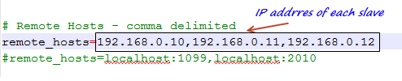
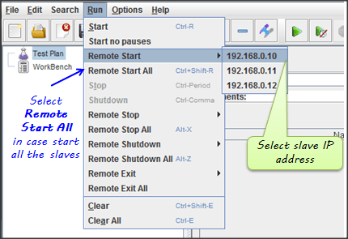
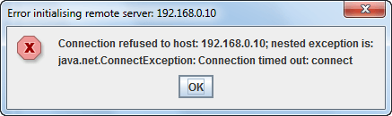

# 如何在 JMeter 进行分布式测试 

**概述**：

分布式测试是利用多个系统进行压力测试的一种测试方法，在分布式测试应用于测试 Web 站点和服务器应用程序时，他们会与多个客户端同时工作。

分布式测试使用客户端服务器模型如下图：

   - **Master**：系统运行 JMeter 的 GUI，控制每一个 slave。
   - **Slave**：系统运行 JMeter-server，从 master 接收命令和发送一个请求到测试服务器下。
   - **Target**：被测试的 Web 服务器，从 slave 获取请求。

### 开始你的测试

**前提条件**：

   - 系统上的防火墙已关闭，在某些情况下，防火墙仍可能进行拦截，你应该禁用 Windows 防火墙或 Linux 防火墙。
   - 所有的机器都应该在同一个子网，如果机器不在同一个子网上，也许他们就不能在网络中相互识别。
   - 使用 JMeter 的相同版本以免发生意外错误。

这是这个测试的**路线图**：

### 步骤 1)系统配置

在 **slave** 系统下，在目录 jmeter / bin 下执行文件 “jmeter-server.bat”。

假设一个 slave 机的 IP 地址为：192.168.0.10，在 Windows 上，你应该会看到一个窗口出现如下图：

在 **master** 系统下，在目录 jmeter / bin 下编辑文件 **“jmeter.properites”**，在 slave 机添加 IP 如下：

### 步骤 2)运行测试

在 master 机上，运行 JMeter 的 GUI 和开放的测试计划。

单击菜单栏上的“运行”，选择 **Remote start** -> 选择 slave 机的**IP地址**。

### 步骤 3)故障排除

如果无法在上面的机器上运行测试，请参见下面的错误，请从 slave 机运行 “jmeter-server.bat” 文件。

**限制**:

分布式测试有一些基本的**限制**，这是已知的项目列表：

   - 服务器和所有客户必须在**同一个**子网。
   - 分布式测试要求目标服务器具有较大的处理能力，如果有太多的请求采用分布式 JMeter 测试，目标服务器很可能会**超载**。
   - 一个单一的 JMeter 只能处理有限数量的线程(100 - 300 个线程)。
   - 分布式 JMeter 测试是复杂的，初学者很难建立。
