# 使用 JMeter HTTP 代理服务器测试

记录测试帮助测试人员记录和运行他们对测试目标的活动，它是一种对多个用户的自动化测试，本章将指导你如何使用代理服务器来记录你的测试。

代理服务器允许 JMeter 观察和记录用户浏览 Web 应用程序与普通浏览器时的活动。

这是这个实际例子的**路线图**

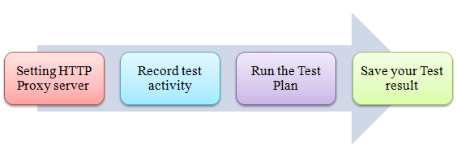

### 步骤 1)设置 HTTP 代理服务器

这是一步步的指导安装代理

1.打开 **JMeter**

2.在**测试计划(test plan)** 目录上选择

3.添加**线程组**：

右击测试计划并添加一个新的线程组：**Add -> Threads (Users) -> Thread Group**

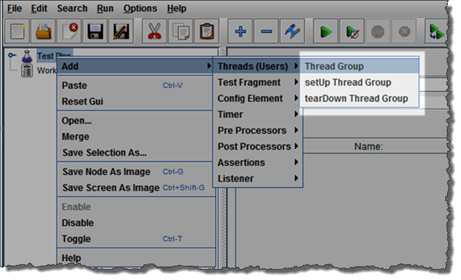

4.添加 **HTTP 请求**：

选择线程组，右击 **Add -> Config Element -> HTTP Request Defaults**

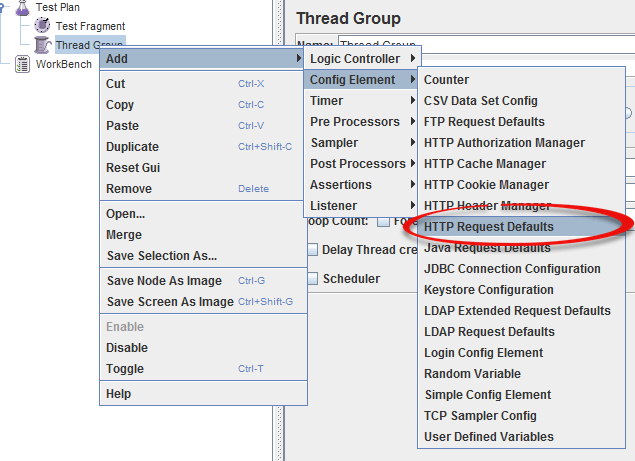

在新的 HTTP 请求违约(HTTP Request Defaults)窗口中：在 Server name or IP 文本框中输入“google.com”，其他字段为空。

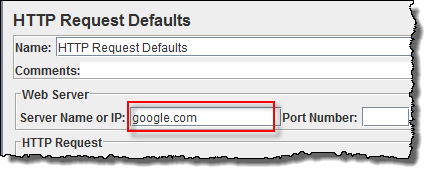

5.添加**记录控制器(Recording Controller)**

右击“线程组”，并添加一个记录控制器：**Add -> Logic Controller -> Recording Controller** 

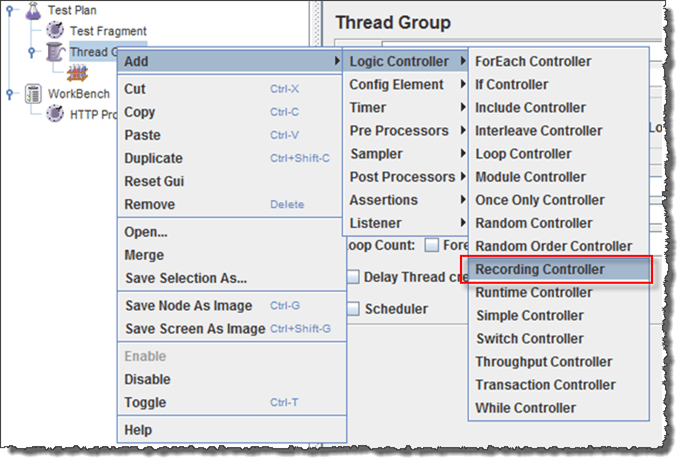

6.添加**代理服务器(Proxy Server)**到工作台
    
右击工作台(Workbench)并添加 HTTP 代理：**Add -> Non-Test Elements -> HTTP Proxy Server**  

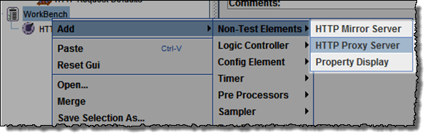

7.设置**目标控制器(Target Controller)**记录脚本

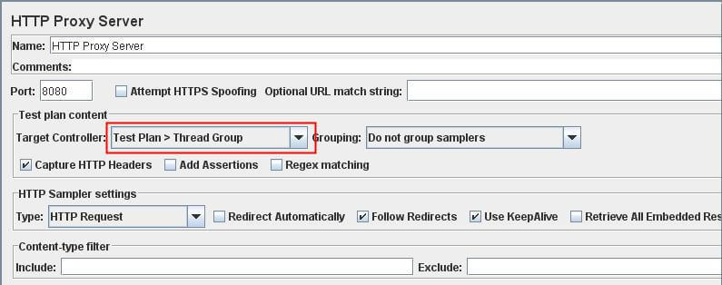  

8.**启动**代理服务器

返回 HTTP 代理服务器(HTTP Proxy Server)，然后单击底部的 **“start”** 按钮，则你的 JMeter 代理服务器被启动

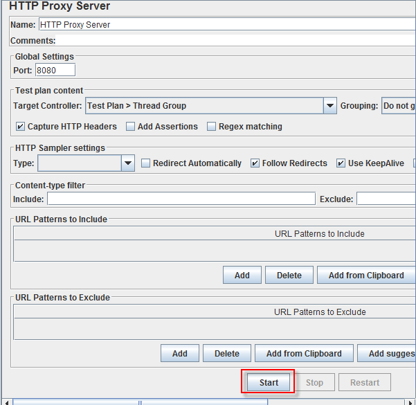

9.启动你的浏览器(我用火狐)，选择 **Tool -> Option -> Advanced -> Network -> Setting** 进入 HTTP 代理如下图

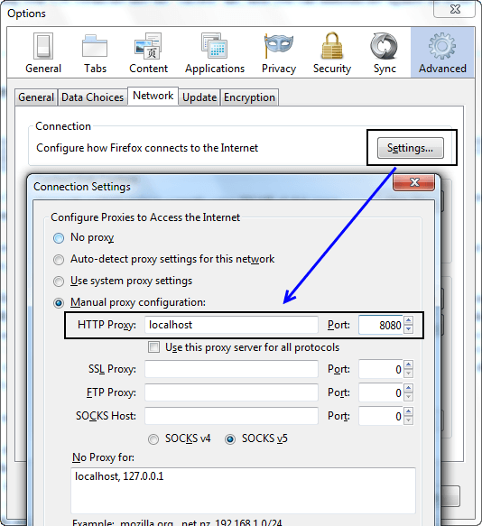

### 步骤 2)记录你的活动

1.在你的 Web 浏览器中现在打开[谷歌](http://www.google.com)(JMeter仍然开放)

2.搜索关键字 “**guru99**”。

3.回到 JMeter，在 HTTP 代理服务器中，完成后单击 **stop**。

4.整理记录后，你会看到 JMeter 自动创建一个新的 HTTP 请求，如图所示：

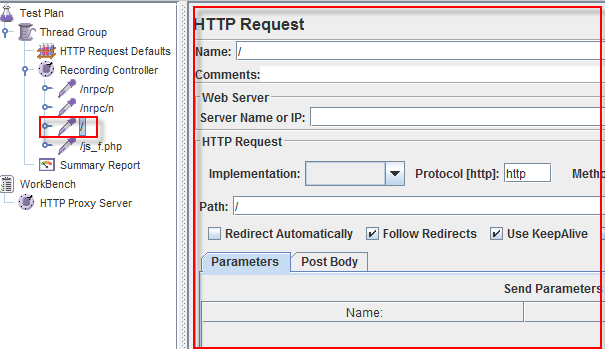

JMeter 已经记录了用户请求的谷歌网站**首页**：[Http://www.google.com/](Http://www.google.com/)

若有其他的 HTTP 请求显示在上面图中，你应该删除它们。因为，当你在谷歌搜索关键词，有时候 JMeter 还记录一些广告链接，我们应该在我们测试计划中忽略它们。

5.点击文件 -> 保存你的测试计划

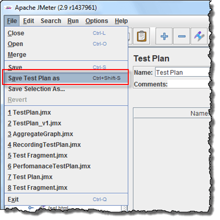

6.出现对话框显示 -> 在文件名字段中输入测试计划的名称 -> 单击“保存”

现在你的测试计划名称保存为 RecordingTestPlan.jmx。

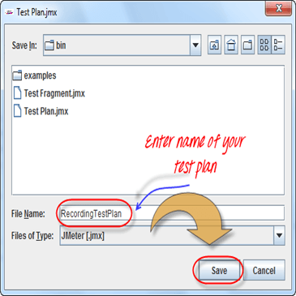

### 步骤 3)运行你的测试计划

1.选择 **线程组 ->  Add -> Listener -> Summary Report**

2.总结报告(Summary Report)将显示一些基本的静态

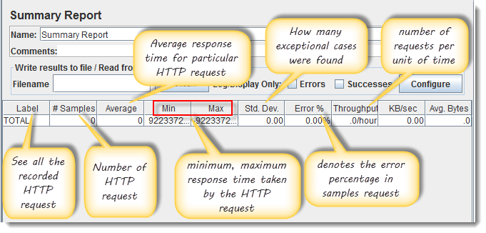

3.选择线程组，输入信息如下图：

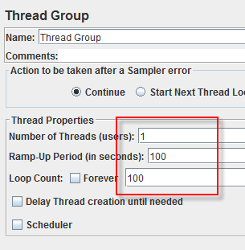

你可以参考教程 5 [JMeter Performance Testing.doc](http://www.guru99.com/jmeter-performance-testing.html) 详细了解线程组配置。

4.在开始测试之前，选择“摘要报告”。准备运行测试时，选择 Run -> Start(Ctrl+R)，JMeter将会重复你的活动 100 次

当测试运行时，统计将更改，直到测试完成。

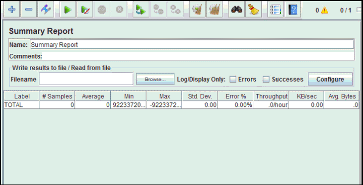

### 步骤 4)保存测试结果

1.点击 **Save Table Data** 将测试结果保存到文件中

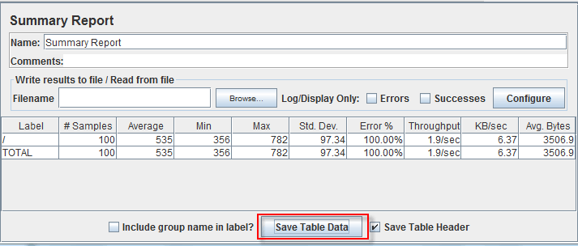

2.输入测试结果的名称，然后单击 Save，JMeter 的测试结果保存为默认的 CSV 格式。

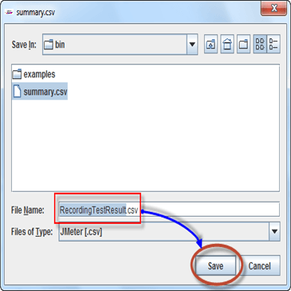

[下载文件记录测试计划](https://drive.google.com/uc?export=download&id=0B_vqvT0ovzHcb0ZveUNDeUFHUnc)

[下载文件的 HTTP 代理服务器](https://drive.google.com/uc?export=download&id=0B_vqvT0ovzHcbVQ0SXM4MFNPUG8)

### 故障排除：

如果你在运行上述方案时面临问题…… 请执行以下操作:

   1. 检查一下你是否通过代理连接到互联网，如果是，删除代理。
   2. 打开 JMeter 的一个新实例。
   3. 在 Jmeter 打开 [RecordingTestPlan.jmx]()。
   4. 双击线程组(Thread Group) -> 总结报告(Summary Report)。
   5. 运行测试。
