# 手用 JMeter 的 GUI

一旦你启动 JMeter ，你将看到两个元素。

    1. 测试计划
    2. 工作台

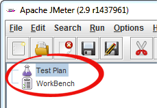

### 测试计划

测试计划是你添加你的 JMeter 测试所需的元素。

它存储的所有元素(ThreadGroup、定时器等)和其相应的设置需要运行所需的测试。

下图显示了一个测试计划的例子。

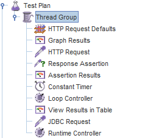

### 工作台

工作台只提供一个**临时**存储测试元素的地方，工作台若和测试计划没有关系，JMeter 将不保存**工作台**的内容，它只保存测试计划的内容。

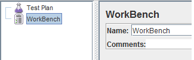

“工作台”将用于我们教程的 HTTP 代理服务器的测试记录。

现在，我们先忽略它。

### 添加元素

添加元素是构建测试计划**至关重要的**一步，若没有添加元素，JMeter 将**不能**执行你的测试计划。

一个测试计划包含许多元素，如侦听器，控制器，TimerA。

你可以右键单击**测试计划**，并“**添加**”一个元素到测试计划 。

假设，你想在测试计划添加两个元素 **BeanShell 断言**和 **Java 要求违约**。
  
   - 右击测试计划  - > Add -> Assertion-> Bean Shell Assertion
   - 右击测试计划  - > Add -> Config Element -> Java Request Default

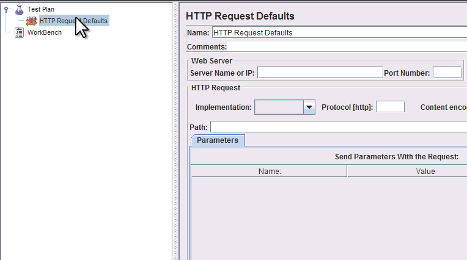

你可以**删除**一个未使用的元素。

比方说，你想要删除元素 “**HTTP 请求违约**”，选择“默认”->右击->从上下文菜单中选择**删除**->在消息框里点击**确认**删除该元素。
## 加载和保存元素
### 保存元素

假设你已经添加了一个元素名称 “BeanShell **Assertion**”，现在你想要保存它。

右击 BeanShell Assertion->选择 **Save Selection As...**。

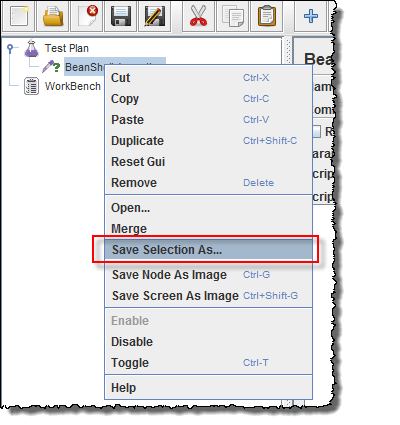

弹出一个对话框显示，点击 **Save** 按钮后你可以使用默认的名称 **BeanShell Assertion.jmx**，你也可以改为你想要的名称。

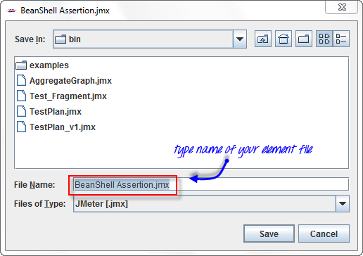

JMeter 测试元素和测试计划存储是***.jmx** 格式，**JMX** 正站在  **Java 管理扩展（Java Management Extensions）**。
### 加载元素

加载存在的元素可以帮助你节省你的时间来创建和配置新元素。

比方说，在测试计划中有一个现有的元素：**Java 请求违约（Java Request Default）**。

右击 **Java 请求违约**->选择**合并（Merge）**。

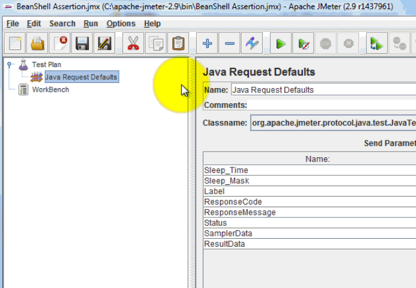

选择这个**元素(BeanShell Assertion.jmx。)**目录中的文件，此元素将被添加到您当前的测试计划中。

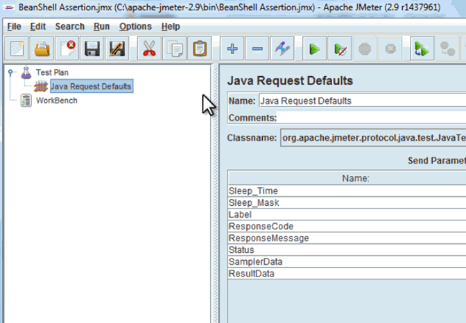
## 配置元素

In order to configure any Element 

    1. 在左窗格选择树中的元素
    2. 在右窗格中输入配置设置

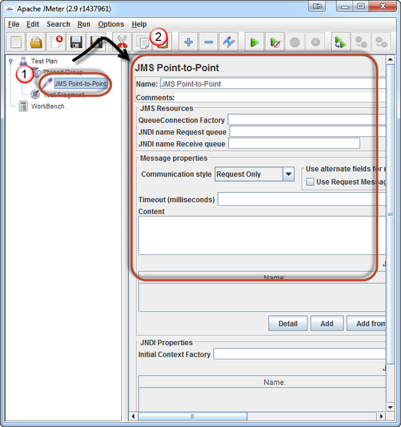
## 运行和停止测试计划

在运行测试之前，你应该先保存您的测试计划，保存测试计划可以帮助您在运行测试时避免意外错误. 保存测试计划的步骤:

    1. 文件 - > 保存测试计划 - > 一个对话框显示
    2. 输入一个文件名的测试计划 - > 点击 保存

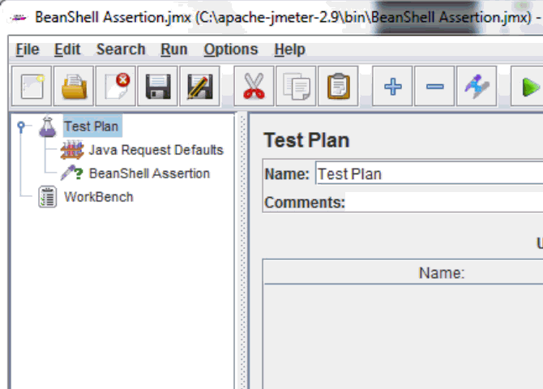

注意：保存测试计划与保存元素**不同**。
| 保存测试计划 | 保存元素 |
|--------------------------|------------------------------|
| 测试计划包括一个或多个元素 | JMeter的元素是一个基本组成部分 |
| 当你保存你的测试计划后,计划中的所有元素都已保存  | 当你保存你的元素后,只保存了一个元素。|

### 创建组合测试计划

你可以**合并**一个或多个测试计划创建一个**组合测试计划**如下图所示。

假设你已经有一个现有的测试计划名称 [Test_Fragment.jmx](https://drive.google.com/uc?export=download&id=0B_vqvT0ovzHca3g5WDJucmZmNFE) 在你的电脑上(本文包含这个文件)，你可以将此测试计划在当前 JMeter 来创建一个新的测试计划。

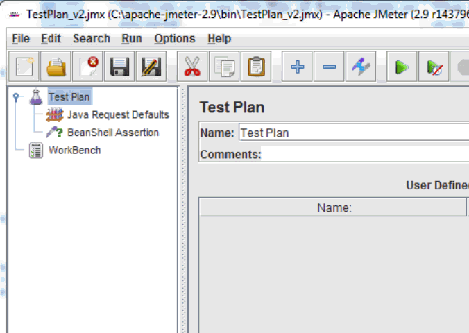

现在所有的测试元素添加到当前文件 test_fragment.jmx 的测试计划，如下图所示。

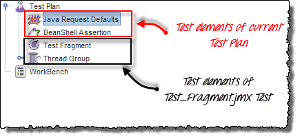
### 运行测试计划

若你要运行单个或多个测试计划，选择**开始**(Ctrl+R)选择菜单项的**运行**。

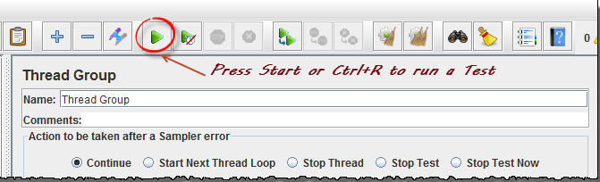

JMeter 运行时，它显示了一个绿色的小盒子在右边菜单栏。

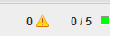

这个绿色盒子左边的数字是**活动线程**/ **总线程**。

停止测试，按停止按钮或使用快捷键 Ctrl+“。”

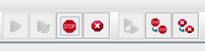