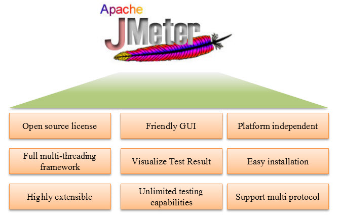
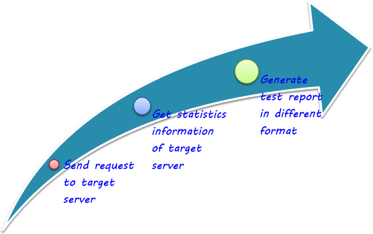
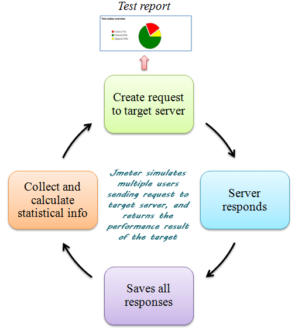

# JMeter 简介

你是否曾经测试过一个 web 网站的性能？一个 web 服务可以处理多少个并发用户？

可能有一天，你的老板要求你对 www.google.com 做 100 个用户的性能测试。你会怎么做？

也许你的老板，他是一个新手，会问你

本课程将帮助你回答这些问题和并完成你性能测试工作。

## JMeter 是什么?

Apache JMeter 是用 Java 语言编写的开源软件，它最初是由 Apache 软件基金会的 Stefano Mazzocchi ，旨在对 web 服务的功能行为做负载测试和性能测量。可以使用 JMeter 分析和测量 web 应用程序或各种服务的性能。性能测试意味着测试一个 web 应用程序在大负载多并发用户访问下的表现。JMeter 最初是用于测试 Web 应用程序或 FTP 应用程序。如今，它也用于功能测试和数据库服务器测试等。

## 为什么使用 JMeter ？

JMeter 的优势如下图所示：

- 开放源码许可：JMeter 完全免费，允许开发人员使用源代码进行二次开发  
- 友好的界面：JMeter 非常容易使用和上手很快  
- 平台无关：JMeter 是 100% 纯 Java 桌面应用程序。所以它可以在多个平台上运行  
- 完整的多线程框架：JMeter 允许由一个单独的线程组对多个不同的功能进行并发和同步采样  
- 测试结果可视化：测试结果可以有不同的格式的显示，如：图、表、树和日志文件
- 安装简便：只要复制和运行 bat 文件就可以运行 JMeter。不需要安装。  
- 高度可扩展：你可以编写自己的测试。JMeter 还支持可视化插件允许扩展你的测试。  
- 多个测试策略：JMeter 支持多种测试策略，如：负载测试、分布式测试和功能测试。  
- 模拟：JMeter 通过并发多线程来模拟多个用户，对被测 web 应用程序创建一个大的测试负载  
- 多协议支持：JMeter 不仅支持 web 应用程序的测试，而且也可以评估数据库服务器的性能。所有基本协议，如：HTTP、JDBC、LDAP、SOAP、JMS、和 FTP，JMeter 都支持  
- 录制和回放：录制浏览器的用户操作，用 JMeter 模拟使用 web 应用程序  
- 脚本测试：可以把 JMeter 和 Bean Shell 以及 Selenium 结合起来做自动化测试。  

## JMeter 的工作原理

JMeter 的基本工作流如下图所示

JMeter 模拟一组用户向目标服务器发送请求，并返回目标服务器的图形统计信息

JMeter 的完整工作流如下图所示

