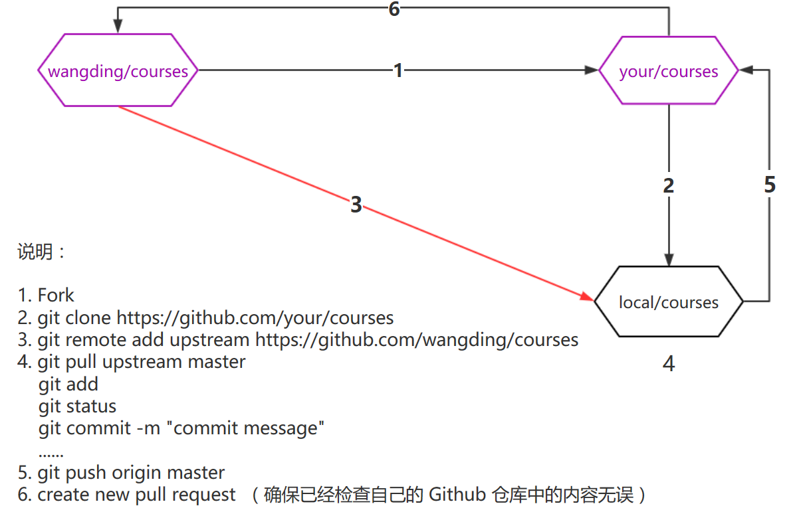

# courses

存放开发的各门在线课程资料。

## 课程状态

| 编号       | 课程名称  | 进度  |  
| :---: | -----  | :-----:|  
|  1    | [Gravatar 全球大头贴](./gravatar)  ||  
|  2    | [Selenium IDE web 自动化测试入门](./seleniumIDE) |  |
|  3    | [产品设计简介](./productIntro)  |   |
|  4    | [seIDE 综合案例实战](./seIDEPracticeCase)  |  |
|  5    | [redmine 项目管理](./redmine)  |   |
|  6    | [在线思维导图](./mindmap) |   |
|  7    | [vimperator 高效上网](./vimperator) | |
|  8    | [界面原型设计](./UIPrototype) | |
|  9    | [七天学会软件测试](./7DTesting) |  |
|  10   | [Github 开源之旅第一季：启程](./github) |  |
|  11   | [Github 开源之旅第二季：MarkDown](./markdown) |  |
|  12   | [Github 开源之旅第三季：Git 进阶](./github) |  |
|  13   | [Github 开源之旅第四季：Git 团队协作](./github) |  |

## 课程路线
| 编号       | 路线名称  | 进度  |  
| :---: | -----  | :-----:|  
|  1    | [IT 新手](./newer)   |   |  
|  2    | [测试工程师](./7DTesting) |  |  
|  3    | [产品工程师](./PM)     |  |
|  4    | [开发工程师](./PM)     |  |

## 参与项目  

- [课程开发流程<有待完善>](README.md)  
- [文档写作规范](https://github.com/wangding/course-editors-guidelines)  
- [课程开发计划](plan.md)  
- [Github 团队协作流程图](http://www.processon.com/view/584a4160e4b005d48b73cf55)  

## 目录结构

- 每个目录代表一门单独的课程，目录的名称是课程名称的简短英文单词或短语；   
- 每个课程目录下有一个 README.md 文件，该文件描述此课程目录下各种资料的内容和组织安排，等；  
- 课程资料一般包括：课程大纲、教案、作业、幻灯片和测验，等；  
- 一般来说为了课程教学的方便，测验题不出现在课程目录中；  
- 另一种目录不是课程目录，而是职业发展路线图，如：tester，programmer，等。职业发展路线图是一系列的课程列表；  
