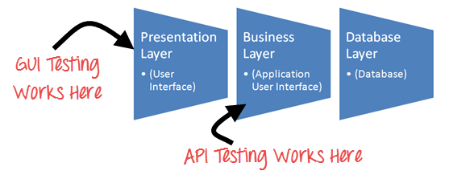

# 10 分钟学会应用程序接口测试！！！

应用程序接口测试之前，我们先了解

## API 是什么？

API 是 Application Programming Interface 的缩写。 

它使两个独立的软件系统之间的通信和数据交换。实现 API 的一个软件系统包含的功能/子程序，可以执行由另一个软件系统。

## 应用程序接口测试是什么？

应用程序接口测试与 GUI 测试完全不同，它主要集中在业务逻辑层的软件架构。这个测试不会集中在外观和感觉的应用程序。

在应用程序接口测试中，不要使用标准的用户输入（键盘）和输出，而是使用软件向 API 发送调用，得到输出，并记录系统的响应。

应用程序接口测试需要一个应用程序交互的 API。为了测试 API，您将需要

- 使用驱动工具来测试API
- 在应用程序接口测试编写自己的代码

## 设置 API 测试环境

- 应用程序接口测试是不同于其它类型的测试，不可用 GUI，你还需要建立初始环境，调用 API 需要的参数的设定及最后的测试结果。
- 因此，建立一种测试 API 测试环境似乎有点复杂。
- 数据库服务器并且可根据应用需求配置。
- 一旦安装完成，API 功能被调用来检查 API是否正在工作。

## API的输出类型

API输出可以有

1.任何类型的数据  
2.状态（失败或成功）  
3.调用另外一个 API 函数。

让我们来看上述各类型的一个例子，

### 任何类型的数据

例子：有一个 API 函数添加两个整数。

Long add(int a, int b)

该号码必须被给定作为输入参数。该输出是两个整数。该输出需要被预期结果检验。

调用需要做的，如

add (1234, 5656)

例外情况是如果所述数量超过上限的整数。

### 状态（失败或成功）

考虑以下 API 函数

1.Lock()  
2.Unlock()  
3.Delete()

他们返回任何值，如在 True (成功的情况下)或 FALSE (错误的请款下)作为输出。

更准确的测试案例，可以调用该功能的脚本，并随后检查在数据库或应用中 GUI 的改变。

### 调用另外一个 API 函数

在这种情况下，调用 API 函数，这又会调用另一个函数。

例如，第一个 API 函数可用于删除指定的表和记录，此函数反过来调用另一个函数来刷新数据库。

## 应用程序接口测的测试用例：

API 测试的测试用例是基于

- 返回基于输入条件：它是相对容易的测试，可以定义输入和结果可以被认证，
- 不返回任何值：当没有返回值，行为上的 API 的系统检查
- 一些其他触发事件/中断/API：如果输出 API 的某些触发事件或中断，这些中断事件和侦听器应该跟踪
- 更新数据结构：更新数据结构具有一定成果或影响系统，并对其进行身份验证，
- 某些资源修改：如果 API 调用修改某些资源，然后应验证通过访问相应的资源 

## 应用程序接口测试的方法：

以下几点有助于用户 API 做测试方法：

1.了解 API 程序的功能并明确定义程序的范围  
2.应用测试技术，如等价类、边界值分析和错误猜测和编写  API 测试用例  
3.API 的输入参数需要适当地规划和定义  
4.执行测试用例，并比较预期的和实际的结果。  

## 区别应用程序接口测试和单元测试

| 单元测试 |	应用程序接口测试 |
|---------|----------------|
| 开发商执行它 | 测试人员执行它 |
| 测试单独功能 | 测试端对端功能 |
| 开发者可以访问源代码 | 测试人员可以在不访问源代码 |
| 还涉及 UI 测试 | 仅 API 功能测试 |
| 只有基础功能的测试 | 所有测试都是功能性问题 |
| 范围狭窄 | 范围宽阔 |
| 经常在检查前执行 | 创建后运行 |

## 应用程序接口测试中测试什么

除了通常的 SDLC 过程，应用程序接口测试至少应包括以下测试方法

- 发现测试 ：测试组应该手动执行的一组 API 调用记录在像特定资源的验证由 API 暴露，适当地创建和删除
- 可用性测试：该测试验证 API 的功能性的和用户友好。以及与另一 API 平台集成
- 安全测试：这个测试包括哪些类型的是否需要认证和加密的敏感数据或两者都是通过HTTP
- 自动化测试：应用程序接口测试的终点应该是创造的一组脚本或工具可以用来定期执行该 API 
- 文档：测试团队必须确保文档足够，并提供足够的信息与 API 进行交互。文档应该是最终的交付的一部分

## 应用程序接口测试的最佳实践：

- 测试用例应归入测试类
- 在每个测试，应包括声明的 API 调用。
- 参数选择应明确提及的测试案例本身
- API 功能调用优先化，以便更容易的测试
- 每个测试用例应作为自主和独立，依赖性可能
- 避免“测试链接”的发展
- 必须特别注意在处理一个呼叫时间等的功能删除，关闭窗口等。。。
- 呼叫顺序进行计划性管理
- 为了确保完全的测试覆盖率、创建测试案例的所有可能的输入组合的 API。

## 应用程序接口测试类型的错误检测

- 无法正确处理错误条件
- 未使用标志
- 缺失或重复的功能
- 可靠性问题。在连接响应从 API 获得。
- 安全问题
- 多线程问题
- 性能问题。API 响应时间非常高。
- 不当错误/警告呼叫者
- 操作不正确值的有效参数。
- 数据结构不正确响应(XML 或J SON)

## 应用程序接口测试的工具

由于 API 和单元测试都是目标源代码，类似的工具可以用于测试两者。

- SOAPUI 
- Runscope
- Postman with jetpacks 
- Postman with Newman 
- Curl 
- Cfix
- Check 
- CTESK 
- dotTEST 
- 应用程序接口测试自动化工具-Eclipse-SDK

## 应用程序接口测试的挑战

应用程序接口测试的挑战包括：

- 应用程序接口测试是主要挑战参数组合，参数选择以及叫顺序
- 没有 GUI 可用于测试应用程序，这使得难以给出输入值
- 验证和验证不同系统的输出对测试人员来说很困难
- 参数选择和分类是已知的，需要测试人员
- 异常处理功能需要测试
- 测试人员需要编码知识

查看顶部应用程序接口测试工具[列表](http://www.guru99.com/top-6-api-testing-tool.html)

## 结论：

API 由一组表示业务逻辑层的类/函数/过程组成。如果 API 没有正确测试，它可能会导致问题不仅 API 应用程序，而且在调用应用程序。