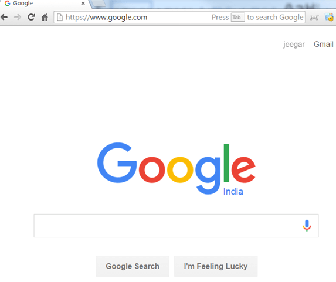
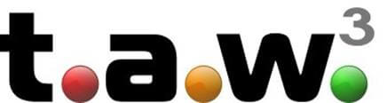
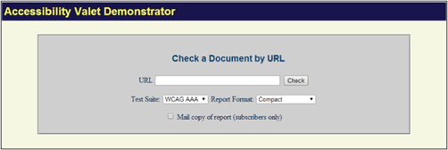
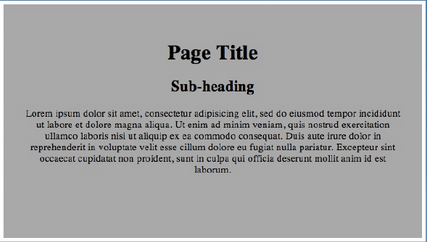

# 可访问性测试是什么？

## 可访问性测试是什么？

可访问性测试是可用性测试的子集，并且执行以确保正被测试的应用是可用的，比如听力、色弱、老年人等弱势群体。

残疾人使用辅助技术，帮助他们运行软件产品。

- **语音识别软件**-它将语言转换成文字输入到计算机。
- **屏幕阅读器软件**-用于读取被显示在屏幕上的文本
- **屏幕放大软件**-用于放大显示器，便于视障人士阅读。
- **专用键盘**为方便打字有困难的用户

 
## 为什么进行可访问性测试？

**原因1**：迎合市场。

约 20% 的人口拥有残疾问题。

- 在十个人中就有一个重度残疾
- 在 65 岁以上人群具有降低的能力

残疾，包括失明、失聪、残废或身体的任何疾病。

如果一个软件产品使残疾人友好，就可以迎合这个大市场。可访问性测试是正常测试生命周期的一部分，可以解决软件中的可访问性问题。

**原因2** ：遵守无障碍立法 

政府机关都有办理，这就要求产品要通过残疾人无障碍。

以下是通过各种法律的政府行为

- 美国：1990 年 美国残疾人法案
- 英国：1995 年 残疾歧视法案-
- 澳大利亚：1992 年 残疾歧视法案
- 爱尔兰：2005 年 残疾的作用

可访问性测试是重要的，以确保合法合规。

**原因3**：避免潜在的法律诉讼

在过去，财富 500 强公司已被起诉，因为他们未被禁止的环保产品。这里有几个知名案件

- 全国盲人联合会( NFB )与亚马逊( 2007 )
- 塞克斯顿和 NFB VS 目标（ 2007 ）
- NFB VS AOL 结算( 1999 )

创建最好的支持残疾人的产品和避免潜在的诉讼。

## 哪些障碍？

应用程序必须支持残疾人像-

| 残疾类别 | 残疾的描述  |
|---------|--------|
| **视力残疾** | 完全失明或视力较差或者色盲   视觉的问题，像视觉和频闪闪烁效果问题 |
| **肢体伤残** | 不能使用鼠标或键盘。  运动技能差，如手部动作和肌肉缓慢 |
| **认知障碍** |  学习障碍或记忆力差或不能理解更复杂的场景 |
| **识字困难** | 阅读问题 |
| **听力残疾** |  听觉失聪和听力障碍等问题   能不能听见或者能不能听清楚 |

## 如何做可访问性测试？

可访问性测试有两种执行方式，它们是：

1.指南  
2.自动化的

以下是该点的需要检查的应用中使用的所有用户。本清单用于签名的可访问性测试。

1.是否所有的应用提供了键盘操作和鼠标操作吗？  
2.指令是否被用户提供的文档或是手册吗？容易理解和操作的应用程序使用的文件吗？  
3.标签是否有序地排列以确保顺利导航？  
4.是否设置菜单的快捷键？  
5.应用程序是否支持所有操作系统吗？  
6.是否每个响应时间的屏幕或页面中明确提到的是，使得终端用户知道要等多久？  
7.是否所有标签写入正确的应用程序？  
8.无论颜色应用灵活用于所有用户？  
9.是否使用适当的图像或图标，因此很容易理解的端用户？  
10.申请是否有音频警报？  
11.用户可以调整音频或视频控件？  
12.用户可以重写默认字体的文本和打印显示？  
13.用户是否可以调节或禁用闪烁、旋转或移动显示吗？    
14.检查以确保颜色不会用作唯一的输送装置的信息或指示动作  
15.不管是可视的高亮颜色反转？测试中色彩的应用通过改变对比度  
16.音频和视频相关内容是否正确的听到人们的残疾？所有测试在没有扬声器多媒体网页与网站  
17.是否提供培训残疾人，使他们成为熟知软件或应用？

可访问性测试，测试人员可能是具有挑战性的，因为他们不熟悉的。最好使用残疾人特殊需求的挑战。

有不同方式的检测取决于残疾。我们来学习它们。

1.**视力残疾** 

好了，现在让我们假设我没有视觉能力。我看不见，我想和 XYZ 来访问网站。在这种情况下，该选项是什么？？？？我不可以访问 XYZ 网站？我有什么选择呢？有一个词被称为选项屏幕阅读器。是啊，你说得没错。屏幕阅读器。现在，这个屏幕阅读器是什么？它是一软件，用于对 Web 内容。基本上，为你的网站无论是内容、链接、无线电按钮、图像、视频等。屏幕阅读器将会讲述每一件事情对我来说。存在多种可用的屏幕阅读器。我曾经和 jaws 一起工作。

基本上，当你开始钳夹或任何屏幕阅读器，然后到网站主页，然后讲述它的完整内容。例如：我已经开始，并且开始在浏览器 Mozilla Firefox 的页面开始，如果我去的地址栏然后 jaws 将宣布地址栏，然后在地址栏键入 **www.google.com**，jaws 将会介绍类似这些：

地址栏，**w,w,w,period,g,o,o,g,l,e,period,c,o,m**。而且，当页面加载时将 jaws 完全再次宣布 Google.com 主页。

**现在如果我去谷歌搜索，那么 jaws 会宣布谷歌搜索。因此，盲人很容易用简单的方式来识别事物。**

在这里，我想解释屏幕阅读器将会讲述你输入在文字框的字或事情。类似地，如果存在链接，将它作为一个链接，它将宣布它的链接为按钮。因此，盲人可容易辨别事物。

现在，如果一个网站设计不佳，那么将有可能（一般情况），jaws 不能为盲人讲述的内容不正确导致。（说如果 jaws 叙述一个链接作为内容，那么盲人用户将永远无法知道它的一个链接，如果是网站之后的一个重要吗？？？在这种情况下，这将导致网站业务的高损失。

2.**视觉障碍**-有两类，我想提到的是在视力受损下的情况。

第一个是色盲。色盲并不意味着完全失明，但不能查看某些特定的颜色。色和蓝色是常见的颜色，如果人们有色盲的话，他们就不能正确地看到。所以基本上，如果我有色盲的红色，我想用 80% 红色的网站呢？？？我在那个网站上会舒服吗？答案是否定的。

所以一个网站应该被设计成使得色盲的人不具有任何访问问题。举个简单的例子，对于一个在红色按钮上，以使其可访问它以黑，然后很容易访问。通常为黑色和白色被认为是通用的。

**视力残疾**

第二是人的视力差的(不明确)具有不同的视觉或视力问题(很多问题相关的眼睛视网膜等)访问任何网站。

1)在这种情况下，最好的办法是避免小文本。因为这是一个非常好的方法。对视力很差的人人来说。

2)而且患有视力问题要缩放文本的网站使其舒适。所以一个网站应该以这样的方式设计，即如果它扩大，它的布局是当变焦时不可断开。否则，它就不会成为一个好的印象。

**其他残疾**：在残障观众的可访问性测试中，一个非常重要的考虑点是不使用鼠标访问网站。一个人应该能够完全访问的链接、按钮、单选按钮、复选框、弹出框，下拉列表的网站，所有的控制应通过键盘完全可以访问和操作。

**诸如**：如果我右手瘫痪，我不想用鼠标或说我不喜欢使用鼠标，然后呢？在这种情况下，如果不能够访问链接或复选框对站点，经由键盘呢????所以一个网站应该是键盘完全可访问的。

**可选择文本的话，则需要对图像、音频、视频，以便屏幕阅读器读取它们，叙述它们，从而盲人可以容易地识别的图像、音频、视频。此外，键盘快捷键应该来容易地访问和导航网站应提供的键盘。**

另外，焦点必须完全可见。当我们按下 Tab，用户应该能够看到的是运动控制。可见，非常方便用户的视力差或色盲识别的站点，并且还易于访问。

**用户听力残疾（失聪或听)**：最后一个是有听力障碍的人。聋人可以访问的网站，因为他是什么可以看到网站上的内容。但当涉及到音频和视频他们面临的困难。所以在这种情况下，任何视频和音频，应该有ALT文本。ALT文本的方式替代文本。假设有关于如何预订机票的视频。在这种情况下，文本应该在那里，这样一个聋人可以阅读，得到的想法是什么视频。

## 可访问性测试工具：

让您的网站更容易接受和与用户更友好，容易接近。存在各种工具可检查网页的可访问性。这些流行工具如下-

### achecker

辅助功能检查器是 Web 易访问性评估工具。通过输入 URL 或 web 页面的 HTML 文件上载其网页可及性进行检查。它是一个免费的工具，在选择报告格式。achecker 允许用户创建可访问性指导原则。

- 它是用于可访问性检查
- 选择验证标记来验证 HTML 回顾无障碍
- CSS 验证选项，您的样式表和内联样式同时审视可达性
- 用于瞬时查看 HTML 的地方,周围可达性问题，您可以显示源代码
- 开发人员可以使用 REST 协议的 Web 查询的应用 achecker
- 除了这些特征之外，还可以管理用户和组、检查管理、方针管理、语言管理等。

查询[这里](http://www.atutor.ca/achecker/)

### Wave

Wave 是一个免费的网络辅助工具创建的 WEBAIM。它是用来验证网页的手动各方面的可访问性。此工具可用于检查内部网，通过 Word 保护，动态生成，或敏感的网页。Web 可访问工具栏的主要功能包括识别网页的组件，提供访问页面内容的替代视图，并有助于使用第三方在线应用程序。它确保 100% 私人和安全无障碍报告

查询[这里](http://wave.webaim.org/)

### TAW

Taw 是在线工具，用于确定可达性。这个工具分析网站按照 W3C Web 无障碍指南和说明现实问题。网站可访问性测试问题被分类为优先级1、优先级2、优先级3。TAW 的有趣特征是能够生成 WCAG 1.0 的子集以进行测试。在 TAW 工具，您可以选择“测试单个页面或多个页面中的“蜘蛛”的网站。TAW 还限定经由额外检查的“检查”的用户”对话框

### Accessibility Valet

它是一个工具，允许你检查网页在 WCAG（Web 内容可访问性指南）。所有的 HTML 报告选项显示你在正规形式突出使用伪造的有效标记，标记以及错位的元素。此工具提供各种功能，如

- 开发部门的报告
- 执行摘要和质量保证的管理
- 元数据的语义 Web 和 WWW
- 自动清理 XHTML 和 HTML 转换
- 脚本工具

查询[这里](http://valet.webthing.com/access/url.html)

### 辅助开发工具

它是 chrome 扩展。它和可访问性审计。审核结果显示被测试页所违反的可访问规则。该延伸部具有较高的评论，并经常更新

查询[这里](https://chrome.google.com/webstore/detail/accessibility-developer-t/fpkknkljclfencbdbgkenhalefipecmb?hl=en)

### 快速地访问页面检测仪

因为有一些极好的无障碍工具条，快速检测仪网页可达性是书签，你可以点击网页的快速分析。它会找出你的网页的各种问题，警告可能的问题和突出的页面可能会受益于咏叹调区（访问丰富的互联网应用程序）。

查询[这里](http://accessify.com/tools-and-wizards/accessibility-tools/favelets/quick-page-test/)

有多种工具可用以 Web 可访问性测试，如下：

### 设计师

该工具是由 IBM 公司开发的模拟视障者的经验，使设计师能更好地了解残疾人的需要和应用开发。

查询[这里](http://www.eclipse.org/actf/downloads/tools/aDesigner/)

### webanywhere

这是一个基于浏览器的工具，这种类似于屏幕阅读软件。它帮助读者如何阅读该网页。

查询[这里](http://webanywhere.cs.washington.edu/)

### vischeck

这个工具是用来模拟一个 web 页面或图像将被观察的人患色盲。这可以通过输入 URL 或上传图片。

查询[这里](http://www.vischeck.com/)

### Web Accessibility Toolbar

 WAT 是 Internet Explorer 或歌剧提供了网页设计者在网页分析有用的功能的扩展。一个最大的特点就是灰度特征，有助于发现设计中的低对比度的点。

查询[这里](http://www.wat-c.org/tools/)

## 可访问性测试的神话：

以下是对可访问性测试的神话：

    神话：创建可访问贵网站

**事实**：它并不昂贵。把该超时考虑无障碍设计本身的基本试验阶段。这将节省金钱和返工。

    神话：改变不可访问的网站来访问网站耗时并且昂贵，

它没必要包含所有的变更。工作的基本需求，最需要的用户禁用。

    神话：无障碍是平淡乏味的

**辅助功能不等于唯一文本页面**

你可以使网页有吸引力，但是它应该被设计成使得它可以由所有用户访问。还按照 W3C Web 内容无障碍指南--它极大地阻碍了使用唯一的文本页面。

    神话：可访问性，如果盲人和残疾人

**事实**：遵循可访问性准则提高了软件的整体可用性，这有助于普通用户以及。

## 结论

可访问性测试有助于做出应用程序禁用友好。如果由于 web 应用程序的复杂性，以下无障碍指南是不可能的，为普通用户和其他禁用的网站构建一个版本。