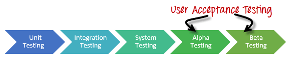
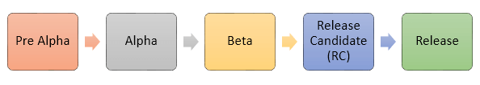

# α 测试和 β 测试

## 什么是α 测试？

α 测试是验收测试的一种，用来找出软件中所有可能的问题或缺陷。α 测试通常在产品推向日常用户或公众之前进行。本种测试的关键是通过使用黑盒和白盒技术来模拟真实用户对软件进行测试。其目的是模拟并执行用户日常典型业务。α 测试是在开发环境中进行的，而且通常是由开发团队内部的测试人员来完成。简单而言，这种测试之所以被称为 α 的测试，是因为它在即将要完成软件开发，并且在 β 测试之前发生的。

 
## 什么是 β 测试？

β 测试是由“真实用户”对“真实环境”下的软件应用程序做的测试，并且可以视为某种形式的外部用户验收测试。

β 版本的软件发布到有限数量的终端用户，从而获得该产品质量方面的反馈。β 测试减少了产品失败的风险，并且通过客户审核提升了产品质量。

它是在产品发布给用户之前的最终测试。β 测试的主要优点是客户能够直接反馈产品中的问题。β 测试有助于测试产品在真实环境下的表现。

## α 测试和 β 测试

以下是 α 和 β 测试的差异：

 

| α 测试 | β 测试 |
| :---: |:-----:|  
| α 测试由软件公司的内部测试工程师来执行 | β 测试是由客户或终端用户来|
| α 测试在开发人员站点 | β 测试是在客户端位置或最终产品用户 |
| 可靠性和安全性测试，不执行深度测试 | 可靠性、安全性、健壮性测试期间检查|
| α 测试是白盒和黑盒技术 | β 测试通常使用黑盒测试 |
| α 测试需要实验室环境或测试环境 | β 测试，不需要任何实验室环境或测试环境。软件可供公众使用并被认为是实时环境|
| 长周期可能需要用于执行 α 测试 | 只有几个星期的执行所需的 β 测试|
| 关键的问题便可以解决固定或开发者立即在 α 测试 | 大部分的问题或反馈收集来自测试将在未来版本的产品。|
| α 测试是为了确保产品的质量之前测试 | 	β 测试，也关注产品的质量，但是用户输入收集的产品，确保产品是真正的用户准备的时间。|

 
## 测试的类型

存在不同类型的测试，具体如下：

- 传统的 β 测试:产品分配到目标市场，以及收集所有方面相关数据。此数据可用于改进产品。

- 公测：通过网上渠道和数据收集公开产品。基于反馈，改进产品。例如，微软进行的最庞大的β测试的操作系统-- Windows 8 正式发布之前。

- 技术测试：产品在集团内部的组织机构和数据收集/反馈对员工的组织。

- 聚焦 β：产品发行到市场收集的反馈的具体功能的程序。例如，软件的重要功能。

- 后释放 β：产品发行到市场和数据收集的改善对于未来发布的产品的改进。

## 进入和退出标准

###  α 测试进入标准:

- 商业需求文档或软件需求规格说明书
- 所有测试的要求
- 测试团队良好的软件知识与应用
- 建立测试实验室环境
- QA 生成执行准备
- 测试管理工具，用于上传和测试用例，记录缺陷  
- 可追溯性矩阵确保每个设计要求的情况下，一个  alteast 试验进行了验证

### α 测试退出标准：

- 所有测试已执行并通过。
- 所有严重性的问题需要固定和封闭
- 试验总结报告
- 确保没有更多的附加特征可以包括
- 停止 α 测试

###  β 测试进入标准：

- α 测试文件上签字  
- β 版本软件准备
- 环境准备软件的应用
- 工具以捕获实时故障

### β 测试退出标准：

- 所有主要和次要问题关闭
- 反馈报告应当从公共
- 递送的 β 测试总结报告

## 阶段测试

 α 和 β 测试通常被用于“现有的”软件或产品导向的公司。在试验阶段的产品的公司一般会从服务组织。以下为产品公司通过的测试阶段

 

- Pre Alpha ：软件原型。UI 是完整的。但并非所有特征都完整。在这个阶段未被发布的软件。

- Alpha：软件是接近其内部开发和测试的程序故障(bug)/问题

- Beta：软件运行稳定和释放到有限的用户基础。他们的目标是把客户反馈对产品做出改变并因此在软件

- RC (候选版本)：基于反馈的测试、软件修改和试验要进行错误修正。在这个阶段，你不想要做出重大改变但在功能检查的缺陷。Rc也被报道出来

- Release （释放）：所有作品中，软件被发布给公众。

- Note：在试验阶段，但是为了获得蜂鸣营销、公司合并等“Pre-αβ”、“-β”等。

## 优点 & 缺点

### β 测试优势

- 减少产品故障风险客户审核通过。
- 测试可在测试后推出基础设施。
- 通过提高客户产品质量反馈
- 成本相比类似的数据收集方法
- 与客户建立起友好感情，提高客户满意度

### β 测试缺点

- 测试管理的问题。相比于其他类型的测试通常在公司内部执行的受控环境中，执行 β 测试是在现实世界中你很少控制。
- 找到合适的用户和保持他们的参与可能是个挑战

### α 测试优点：

- 视图提供了更好的可靠性，则软件在早期阶段
- 有助于模拟真实用户行为和环境。
- 许多检测错误严重或致命
- 提供错误的早期检测的设计和功能

### α 测试缺点：

- 在深度测试功能可以作为软件还在发展阶段有时开发人员和测试人员，对结果不满的阿尔法测试

## α 和 β 测试的神话：

- 神话：α 和 β 测试进行测试的过程中出现了一款生命周期效益

    真相：α 和 β 测试有助于突出问题具有重要的应用中提供用户反馈和软件。

- 神话：相同类型的测试的 α 和 β 测试，不同的场景

    真相：α 测试是在实验室环境中，β 测试是由真实用户真实报告基于第一手经验。这两种情形都是显著不同的。

- 神话：β 型的检测是困难的和耗费时间

    真相：经验/ β 测试需要时间以获得最大的价值。但该数据/提供的宝贵反馈。

- 神话：β 测试中产生很少或没有有用的数据

    真相：一个成功的 β 测试能够产生大量的有价值的信息，否则难以在实验室环境中获得。

## 最后结果

无论你进行多少考试，修复多少漏洞，你没用你的软件用户都不喜欢它。β 测试（第二个希腊字母）有助于提供可靠的反馈的用户的软件。

α 测试（第一希腊字母）帮助用户实时发送的软件的 β 测试，都会帮助稳定软件的 β 测试的候选资格。

α 测试和 β 测试是必不可少的。