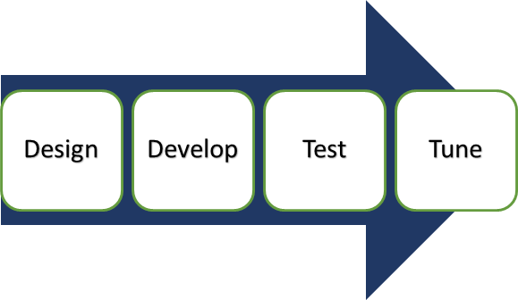

# 应用测试教程：方法、工具、测试计划，最佳实践

## 应用测试是什么？

应用测试是一组通过脚本进行的活动，其目的是在软件中发现错误。它涉及整个应用程序的测试。

这有助于提高应用程序的质量，同时降低了成本，最大化 ROI，并且节省了开发时间。

应用程序测试可以在 GUI、功能、数据库（后端）、负载测试等各种类别中进行。

对于应用测试，该测试涉及生命周期的各个阶段需求分析、测试规划、测试分析、测试设计、测试执行和错误报告等。

在本教程中，您将学习-

- 应用测试方法

- 应用测试测试计划

- 应用测试工具

- 测试应用测试的最佳实践

- 应用测试挑战

- 移动应用测试

- 移动应用测试要测试什么

- 移动测试挑战 

软件应用程序和产品在它们支持的功能以及实现的过程中有许多变化。因此，应用测试确保特定的程序或应用程序的功能正常。

应用测试的生命周期包括四个阶段。

1. 根据应用需求设计测试计划
2. 开发手工测试和自动化测试脚本
3. 执行功能测试，以验证应用要求
4. 执行测试和调整负载应用性能

应用测试被分为两部分。

-  Web 应用测试
-  桌面应用测试

| 应用测试 |	测试的类型 |
|---------|-----------|
| Web 应用测试 | 功能和性能测试   跨浏览器的测试   负载测试和压力测试   回归和符合性测试   用户验收测试   β 测试   探索性和冒烟测试   多语种支持和兼容性测试|
| 桌面应用测试 | UI 测试   可用性测试   性能测试   兼容性测试(硬件/软件)   功能测试   安全测试 |
| 移动应用测试 | UI 测试   基于规则测试   回归测试   功能测试   安全测试 |

## 应用测试方法

测试方法是一种不同的方法来确保软件的应用进行了全面测试。散乱差和测试方法可导致不稳定的产物。

有三种方法进行测试。

- 黑盒测试
- 白盒测试
- 灰盒测试

### 黑盒测试

黑盒测试技术通常用于测试功能测试、非功能测试和回归测试。在黑盒测试中，所使用的策略是

- 等价类测试
- 边界值测试
- 决策表测试
- 状态转换表 

### 白盒测试

白盒测试一般用于软件代码安全漏洞检查内部，或条理紊乱，功能性的循环等。在白盒测试中，使用的策略

- 代码覆盖率分析
- 路径覆盖

### 灰盒测试

这种测试技术包括黑盒测试、白盒测试技术。它是根据寻找缺陷结构不当使用或应用。

## 应用测试测试计划

测试计划文档是从产品说明、软件需求规格说明，或用例文档。测试的重点是什么测试，如何测试，何时测试，以及谁将测试。测试计划文档用作测试团队和测试管理人员之间的通信介质。

应用测试的标准测试计划应定义以下特性；

- 定义测试范围
- 定义测试的目的
- 活动测试方法
- 排定测试
- bug 报告和跟踪

## 应用测试工具

应用测试有多种测试工具。选择工具取决于你想要执行什么类型的测试。针对不同的平台推荐不同的工具。应用测试工具确保各种设备的性能、可用性和功能。

这里有几个。

- Selenium
- IBM Rational Robot
- RFT (Rational Functional Tester)
- Load Runner ( HP Performance Tester)
- Apache Jmeter

## 测试应用测试的最佳实践

选择正确的应用程序测试策略是保证应用程序缺陷的有效方法。因此，QA 团队遵循一套标准的过程来检测更多的错误和更少的时间变得非常重要。

对于应用程序测试，一些最佳实践包括

- 定义功能规范
- 审查和检查
- 正式进入和退出标准
- 功能测试的变化
- 多平台测试
- 自动化测试的执行

## 应用测试挑战

应用测试中，测试人员可以遇到很多挑战

- 只在用户调用时识别的问题
- 无法预料的变化的影响
- 不可见应用和运行错误
- 消耗时间的

## 移动应用测试

像 web 应用测试，移动应用测试是基于相同的策略和方法。这种差异可能是用于测试的工具，一些常用的工具是用于移动应用测试的 sikuli、testcomplete、fonemonkey，robotium 等。

移动应用类型被分为三个部分

- Web 应用程序-它是由用户访问的网络，如互联网或内联网
- 原生应用程序-它是针对特定平台和安装在计算装置
- Hybrid  应用-混合这两者的元件组合 web 和本地化。如 Facebook。

对于大多数的移动平台，您可以使用简单的 CSS、HTML、JS 等。

## 移动应用测试要测试什么

一个完整的移动应用测试策略包括网络基础设施和设备、目标设备的选择和有效组合的手动和自动化测试的工具，可以覆盖非功能性测试与功能性。

对于移动应用程序，要测试的东西是

- 装置工具
    - OTA
    - Wi-Fi
    - Data Cable
    - Bluetooth
- 卸载
- 应用 LOGO
- Splash
- 慢速存储器
- 视觉反馈
- 退出应用程序
- 启动/重新启动应用。

## 移动测试挑战

具有增加数量的用户、移动设备、移动 APP 测试变得越来越复杂。测试移动应用与桌面的应用程序是显著不同的。在测试期间移动共同面临的挑战

- 全面覆盖测试
- 管理碎片（不同的版本，处理器，内存）
- 缺乏测试计划
- 时间压力
- 缺少物理设备
- OS 和平台多样化

## 最后结果

在应用程序测试中，测试了整个应用程序，使用了不同的方法、工具和方法。在开始之前执行应用测试是软件产品成功的关键。

 