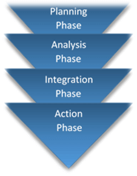

# 基准测试:定义，框架，工具和测试计划

## 什么是基准?

基准是衡量产品或服务质量的指标或参照点，以评估产品/服务的质量。

换句话说，它是一组标准，以帮助确定产品或服务的质量。

例如，一个足球队有一个球员作为一个**英超球员资格**的基准。为基准设置的技能可能是在过去五赛季进球数，或在上半场的球拥有，或在当地比赛中发挥的最低比赛等

在软件行业中，可以对软件产品或服务进行基准测试以评估其质量。

## 基准测试是什么？

基准测试是一种测试得到**可重复设定的量化结果**从其当前和将来的软件版本，比较具体功能或基线。

这是一个用来比较的软件或硬件系统也称为 SUT 执行过程（系统测试）。一个系统可以是一个基于 Web 的应用程序。

基准必须是**可重复的**。例如，在负载测试的每一次迭代，如果响应时间变化太多，系统的性能被定基准。响应时间需要在不同负载条件下稳定。

基准必须是**可量化的**。例如，用户体验不能量化的数字，但用户的时间花费在一个网页由于良好的用户界面可以量化。

**基准测试不是与软件测试相关的术语，但它也涉及硬件测试，并被认为是商业世界中最重要的任务之一**。

在本教程中，我们将讨论客户端服务器应用程序或其他 Word web 应用程序的基准

所述基准测试可以为以下服务，

- 浏览器的兼容性
- 断开的连接
- HTML 的依从性
- 加载时间
- 可访问性
- 链接流行度

在本教程中，您将学习-

- 为什么基准测试很重要

- 创建基准测试计划

- 基准测试框架

- 基准测试时要考虑的事项

- 基准测试组件

- 基准测试工具 

## 为什么基准测试很重要

在业务层面，基准测试可帮助确定

- 一个基于 web 的应用程序对竞争对手的表现如何
- 不同类型的客户如何体验网站的响应时间和可用性
- 它确保网站符合行业标准和最佳实践
- 这使得能够评估第三方服务商承包之前做出决定
- 允许找出要避免的错误

## 创建基准测试计划

测试计划是基准测试过程中最关键的元素。基准测试计划如下步骤如下；

1. 调用和缩放工作量
2. 收集和存储基准测试措施
3. 定义测试过程所需的时间跨度和终点
4. 准备备份计划，以克服任何新的测试用例失败
5. 决定终止过程的权限

### 基准测试的阶段

基准测试有 4 个阶段：

1. **规划阶段** 

    - 识别和区分优先次序的标准和要求
    - 决定基准标准
    - 定义基准测试过程

2. **分析阶段** 

    - 确定根源的错误,提高质量
    - 为测试过程设定目标

3. **集成阶段**

    - 与相关人员分享成果并获得批准
    - 建立功能目标

4. **行动阶段** 

    - 制定测试计划和文档
    - 执行前阶段指定的操作并监控进度
    - 连续运行过程

## 基准测试框架

基准测试框架有助于执行性能检查的一些基本任务。

这些基本任务包括；

- 数据库访问
- 服务器端组成
- JSON 序列化
- 配置

**基准框架 2.0 和 TechEmpowe** 大多采用基准测试框架

让我们看看 TechEmpowe 走向。我们将快速浏览其显著特点

- 它是一个开源框架，以执行基准任务
- 它需要正确配置基准环境
- 主要有两种模式，如**基准模式**比较结果和**验证模式**
- 有几个文件所要求的是唯一的，可能会改变系统到相应的系统
- 它包括“基准配置文件”，它定义了测试指令集和基准程序的元数据
- 它是基几种语言,比如 Java，Python，Ruby，PHP，JavaScript，PERL，C，Groovy，Haskell，Scala 等。
- 对象-关系映射器(ORM)是用来对数据库进行测试的 JSON 序列化，等等。

## 基准测试时要考虑的事项

- **一致性和控制**是进行基准测试的重要措施
- 理解系统架构，设计测试标准和测试数据
- 检查初始静态数据并根据用户数量更新
- 检查“重置”功能在任何地方，并定义每秒交易率（这具体处理用户对数据库的交易）
- 根据功能划分系统元素
- 每个系统有不同的体系结构和设计，需要进行考虑，同时进行基准测试

## 基准测试组件

不同的系统有不同程度的复杂性，需要不同的技术测试应用程序。

基准测试有 3 个主要组成部分。他们是

1. **工作量规格：**确定要提交给被测系统的请求的类型和频率。
2. **度量标准：**确定要测量的元素例如：下载速度
3. **测量规范：**确定如何测量指定的元素以找到合适的值

为成功运行基准测试,需要考虑到以下事实。

1. 确保所有软件组件都处于良好工作状态
2. 操作系统和驱动程序支持要准确
3. 在运行基准从系统中删除预取和临时文件
4. 关闭后台运行的所有进程和应用程序
5. 检查操作系统更新和真实世界配置

## 基准测试工具

基准测试工具正在相应地进行分类。我们将逐一招募。

###测试 Windows PC 的工具：

1. Prime95
2. Novabench
3. 3DMark
4. SiSoftware Sandra 

### 测试 CPU 性能的工具：

1. Cinebench
2. Geekbench
3. SuperPI 

### 测试系统速度和移动设备电池的工具：

1. Phoronix( Linux )

2. CPU-M( CPU 基准测试）

3. Vellamo（网页浏览性能）

### 不同机器之间执行基准测试的工具：

1. Everest Ultimate Edition

2. Fresh Diagnose 

基准测试可以与 Android 手机和平板电脑进行，一些工具是上面列出的相同。在所有的及格分数是众所周知的和广泛使用的基准测试工具。

## 总结

- 基准测试为系统性能提供了可重复的可量化结果集。
- 有助于运动负荷条件下，确定系统行为的 DDoS 攻击。
- 工作量规格、度量标准和测量规范是基准测试的主要组成部分。
- 一些工具和框架用于快速有效地执行基准测试。
- 基准测试还可用于移动设备。