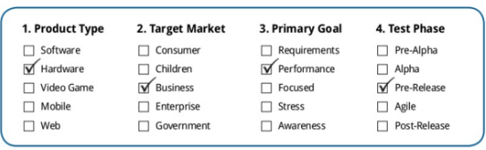

# 什么贝塔测试？5 分钟学会

## 什么是贝塔测试？

贝塔测试包括将产品发送到测试环境之外的测试站点，用于真实世界的暴露。很多人在现实生活中遇到过贝塔测试，它可能是你最喜欢的游戏之一，或者你最喜欢的 安卓/手机/平板电脑。

大多数人理解贝塔测试是软件的预发布版本。

贝塔测试是一个软件产品在真实的/虚拟的环境中在释放之前对其进行测试的过程。

它将密钥添加到测量质量测试，通过测试的产品的情况下，不能在实验室设置。

下面的流程图说明了贝塔测试在软件开发生命周期中的作用。

贝塔测试也被称为其他名字，如

- 用户验收测试
- 客户验收测试
- 客户审核
- 在欧洲国家常见的野外步道
- 预释放

## 什么时候执行贝塔测试？

- 它是在产品装运之前的最终测试产品
- 通常在内部阿尔法测试之后开始
- 当产品处于或接近将来完成时开始
- 包括现有的和有针对性的潜在客户
- 普遍建立质量改进
- 在发布之前建立产品的最终评估
- 扩展 QA 测试（但不应该取代它）

## 贝塔测试的类型

存在许多不同类型的测试，并且每个具有不同的挑战、目标和益处。

任何产品可能被单独测试，包含这些

- 产品类型
- 目标市场
- 首要目标
- 测试阶段

上面所述的例子说明了传统的基于性能的硬件贝塔测试目的在在业务市场。

每个人都看到贝塔值不同。这将有助于实现产品管理，市场营销，工程，执行水平，质量和销售团队的独特目标

## 贝塔测试的工具

贝塔测试是一个非常独特的过程，包括个人，包括你的客户的各种工具，包括各种学科。它可以极大地促进贝塔测试的成功，如

- β 周期缩短
- 减少时间投资
- 增加参与测试仪
- 改善质量反馈
- 增加可视性

### 生产力工具

可以积极使用的生产工具是邮件、电子表格、文字处理机等。

### 优点：

- 非常昂贵（你可能有）
- 没有学习曲线

### 缺点：

- 测试人员之间没有沟通的方法
- 没有足够的团队环境（几乎没有可见性或责任）

### 非测试软件与服务

而一些非测试的软件工具，它可以是有用的 Bugzilla，JIRA，调查猴子，得到满意的文字记者，等。

### 优点：

- 廉价的
- 方便
- 很多选择

### 缺点：

- 利用多个系统
- 难以管理/产品碎片数据
    
### 商业贝塔管理工具

商业管理工具实例：**VC ONLINEFMS, BETA EASY,等。**

### 优点：

- 内置测试版（社区协议，CMS，调查，反馈，论坛，报告）
- 客户/测试员的低学习曲线
- 灵活性，以满足不断变化的需求与现有的工具集成

### 缺点：

- 利基市场的几个供应商选项
- 可能要高于单一功能的工具
- 适应新的应用

## 贝塔测试过程

在本节中，我们将重点介绍贝塔测试过程一步一步如下所述

1. **贝塔测试过程**
2. **贝塔测试计划**

### 贝塔测试过程

有很多方法来进行和管理一个贝塔测试，但一个真正有效的测试方法。

在贝塔测试过程中有六个阶段：

- 项目计划
- 参与者招募
- 产品分布
- 收集反馈
- 评价与反馈
- β 结论

#### 项目计划

在项目计划阶段，需要确定贝塔测试的目标。

通过预先定义你的目标，你将更好地了解有多少人必须为贝塔过程选择。项目计划期间必须建立项目时间表。

#### 参与者招募

测试与测试候选人的选择开始。大多数私人贝塔测试纳入任何地方的范围内 10 至 250 名成员。

#### 产品分布

下一阶段是产品分布，测试项目被传播给测试人员。当一个完整的包，包括每一个适当的材料（编程，设备，手册等）发送给成员的测试是最好的。

#### 收集和评估反馈

一旦您的成员开始使用贝塔项目评论需要迅速积累。这是在众多的盈利结构包括输入错误报告，一般的话，引用，建议，研究证。

一个测试提供了丰富的信息，你的项目，如错误，客户支持信息，重要的交易数据和客户如何看待它。所有输入应仔细检查其对项目和适用组的影响。

#### β 结论

在时间点贝塔测试得出结论。这意味着注释的成员有关他们问题，他们的状态检修的项目，并以一个理想的机会，并感谢他们花费的劳力。

## 贝塔测试计划

尽管存在多种方式来测试结构的计划，然而，有成本效益的标准测试方案需要以下组件如

编写测试方案包括：

**预算**：识别与测试相关联的任何费用，包括设备，测试单位，航运物流和奖励

**产品定义**：项目本身的发展和蓝图，包括数据的当前状态（即 α，β2 异常状态模块等）

**测试参数**：绘制任务的基本范围，包括测试人员的总人数，创业日历和英里石。

## 目标市场的确定：

定义目标区域用于自己的软件产品。

**测试目标**： 列表中的项目，包括质量改进界面的独特目标，验收测试和支持基础设施，收集客户的建议和记录证明书。还包括要测试的模块的区域。

**项目利益相关者**：表征中所承担的义务，如何定义输入将监督它的变化和进步的手

**初始测试活动**：编排的入门练习，将所有的测试过程包含 bug 报告，强调对话需求收集、审核、分配及经营。

## 为进行贝塔测试准备

测试产品或项目处于准备试用状态。以下是检查，我们将在产品上执行。

### 产品准备检查表

设计团队已经检查了所有的项目都准备开始测试。

- 辅助件/零件（证明或支持某物的文书工作等等）它定义将被发送到分析器。
- 容器经验已被有效地检查，包括安装，建立和文档。
- 基本项目的有效性已有效地检查（每个关键要素的工作）项目管理。
- 该已知缺陷是对前述 β 应归档并传送到分析仪。
- 卸载过程（如物料）已有效检查。

### 测试准备检查表

- 详细的会议所需的任务
- 精确的接触数据和位置（如果测试设备）已被确认为所有分析仪
- 非曝光和已阐明 β 投资理解文字标记，并且返回所有分析仪。
- 义务和任务计划显然已经被施加到分析器。
- 分析仪看到如何利用该框架容纳批评。
- 确保资产需要通过分析器，其义务是提供简单和有效。

## 贝塔测试管理

有各种各样的练习，你的贝塔测试者可以去关注，为了增强您的项目。

最普通的练习：

- 缺陷报告
- 特征请求
- 论坛讨论
- 指定的分配的
- 任务
- 日报
- 调查和民意测验
- 证实
- wiki 协作
- 电话测试仪
- 现场探访

在接下来的几页，我们将涵盖每一个

### 缺陷报告

错误报告聚集在几乎所有的测试。伴随的是收集β错误的技巧

-  β 分析器的 bug 报告比 QA 人员编写的要容易得多

- 错误报告可以分析加入记录（日志、截图等）这些记录描述错误更紧凑比分析仪可能有能力。

### 功能要求和形式

鉴于大多数贝塔测试单元紧密完整的条件，突出广告的目的是尽早认识到为项目将来的修改客户端的先决条件

### 论坛讨论

贝塔测试中的社交聚会

1. 通过提供与分析仪增加兴趣的组，并且利用动力来继续并检查项目
2. β 降低行政和支持结构通过允许背必需品到另一个分析器
3. 提供一个基本组件，以便于协调的话语(例如在线收集中心)和
4. 帮助减少分类负债，给分析者一个可控的出口来表达他们的热情，减少他们的愿望，这样做的人在一般的互联网。

然讨论是一个令人难以置信的仪器在贝塔测试，他们是一个非常浪费的方法监督错误和突出要求。

### 任务和日报

每天日记是朴素的/诚实的/简单的方式或方法来建立支持。它们通常由一个表单，要求用户规模 1-5 经验率。

回来后，再做任务应该被推开的分析器将是谨慎和明智的。

在进行贝塔测试，是对日常期刊有效的通讯方式的分析器。

### 调查和鉴定

调查是一个真棒的方法来收集输入和保持分析仪连接所有通过您的测试。这些都是最常用的技术，以获取结论（关于元素，实用性，或执行），或收集特定的批评问题（错误，等等），区别所有的承诺。

### 证实

大多数测试者都非常愿意为您的项目分享他们的热情。推荐大部分是聚集向贝塔测试结束，应该包括一个声明，证明了如何将被使用。

### Wilds, Calls 和 wiki 访问

共享的 Wiki 是一个非常现代的 β 作用。这是一个极好的方法，给客户输入的另一种方法，同时具体添加到您的项目的变化

### 呼叫分析仪

客户电话（无论是单个或多个分析仪）提供直接的常量输入，如中心收集。此外，客户来电显示高估计的贝塔分析仪和他们的批评扩大利率。

### 现场探访

只要可能，将 β 的客户是一个非常直接的客户体验。像客户呼叫、客户回访分析器可以展开合作。

## 测试人员管理的技巧

一些提示可以被用于测试人员管理贝塔测试

- 预期早期的和表达
- 一贯鼓励保密（需要保密协议，等）
- 平衡感恩与期待
- 让测试人员参与正在进行的活动
- 测试人员关于保持更新项目进度
- 提供了一种简单方法，测试人员提供反馈
- 允许测试者当中进行沟通
- 快速响应所有的问题和请求
- 非测试人员直接接触(如果可能)通过电话

## 闭合相位

关闭贝塔测试的关键：

- 给你的分析仪时间提交最后的问题。在大多数情况下，最好在任务结束前给你的分析仪不少于三天的通知。
- 行分析器访问提交问题。一旦你的结束日期已经实现，它是必不可少的切断输入。
- 关闭所有打开的问题。审核并关闭任何剩余输入。如果你需要在你的分析器之间设置一定的距离，需要额外的数据，这应该很快完成。
- 提供分析仪一个基本的打算归还项目。如果项目是基于设备的，一定要给出返回的方向（分析器不应该管理任何成本）。

## 激励

激励是令人惊讶的迫切需要你的测试。

- 在执行中包含不同层次的动机。
- 确保必需品合作动机相匹配。
- 所有符合这些级别奖励。在大多数情况下，“主要途径”方法不是一个有效的水平。如果每个人都放弃震撼心灵的输入，每个人都值得奖赏。
- 快速分配激励
- 如果可以，谢谢，分析仪。远远的单个触摸。

## 制定关闭报告

由于你的测试者是乐观的，结论报告给出了一个审查后效应的贝塔测试。

- 加入到正式的风险
- 发现存档密钥问题
- 存档经常要求部件
- 存档概览结果（带有漂亮的图表）
- 存档和顶级的动力补偿
- 确保所有部门获得的一份报告

## 贝塔成功的要素

- 一个详细的计划
- 强作了合理的安排，包括引导大家。
- 全部包括的购买-在一个将贝塔股票放在一个组将相当多准备提供援助。
- 令人难以置信的测试人员–错误分析器可以将结果毫无意义。
- 报告提供对应正常时间表，责任，进步
- 使分析仪响应觉得作为关键人物的组
- 使用强大的工具
- 协会切实解决自身存在的 β 中巨大的信息。
- 激励分析器以令人难以置信的巨大价值。

## 进行贝塔测试时面临的主要挑战

- **奉献合格的资源：**贝塔测试通常发生在最小的机会，当产品具有很多疯狂而仓促的活动试图关闭每个松散端部，并具有很少的时间或精力关注贝塔
- **招聘熟练测试者：**查找库但无偏测试人员的目标是一项艰巨的任务
- **收集相关反馈：**不是所有的反馈都是有价值的，任何的反馈，这有助于即兴的产品质量负责
- **组织和分发反馈：** 右反馈分配给正确的人是复杂和耗时的任务。

## 十大贝塔错误

- 缺乏通用贝塔程序支持
- 没有明确计划
- 低估斜坡时间要求
- 将非可行产品释放到贝塔测试中
- 太少或太多的测试人员
- 测试两个周期过短或过长
- 缺乏动力和/或管理测试人员
- 无效导致损失时间并反馈工具
- 没有有效反馈管理
- 管理不善的激励

## 总结：

- 贝塔测试是对测试的项目，通过真实客户的现实世界
- 贝塔测试也被其他一些名称，如用户接受测试，客户接受测试，现场跟踪，预发布等。
- 当产品处于或接近将来完成时开始
- 可以积极使用的生产工具是邮件、电子表格、文字处理机等。
- 而一些非测试的软件工具，它可以是有用的  Bugzilla，JIRA，Survey Monkey
- 测试过程涉及两个步骤，
        - 测试过程
        - 贝塔测试计划