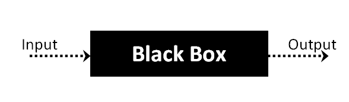
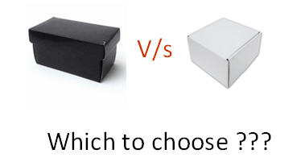

# 黑盒测试是什么？技术、范例与类型

## 黑盒测试是什么？

黑盒测试是软件测试技术的功能的软件( SUT )的测试不需要看内部代码结构，内部的实现细节和知识的软件路径。 7This 类型的测试是完全基于软件的要求和规范。

黑盒测试中我们只关注软件的输入和输出系统而不用担心内部知识的软件程序。

例如：一个操作系统，像 Windows，像谷歌这样的网站，像 Oracle 这样的数据库，甚至你自己的自定义应用程序。在黑盒测试中，您可以通过只关注输入和输出而不知道其内部代码实现来测试这些应用程序。

## 黑盒测试—步骤

下面是执行任何类型的黑盒测试的通用步骤：

- 最初的系统规范和要求等内容。
- 测试者选择有效输入(阳性测试场景 SUT )，以检查是否正确地处理它们。还有些负无效输入(测试场景)被选择来验证 SUT 是能够检测到它们。
- 测试人员确定期望输出的输入。
- 软件测试人员构造选定输入的测试用例。
- 在测试用例被执行。
- 测试人员软件将实际输出与预期输出。
- 如果任何缺陷被修理并重新测试。

## 黑盒测试的类型

存在许多类型的黑盒测试，但以下是突出的-

- 功能测试 - 这个黑盒测试类型与系统的功能需求有关，它由软件测试人员完成。
- 非功能性测试 - 这种类型的黑盒测试与测试特定的功能无关，但非功能性需求如性能、可扩展性、可用性。

- 回归测试 - 回归测试是编码后进行修复、升级或其他维护系统，以检查任何新的代码不影响现有的代码。

## 用于黑盒测试的工具：

用于黑盒测试的工具很大程度上取决于你正在做的黑盒测试的类型。

用于功能性/回归测试中您可以使用- [QTP](http://www.guru99.com/quick-test-professional-qtp-tutorial.html)，[Selenium](http://www.guru99.com/selenium-tutorial.html)

非功能性测试，您可以使用 - [LoadRunner](http://www.guru99.com/loadrunner-v12-tutorials.html)，[JMeter](http://www.guru99.com/jmeter-tutorials.html)

## 黑盒测试策略：

以下是突出的测试策略，其中许多用于黑盒测试

- **等价类测试**：它是用来最小化可能的测试情况，以最佳的水平，同时保持合理测试覆盖。
- **边界值测试**：边界值测试重点是边界处的值。该技术确定的可接受值的范围是由在系统中。在减少测试用例的数量。最适合各类系统中，它主要适用于系统的输入是在一定范围内。
- **决策表测试**：决策表将矩阵中的原因及其影响。每列有独特的组合。

## 黑盒测试和白盒测试的比较：

| 黑盒测试 | 白盒测试 |
|--------|---------|
| 黑盒测试的主要焦点是验证功能需求。|	白盒测试（单元测试）验证内部结构和软件代码的工作 |
| 进行白盒测试，底层编程语言的知识是必不可少的。当前系统使用各种软件编程语言和技术，他们不可能都认识。| 	黑盒测试给出了抽象的代码和重点测试的软件系统行为的努力。 |
| 白盒测试未促进测试模块之间的通信	| 黑盒测试促进测试模块之间的通信 |

## 黑盒测试和软件开发生命周期( SDLC )

**黑盒测试有其自身的生命周期称为软件测试生命周期（ STLC ）**，它是相对于软件开发生命周期的各阶段。

- **资格** - 这是在初始阶段和在该阶段中需要被聚集。软件测试人员也可参加。
- **测试计划与分析** - 适用于项目的测试类型确定。创建测试计划，确定可能的项目风险及其缓解。
- **装置** - 在这个阶段，测试用例是软件需求文档的基础上创建的
- **测试执行** - 在这个阶段执行测试例的编写。如果任何缺陷被修理并重新测试。
