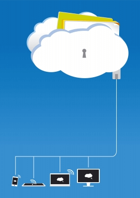

# 云测试教程——初学者指南

##什么是云计算？

云计算是一种基于 Internet 的平台，提供各种计算服务，如硬件、软件、其它计算机相关的远程服务。云计算有三种模式。

- **SaaS** - 软件服务
- **PaaS** - 平台服务
- **IaaS** - 基础设施服务

在本教程中，我们将学会——

- 云测试的类型
- 在云测试中执行的任务
- 云测试的测试用例
- 云测试的挑战
- 云测试与常规测试 

## 云测试的类型

整个云测试被分为四个主要类别

- **整个云测试：**云被看作是一个整体的实体，并根据其功能进行测试。云计算和 SaaS 供应商以及终端用户在进行这类测试感兴趣
- **在云测试：**通过检查其内部特征中的每一个，进行测试。只有云供应商可以执行这种类型的测试
- **测试跨越云：**测试进行不同类型的云，像私有，公共和混合云
- **在云的 SaaS 测试：**功能和非功能测试是根据应用需求进行的

## 云测试关注的核心成分

1. **应用：**它涵盖了测试功能，终端到终端的业务流程，数据安全性，浏览器兼容性等。
2. **网络：**包括通过网络测试各种网络带宽、协议和数据的成功传输。
3. **基础设施：**包括灾难恢复测试、备份、安全连接和存储策略。基础设施需要验证的法规遵从性

云测试包括的其他类型

- 性能
- 有用性
- 遵守
- 安全
- 可扩展性
- 多租户
- 实时升级测试

## 在云测试中执行的任务

| 云测试的类型 | 任务执行 |
|------------|---------|
| **云或 SaaS 定向测试：** | 这种类型的测试通常是通过云或 SaaS 供应商。主要目的是确保所提供的服务中提供的功能或程序的云的 SaaS。这是在测试执行环境集成、功能性、安全性、系统功能验证和回归测试以及性能和伸缩性评价。 |
| **基于云的在线应用测试：** | 在线应用程序供应商执行此测试，检查基于云的服务的性能和功能测试。当应用程序连接到遗留系统，在云中的遗留系统和测试应用程序之间的连接的质量进行验证。 |
| **基于云的云应用测试：** | 要检查一个基于云的应用程序在不同的云的质量进行这种类型的测试。 |

## 云测试的测试用例

| 测试场景 | 测试案例 |
|---------|---------|
| 性能测试 |	失败由于一个用户行动应该不会影响其他用户性能   手动或自动缩放不应该造成任何破坏   所有类型的装置对应用程序的性能应保持相同   超售在供应商端不应妨碍应用程序的性能 |
| 安全测试 | 只有授权客户访问数据    数据必须也被加密    数据必须被完全删除如果未在客户端使用   数据应访问与加密不足   管理供应商端不应该访问的客户数据   检查各种安全设置，如防火墙、VPN、Anti-virus 等。 |
| 功能测试 |	输入有效的预期结果   应该恰当地集成服务与其他应用程序   当成功登录到云，系统应显示客户账户类型   当客户选择切换到其它服务的运行服务应该自动关闭  |
| 互用性和兼容性测试 | 验证兼容性要求的应用系统测试  在云环境中浏览器兼容性检查  识别缺陷可能出现在连接的云  任何不完全的数据不应被云传送   验证应用程序可以跨不同的云平台  测试应用的内部环境,然后将其部署在云环境 | 
| 网络测试 |  负责云连接的测试协议   用于检查数据完整性   检查网络连通性   检查数据包是否被防火墙丢弃 |
| 负载测试和压力测试	| 多用户访问云服务时检查服务   识别硬件或环境故障的缺陷    检查系统在增加负载下是否失效   检查系统在一定负荷下如何随时间变化 |

## 云测试的挑战

### 挑战 1：数据的安全和隐私

云应用程序是多租户的性质，数据被盗的风险是永远存在。云用户应该得到保证他们的数据安全的供应商。

### 挑战 2：短通知期限

云提供商给予短时间（ 1-2 周）的现有客户升级。手动验证更改您的 SaaS 应用是一个大问题。

### 挑战 3：验证接口的兼容性

随着云服务提供商的升级，有时外部接口也会升级，这对于一些使用旧接口的用户来说是一个挑战。云（ SaaS ）用户需要确保用户可以选择他们想要的工作界面版本。

### 挑战 4：数据迁移

数据从一个云提供者迁移到另一个的挑战是巨大的，供应商可以具有不同的数据库架构。它需要大量的精力去了解数据字段，关系和他们是如何映射在 SaaS 应用

### 挑战 5：企业应用集成

企业应用集成的需要出站和入站数据集成验证从客户端网络的 SaaS 应用，反之亦然。数据隐私要求彻底的验证，以确保 SaaS 用户有关数据的隐私和安全。

### 挑战 6：模拟现场升级测试

云测试面临的最大挑战是确保生活升级不影响现有的 SaaS 用户连接。

## 云测试与常规测试

| 测试参数 |	常规测试 | 云测试 |
|:------|----------|-------:|
| 主要测试目的 |	检查互操作性、兼容性、易用性。  验根据给定的规格，验证系统功能和性能的质量 | 验证了 SaaS 的性能和质量的功能，利用云计算环境的云应用 |
| 测试成本 |	 高成本是由于硬件和软件要求 |只需支付运营费。只付你所用的东西。 |
| 仿真测试 |	 模拟网络业务数据   在线模拟用户接入 |仿真的在线业务数据   模拟用户的在线访问 |
| 功能测试	| 验证功能（单位和系统）及其特点 | 测试云或 SaaS 的端到端的应用函数 |
| 测试环境	| 测试实验室中预固定和配置的测试环境 | 具有多种计算资源的开放式公共测试环境 |
| 集成测试|	成分、结构和功能的测试 |  SaaS 基于集成测试 |
| 安全测试 |	基于进程、服务器和隐私的安全特性测试 | 测试基于云安全的特征，在 SaaS 和云供应商的实际测试 |
| 可伸缩性和性能测试	| 在固定环境中执行测试 |  实时和虚拟在线测试数据的应用 |