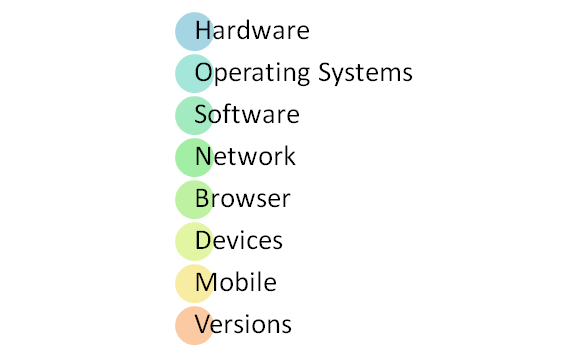
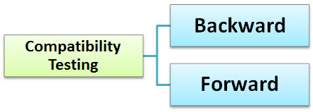

# 兼容性测试教程：向前测试和向后测试

## 什么是兼容？

兼容性只不过是存在或生活在一起的能力。在平时生活中，油与水不相容，但是牛奶可以容易与水结合。

## 兼容性测试是什么？

兼容性测试是一种用来检查您的软件是否能够在不同的硬件、操作系统、应用程序、网络环境或[移动设备](http://www.guru99.com/mobile-testing.html)上运行的软件测试。

兼容性测试是非功能测试

## 兼容性测试类型

让我们看一下兼容性测试类型

- 硬件：它检查软件与不同的硬件配置兼容性。
- 操作系统：检查您的软件兼容不同操作系统，如 Windows、[Unix](http://www.guru99.com/unix-linux-tutorial.html)、MACOS 等。
- 软件：它检查你开发的软件与其它应用软件。例如：MSWord 应用程序兼容的其它软件，如 MS Outlook、MS [Excel](http://www.guru99.com/excel-tutorials.html)、[VBA](http://www.guru99.com/vba-tutorial.html)等。
- 网络：绩效评估系统在网络中改变的参数，例如带宽和速度、容量。它还可以查看应用在不同网络中的所有参数。
- 浏览器：它检查你的网站兼容不同的浏览器（比如 Firefox、Google Chrome、Internet Explorer 等。
- 装置：检查您不同装置的兼容性，例如 USB 端口、打印机、扫描仪和其它媒体设备中。
- 手机：检查您的移动平台的软件兼容性，例如 Android，iOS 等。
- 软件版本：是你验证应用程序软件兼容性不同版本的软件。例如，对 Windows 7，Windows 7 SP1、Windows 7 SP2、Windows 7 SP3。检查您的 Microsoft Word 兼容性。

有两种类型的检查版本

- 向后兼容性测试是用硬件/软件的旧版本来验证开发的硬件/软件的行为。
- 向前兼容性测试是用硬件/软件的新版本来验证开发的硬件/软件的行为。

## 兼容性测试的工具

### BrowserStack 浏览器兼容性测试：

这个工具可以帮助用户查看应用在不同的浏览器的应用程序。

### 安全平台-硬件兼容性工具

该工具包括特定硬件平台的必要驱动程序，它提供了一个工具，用来检查 CD 刻录工具刻录 CD 的过程。

### 虚拟台式机操作系统兼容性：

这是在应用用于运行多个操作系统的虚拟机的数量为 N 的系统可以被连接，并且比较结果。

 
## 兼容性测试过程

1.在初始阶段的兼容性测试，以定义一组环境或平台中的应用是预期的。
2.测试人员具备足够知识的平台/软件/硬件以根据预期的应用行为理解的不同配置。
3.环境设置以供测试不同平台、设备、网络检查是否您的应用程序在各个不同的配置
4.报告的 bug。修复缺陷。重新测试来确认定固定缺陷。

## 结论：

最重要的是使用兼容测试以确保开发的软件是否工作在不同配置文档（如文档要求）。此测试是必要的，以检查应用程序是否与客户端的环境兼容。