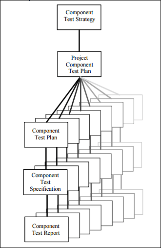
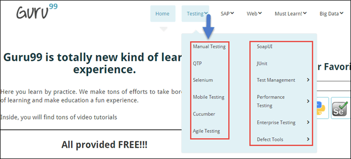
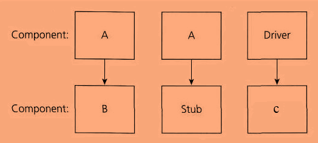
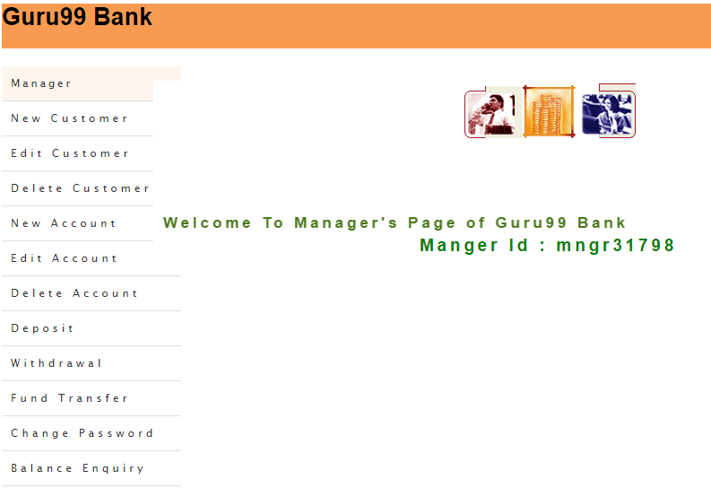

# 用测试用例示例学习组件测试

## 组件测试是什么？

组件测试是一种测试技术，它在每个单独的组件上分别进行测试而不与其他组件集成。从一个体系结构的角度来看,它也被称为模块测试。

一般来说，任何软件作为一个整体有几个组成部分。组件测试涉及单独测试这些组件。

这是最常见的类型是黑盒测试，由 QA 小组执行。

根据下面的图，将有一个测试策略和测试计划的组件测试。在软件和应用程序的每一部分被单独考虑的地方。对于每一个组件，将定义一个测试场景，这将进一步被引入到一个高级别的测试用例中。

术语“**组件测试**”的使用范围从域到域和组织到组织。

最常见的原因是不同的组件测试

1. 开发生命周期模型类型的选择
2. 复杂的软件或测试程序
3. 在软件或应用程序中测试或不与其他组件隔离。

我们知道软件测试生命周期架构具有许多伪影(测试文档、测试活动期间使用）。在许多测试中，工件，它的测试策略和测试策略，定义了测试的类型，在一个给定的项目进行测试深度。

## 谁做组件测试

组件测试由测试人员执行。“单元测试”是由开发人员执行的，它们对单个功能或过程进行测试。在进行单元测试之后，下一个测试是组件测试。组件测试由测试人员完成。

## 什么时候执行组件测试

组件测试在开发人员完成单元测试后不久将执行，并且测试团队将为测试团队发布测试版本。这个版本被称为 UT（单元测试建立）建立。所有组件的主要功能测试在此阶段，
   
组件测试进入准则
   
- 该组件被包括在 UT 最少应开发和单元测试。

组件测试退出准则

- 该功能的所有组件应工作正常。
- 不存在任何关键或高或中等严重度和优先缺陷缺陷日志。

## 组件测试的测试策略

基于深度级别的测试，组件测试可以被分类为

1. **CTIS-小部件测试**
2. **CTIL-大部件测试**

### CTIS–小部件测试

组件测试可以在测试中的软件或应用程序的其他组件的隔离或隔离的情况下进行。如果它与其他组件进行隔离，那么它被称为小部件测试。

**例一**：考虑一个网站有 5 个不同的网页的网页然后测试每个单独网页分别与其它构件隔离地称为小部件测试。

**例二**：考虑的 guru99.com 网站有很多成分，如

首页、测试、SAP、Web、必须学习、大数据、项目实践、博客等。

类似地，任何软件的许多组件，每个组件具有其自己的子部件。每个测试模块分别与例 2 中不考虑与其他组件集成被称为**小部件测试**。

点击测试下拉菜单按下面的快速显示和看到各种“**subcomponents**”的测试组件。所以显示的子组件的手动测试，SOAPUI, QTP, JUnit, Selenium, Test Management, Selenium, 移动测试等等。

**注：**所述子部件的红色用颜色高亮显示在下方的快照。

### CTIS–大部件测试

在没有被隔离的软件或被测试的应用程序中完成的组件测试被称为大部件测试。

让我们举个例子来更好地理解它。假设有一个由三个组成部分组成的应用程序，如**组件 A**，**组件 B** 和**组件 C**。

开发人员已经开发了组件 B，并希望它测试。但是，为了完全测试组件 B，它的功能是依赖于组件 A 和少数组件 C。

功能流程： A -> B -> C 这意味着有一个从 B 到 A 和 C 的依赖，根据图存根是所谓的函数，和驱动程序是调用函数。

但组件 A 和组件 C 还没有开发出来。在这种情况下，测试组件 B，就能够更换组件 A 和组件 C 通过存根和驱动程序。所以基本上，组件 A & C替换为存根和驱动程序作为虚拟物体，直到它们实际开发。

- **存根：**一个存根被调用的软件组件进行测试，如图所示的“Stub”被称为组件 A。
- **驱动程序：**驱动程序调用要测试的组件，如图中所示的“组件 B ”由驱动程序调用。

## 组件测试的测试案例示例

考虑 2 个网页按下面提到的图，这里的网页都是相互联系，从功能的角度。

1. 网页 1 是登录页面demo.guru99.com

    

    当用户输入有效用户 ID 和密码的文本框中，单击 Submit 按钮，将导航至网页的首页上，演示 guru99 演示网站。

2. 网页 2 是 guru99.com 的主页

    

    所以这里的登录页面是一个组件，而首页是另一个。现在单独测试单个页面的功能称为**组件测试**。

网页 1 的组件测试脚本——

- 输入无效的用户 ID 和验证的任何用户-友好的警告弹出显示给终端用户。
- 输入无效的用户 ID 和密码，然后单击“复位”，并且验证数据输入在文本域中的用户 ID 和密码被清除出去。
- 输入有效的用户名和密码并点击“登录”按钮。

网页 2 的组件测试脚本——

- 验证 “欢迎来到 guru99 银行经理的页面”的消息是否被显示在主页上。
- 验证是否所有的网页左侧的链接可点击。
- 验证管理器 ID 是否显示在主页的中心。
- 根据图表验证主页上 3 个不同图像的存在。

## 单元测试和组件测试

| 单元测试 | 部件测试 |
|---------|---------|
| 测试单个程序，演示程序按规范执行的模块称为**单元测试** | 单独或不隔离其他对象来测试软件的每个对象或部分，称为**组件测试**|
| 验证设计文件 | 验证其测试需求，测试用例 |
| 单元测试是由程序员完成 | 通过测试人员完成组件测试 |
| 单元测试被首先完成 | 组件测试完成后，单元测试完成从开发结束。 |

## 总结：

组件测试在查找 bug 中起着至关重要的作用。在开始集成测试之前，我们总是建议执行组件测试，以确保应用程序的每个组件都有效地工作。

集成测试其次是组件测试。测试组件也称为模块测试中作为参考。