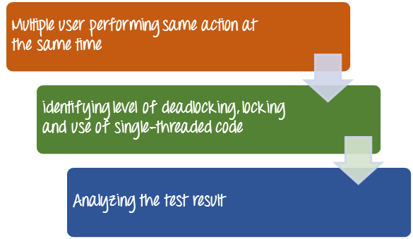

# 软件测试中的并发测试

## 并发测试是什么？

并发测试被定义为一种测试技术，用于检测当多个用户登录时应用程序中的缺陷。换句话说，多个用户同时检测效果时执行相同的动作。下面的图像显示并发测试

并发测试也称为**多用户测试**。测试并发程序是更具挑战性的测试顺序程序，由于非确定性和同步问题。

## 为什么并发测试

- 标识在同一时间访问相同的数据库记录、模块或应用程序代码的效果。
- 识别和测量时的水平，锁定和使用单线程代码和限制访问共享资源

## 并行测试的好处

- 它相对减少了测试应用程序所需的工作量，通过限制并发交互的范围到一些广泛使用的测试组件。
- 封装值允许在不审查整个代码或程序的情况下分析程序的某一部分的行为
- 这有助于在提高并发程序的可靠性和鲁棒性。

## 并行测试的关键挑战

在执行并发测试时可能遇到的挑战 

- 需要在多个测试平台
- 需要更密集的测试
- 函数不返回其结果到呼叫者，而是相反，它可以稍后通过通知、块、回调函数、或类似的机制，这使得检测更加困难。
- 该信息或程序流没有被反映在该调用堆栈。
- 该执行路径的数目可以非常大，这样的处理系统的交互执行时
- 并发程序有更多的失败率比顺序解法
- 并发程序的调试

## 总结：

并发或并发测试技术来检测应用程序中的缺陷时，多个用户登录。