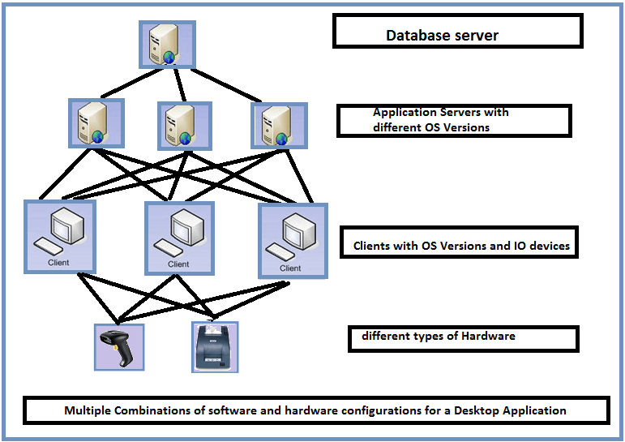
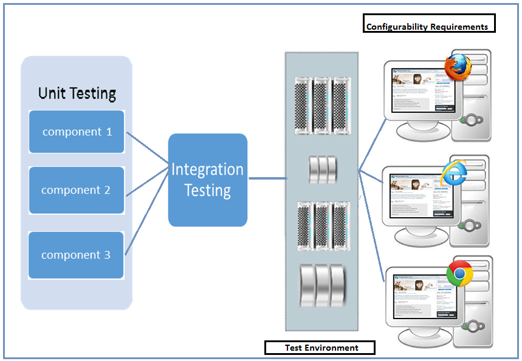

# 配置测试教程：测试用例样本和例子

## 配置测试是什么？

配置测试是一种用软件和硬件的多种组合来测试应用程序的方法，以找出系统能够在没有任何缺陷或错误的情况下工作的最佳配置。

如上所述，配置测试是一个软件测试，测试中的应用必须使用软件和硬件的多种组合来测试。

## 配置测试示例

让我们用桌面应用程序的例子来理解这一点：

一般来说，桌面应用程序将是 2 层或 3 层，这里我们将考虑使用 ASP.NET 开发的一个 3 层桌面应用程序，由客户端、业务逻辑服务器和数据库服务器组成，每个组件支持以下平台。

- 客户端平台 —— Windows XP, Window7 OS、windows 8 OS 等
- 服务器平台 —— Windows Server 2008 R2、Windows Server 2008 R2、Windows Server 2012R2
- 数据库 —— SQL Sever 2008、SQL Server 2008R2、SQL Server 2012 等

测试人员必须用上述平台和数据库版本的组合来测试客户端、服务器和数据库的组合，以确保应用程序正常运行且不失败。

配置测试不仅限于软件，但也适用于硬件，这就是为什么它也被称为硬件配置测试，在这里我们测试不同的硬件设备，如打印机，扫描仪，网络摄像头等，支持测试下的应用程序。

## 配置测试的先决条件

任何一个项目在开始配置测试之前有一些前提条件

- 由软件和硬件配置的各种组合组成的矩阵
- 优先配置很难测试所有的配置
- 每个测试配置基于优先化。

## 配置测试的目标

配置测试目标是

- 验证所述应用是否满足该配置要求
- 手动造成故障，有助于识别在测试过程中没有有效地发现的缺陷（例如：改变系统的时区设置，如时区，语言，日期时间格式等）
- 确定最佳配置的应用。
- 通过添加或修改硬件资源负载均衡分析系统性能，增加或减少内存大小，连接各种型号的打印机，等。
- 基于系统效率分析与优化、高效沟通的实验，以实现可用资源最佳配置的系统。
- 验证系统在地理上分布的环境，以验证如何有效地执行系统。
  例如：对于在不同位置和不同位置的客户机，无论系统设置如何，系统都应正常工作。
- 验证中的错误的不考虑配置变化。
- 如何保证溯源应用项目通过适当记录和维护时，易于识别。
- 如何验证管理应用项目的软件开发生命周期。

## 配置测试-测试策略

在本节中，我们将讨论配置测试类型需要遵循的策略，下面有两种类型的配置测试

- 软件配置测试
- 硬件配置测试

### 软件配置测试

软件配置测试是测试多个操作系统，不同的软件更新等测试下的应用程序。软件配置测试是非常耗时的，因为它需要时间来安装和卸载不同的软件，用于测试。

其其次是测试软件配置的方法之一是在虚拟机上进行测试。虚拟机是安装在软件上的一个环境，它像物理硬件一样运行，用户会有与物理机器相同的感觉。虚拟机模拟实时配置。

代替安装和卸载软件在多个物理机器的耗时，最好安装应用程序/软件在虚拟机中运转并继续测试。该处理可以由具有多个虚拟机，从而简化了测试人员的工作

软件配置测试过程通常始于何时

- 配置需求测试规定
- 测试环境准备
- 测试团队在配置测试方面有良好的培训
- 构建发布单元和集成测试通过

遵循测试软件配置测试的典型测试策略是在多个软件配置中运行功能测试套件，以验证被测试的应用程序是否工作在期望的情况下，而不存在任何缺陷或错误。

另一种策略是通过手工测试失败和效率验证来确保系统运行良好。

#### 实例：

说这是一个银行应用程序，以测试其在不同的浏览器中的兼容性应用当被在托管环境中所有的先决条件都存在，它可能在单元和集成测试的测试实验室。

但如果同样的应用安装在客户端的机器，丢失了一些软件的版本更新或申请是直接或间接相关的应用可能会失败。为了避免这种情况，建议手动测试失败，则通过去除一些配置条件，然后进行测试。

### 硬件配置测试

硬件配置测试通常是在实验室中进行的，在那里我们可以找到与它们相连的不同硬件的物理机器。

每当发布一个版本，软件必须安装在所有物理机器的硬件连接，测试套件必须在每个机器上运行，以确保应用程序工作正常。

要执行上述任务，需要在每台机器上安装软件，附加硬件和手动运行，甚至自动化上述进程并运行测试套件需要大量的努力。

此外，在执行硬件配置测试时，我们指定要测试的硬件类型，还有大量的计算机硬件和外围设备，这使得运行它们几乎是不可能的。因此，测试人员的职责是分析硬件主要由用户使用，并尽量使测试的基础上的优先级。

## 测试用例示例

考虑一个银行场景来测试硬件兼容性。银行应用程序，连接点钞机有不同型号的机器一样，Rolex，Strob，Maxsell, StoK，等等。

让我们拿一些测试用例样本来测试点钞机

- 在未安装先决条件时验证应用程序与 Rolex 模型的连接
- 在未安装先决条件时验证应用程序与 Rolex 模型的连接
- 验证系统是否正确数钱
- 篡改票据注释
- 验证响应时间
- 验证是否检测到假票据等

上述试验例1的模型，并经测试的所有车型在市场上通过设置在测试实验室中，这是很困难的。因此，可取的是，硬件配置测试外包给专业机构。

## 总结：

配置测试应与其他测试类型一样具有同等重要性。如果没有进行配置测试，这是很难分析的最佳系统性能和软件可能会遇到兼容性问题，这些问题它才能运行。