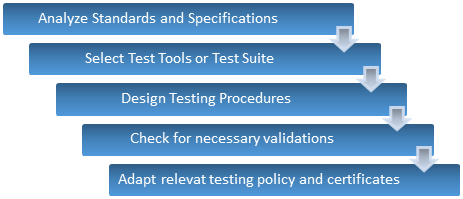
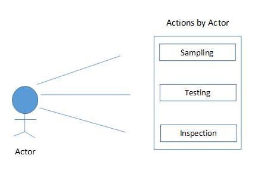
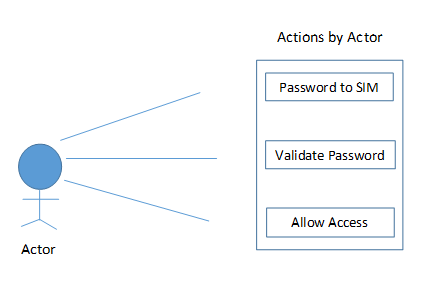
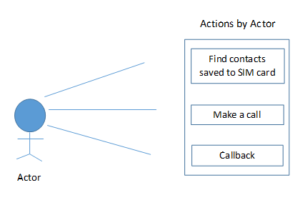

# 一致性测试(符合性测试)-完全指南

## 一致性测试是什么？

一致性测试通俗地也称为**典型测试**(有时也称为**符合性测试**)。主要目的是确定该系统与文件是否符合规格书要求和条件、规程和标准。

它可以处理一些技术方面，但故意包括；

- 性能
- 函数
- 坚固性
- 协同工作的能力
- 行为系统

一致性测试可以是逻辑的或物理的，并且它包括下述类型的测试；

- 符合性测试
- 负载测试
- 压力测试
- 容量测试

## 我们为何需要一致性测试？

- 检查系统的需求满足
- 检查系统是否有必要文件资料的完整性
- 根据规格检查开发，设计和评估

## 我们需要做什么检查？

- 实施的标准
- 要开发的系统的调用
- 规格范围
- 目标规格

一致性测试由管理层发起，全面保证团队和他们对标准、规范和程序的理解。

建立有效的应用、标准和规范应明确提及以避免歧义。如果没有，则一致性测试本身是有用的，以采取必要步骤使其相关和可靠。

## 何时以及如何进行测试？

- 当需要检查的系统的总体一致性、完整性和准确性的规范要求，执行一致性测试
- 有几种方法用于执行它没有太大的差别，在我们开发生命周期阶段，如；
    - 分析需求规格说明书
    - 准备测试计划
    - 准备测试案例和目标
    - 为准备的测试设计创建文档
- 我们需要关注的一些附加方面的规范，诸如子集，其通常是三种类型，如“配置文件”、“水平”和“模块”。
    - **配置文件**是一个规范的子集，其中包括系统的功能，以满足需求，并致力于一组特定的用户
    - 水平嵌套子集的规格 Level1 基本规范及 Level2 指示 Level1 + 额外/新功能
    - **模块**是显着相关的标准和规范的集合

## 一致性测试过程/程序：

一致性测试过程与我们以前测试过的常规测试过程非常相似。

相反，具有一致性测试过程的理论描述，让我们来看看它的图形表示的更好的理解；

在用例的帮助下，这个过程会更容易理解；

上面提到的一致性测试偶尔被称为符合性测试，但仍然有一些基本的事实，使一致性测试不同于合规测试。

我们将回顾两者的比较和对比:

| 一致性测试	| 符合性测试 |
|-----------|-----------|
| 一致性测试是正式和精确的测试标准方法| 符合性测试是非正式和不精确的测试标准方法  |
| 一致性认证仅适用于拥有官方认证机构的操作系统 | 一个操作系统，提供了一个单一的 API 的 POSIX（可移植操作系统接口）是兼容的 |
| 一致性测试是用来测试系统，提供完全支持给定的标准 | 符合性测试用于测试系统，为一些给定的标准提供支持 |

## 一致性测试的挑战：

与其他类型的测试一样，一致性测试执行也有一些任务是非常困难的，并可能成为一个挑战。下面列出了其中的一些；

1. 为了有效地进行一致性测试，它需要识别系统的类需要被测试，以及适当的方法
2. 分类成各种形状规格、等级以及模块
3. 衡量值
4. 设计成功运行测试过程的扩展、选项和方法。

## 一致性测试：关键意见：

一致性测试有一些领域需要额外的关注和知识的成功实施；

1. 最适合的测试方法
2. 测试过程自动化的测试工具的选择
3. 清楚了解一致性测试只有合格代替不合格
4. 设计和执行一致性测试程序
5. 正式定义应当如何执行
6. 政策与法规

## 一致性测试的益处：

1. 确保正确实施规范
2. 确保可移植性和互操作性
3. 提供适当的标准的使用
4. 由此可以确保界面和功能都正常工作，
5. 有助于确定哪些领域是符合那些不符合的，如语法和语义

## 移动系统一致性测试：

和其他类型的测试一样，移动系统也可以进行一致性测试。系统组装完毕后，通过一致性测试检查其部署前的使用情况。

针对不同类型的网络，诸如 GSM 或 CDMA 中，执行测试以获得一致性和互操作性。

这些测试可包括；

- 协议测试
- 安全/安全测试
- SIM 卡测试
- 无线电频率(RF)测试
- 音频测试
- 吸水率试验

下面的用例图显示了部署移动系统的一致性测试是如何进行的；

此外，这可以阐述在以下方式进行 SIM 卡测试分为两个阶段；

1. **密码验证**

2. **电话拨打**

存在可用于两种情况的系统

1.呼叫成功

2.调用失败

类似地，协议测试考虑以下使用情况；

追踪**测试用例模板**将帮助您了解如何编写[协议测试](http://www.guru99.com/protocol-testing.html)的测试用例。

| 测试ID | 测试场景 |	试验步骤 	| 试验资料 |	期望结果 	| 实际效果 | 资格 | 注释 |
|:--------|---------|---------|----------|----------|----------|------|------:|
| PT001	| 无死锁协议	| 沟通过程的开始	| - | 应成功建立通讯	| 成功建立通讯	| 转交 |	- |
| PT002 | “ping” 命令的超时工作正常 |	在命令提示符中输入 ping 命令为 “ping-w”	| ping 1000 | 应显示消息“发送成功” | 该消息显示了“发送成功” | 转交	 | - |
| PT003	| 请求“echo”计数	| 输入命令“pingping-n”在命令提示中 | ping 4 |应该开始侦测 32 字节数据 0.0.0.4 和显示发送成功的信息“发送成功”	 | 开始侦测32字节数据0.0.0.4 和显示消息“发送失败” | 失败 | 语义/功能错误 |
| PT004	| 任何状态都可以达到任何状态 | 退出状态并返回到上一个或下一个 | - | 应成功改变状态 | 成功改变状态 | 转交 | - |

这些术语也表明一致性测试是用于测试执行的技术标准。

为了在测试过程中引入一致性，定义了测试用例。根据网络的类型，数百个测试用例可以被定义和执行，以确保移动系统按要求进行工作。

## 总结：

- 一致性测试也称为类型测试，是一种形式化的测试方法。
- 它是用于确定该系统是否遵循规范要求。
- 它包括服装测试、负载测试、流量测试、兼容性测试
- 它也被视为符合性试验，但二者存在基本的区别
- 一致性测试程序、测试方法和测试工具是一致性测试的一些关键领域
- 通过一致性测试达到标准利用和互操作性的保证
- 对移动系统进行一致性测试。