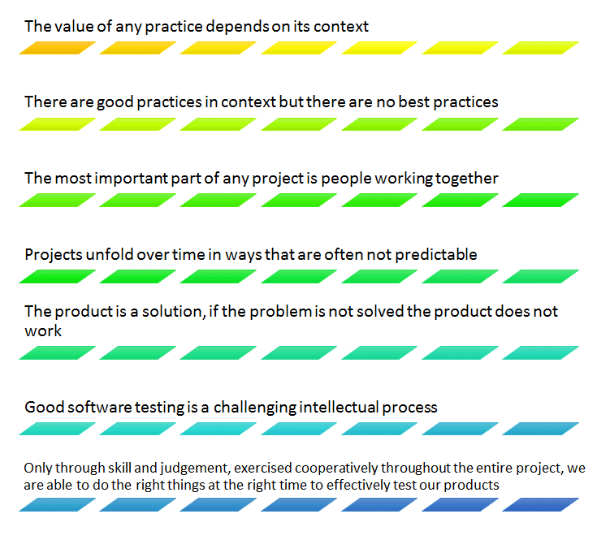
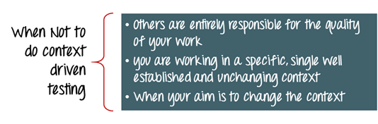
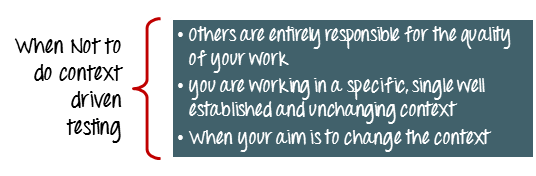

# 上下文驱动测试：完整教程

## 什么是上下文驱动测试？

上下文驱动测试更多的是一种测试方法，而不是一种测试技术，它建议测试人员选择测试技术、测试成果，通过研究具体的细节情况，测试文档和测试目标。

上下文驱动测试的方法是有用的，当程序员不提供任何文件。

上下文驱动的方法是基于主观的程序员和测试人员开发的软件产品。

### 在本教程中，您将学习

- 上下文驱动测试的定义
- 上下文驱动学派的七项基本原则
- 为什么要使用上下文驱动测试
- 什么时候不进行上下文驱动测试
- 如何确保有效的上下文驱动测试

## 上下文驱动学派的七项基本原则

以下是上下文驱动学派的七个基本原则

## 为什么要使用上下文驱动测试

- 监控主要测试计划的挑战
- 明确你的使命
- 分析产品
- 产品风险分析
- 设计测试策略
- 物流计划
- 共享计划

## 什么时候不进行上下文驱动测试

## 如何确保有效的上下文驱动测试

- **提问：**要获得项目的上下文并获得最大的测试覆盖率，你必须向开发团队、利益相关者、测试人员等提出问题。
- **提前计划：**提前计划测试计划并与整个团队一起分享会使你提高工作效率，在公司内部建立融洽关系并产生更有意义的对话
- **调整你的计划：**随着变化的时间表，新的特点和产生的优先事项，有必要你适应你的战略
- **让利益相关者决定完成项目：**让利益相关者决定了项目的完成情况。它解除了测试仪的工期完成，并帮助他集中测试
- **避免使用盲目的做法：**对于上下文驱动的测试人员来说，灵活性是非常重要的，因为对于一个项目来说，对于其他项目来说，没有必要工作