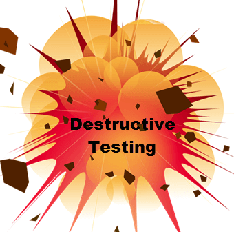

# 破坏性测试教程：战略和方法

## 什么是破坏性测试？

破坏性测试是用来评估软件程序中的故障点的一种软件评估技术。

它是一种测试方法，其中一个应用程序故意不检查应用程序的健壮性，并确定故障点。

与检查应用程序功能的其他测试方法不同，该技术将检查应用程序中的不可预知的用户行为。

对于破坏性测试，不需要了解软件产品的原始要求。然而，一些知识可以帮助开发一个良好的测试策略。

## 为什么要做破坏性测试

- 它有助于理解当软件可预测的行为是不当的使用
- 它有助于检查软件产品的健壮性。

## 你在破坏性测试中检查什么

在破坏性测试中，您将检查以下事情

- 适当的软件行为
- 软件行为不当
- 使用不当
- 不正确的输入数据
- 正确的输出数据

## 破坏性测试策略

破坏性测试涉及许多活动，如设计一组测试脚本，执行测试脚本，提高错误，关闭错误，并提供传递或失败的度量利益相关者在迭代结束。

对于破坏性测试，有很多方法可以测试。让我们看看他们中的一些。

- **故障点分析法：**这是一个演示系统进行什么可以在不同的点去错误的评价。对于这一战略，从 BA（业务分析师）的帮助可能会采取。
- **测试同行评审：**让您的测试用例分析或审查由一个研究员测试员，谁是不太熟悉的系统/功能
- **测试用例的业务回顾：**最终用户或专家可能会考虑许多有效的场景，有时测试人员可能没有考虑或错过，因为他们的整个重点将是测试的要求
- **进行探索性测试，使用运行表：**使用运行表的探索性测试，将有助于确定什么是测试，重复测试，并允许您控制您的测试覆盖率。
- **使用其他来源：**您可以要求某人打破软件产品和分析各种方案。

破坏性测试方法可以使用许多测试技术，如

- α/β 测试
- 回归测试
- 接口测试
- 等价类划分
- 环路测试
- 验收测试等。

虽然很少的技术，可用于修改，白盒测试，安全测试，缺陷测试，烟雾测试，等等。

在进行破坏性测试时，有一定的测试条件

- 软件不能处理或接受无效的输入数据
- 无论输入数据的有效性或正确性，软件都应该产生适当的输出数据

## 总结：

- 在这种技术中，应用程序故意失败的程序，以检查应用程序的鲁棒性
- 对于破坏性测试，**不**需要了解软件产品的原始要求。