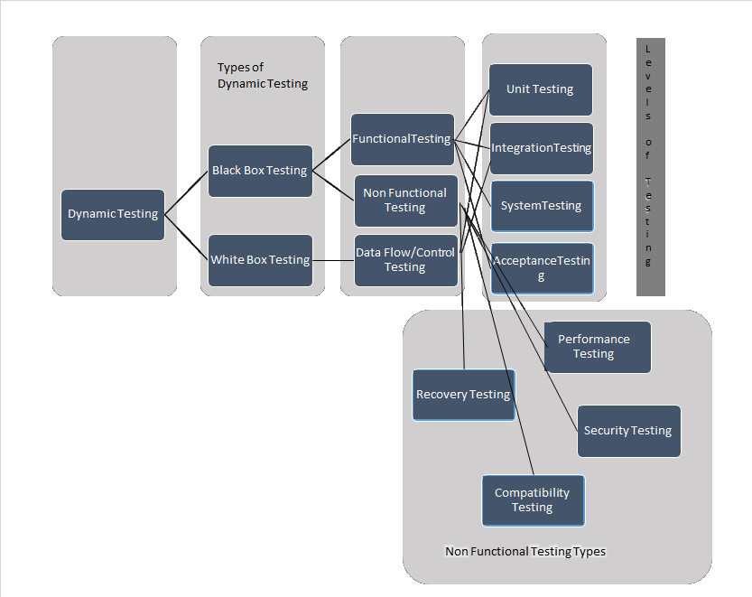
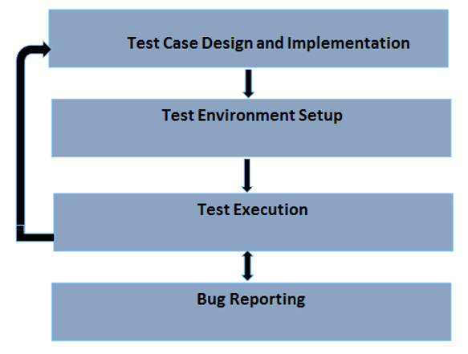

# 动态测试教程:类型、方法和流程

我们都知道，测试是**验证和确认**，它需要 2 VS，使测试完成。在 2 VS 中，验证被称为**静态测试**和其他“V”，确认被称为**动态测试**。

## 动态测试是什么？

动态测试是一种软件测试技术，它对代码的动态行为进行分析。

让我们用一个例子来理解动态测试：

我们假定正在测试一个登陆页面，在我们说有两个字段“用户名”和“密码”和用户名是字母数字的限制。

当用户输入用户名“guru99”，则该系统接受相同。其中，当用户进入应用如 Guru99@123 则抛出错误消息。这一结果表明，该代码是**基于用户输入动态**。

动态测试是当你和实际系统一起工作时，通过提供一个输入并比较应用程序的实际行为和期望的行为。换句话说，使用该系统所进行的检查。

因此，根据上述陈述，我们可以说或得出结论，动态测试是一个过程，验证软件应用程序作为最终用户在不同的环境中建立正确的软件。

## 动态测试做什么？

动态测试的主要目的是确保软件在安装过程中和软件安装后正常工作，确保没有任何重大缺陷的稳定应用（这是因为没有软件是错误的，测试只能显示缺陷而不存在）

动态测试的主要目的是保证软件的一致性，让我们用一个例子来讨论这个问题。

在银行应用中，我们发现不同屏幕，像我的账户、资金转账、账单支付等。所有这些屏幕包含数量字段接受一些字符。

比方说我的帐户字段显示量为 25000 和 25000 美元的资金转移和支付账单的屏幕为 25000 美元尽管金额相同，金额显示的方式是不一样的使软件不一致。

一致性不仅限于功能，它也指不同的标准如性能、可用性、相容性等优点，因此它成为执行动态测试非常重要。

## 动态测试的类型

动态测试分为两类

- 白盒测试
- 黑盒测试

下面的图示表示了一个关于动态测试的类型，测试级别等的概念。

### 让我们简要讨论每种类型的测试及其预期目的

**白盒测试** - 白盒测试是一种软件测试方法，该方法的内部结构/设计是已知的测试仪。白盒测试的主要目的是检查基于代码的系统是如何执行的。它主要由开发人员或白盒测试人员进行编程。

**黑盒测试** - 黑盒测试是测试的内部结构/代码/设计是 **不**知道的测试方法。此测试的主要目的是验证所测试的系统的功能和这种类型的测试需要执行完整的测试套件，主要由测试人员执行，并且不需要任何编程知识。

**黑盒测试**又分为两种类型。。

它们是

- 功能测试
- 非功能性测试

### 功能测试：

执行功能测试来验证所有的功能开发，根据功能说明书，它是通过执行功能测试用例的编写进行 QA 团队，在功能测试阶段，系统通过提供输入输出测试，验证和实际结果与预期结果比较。

不同等级的功能性测试，其中最重要的有

- **单元测试** – 通常单元是可测试的一小块代码，单元测试在软件的各个单元进行，由开发人员执行。
- **集成测试** - 集成测试是在单元测试之后进行的测试，是将所有可测试的单个单元组合起来，由开发人员或测试人员执行。
- **系统测试** - 系统测试是为了确保系统是否按照要求执行，并且通常在完整系统准备就绪时执行，当生成或代码发布到 QA 团队时，由测试人员执行。
- **验收测试** - 进行验收测试，以验证系统是否满足业务需求，并准备使用或准备部署，一般由最终用户执行。

## 非功能性测试：

非功能性测试是一种测试技术，不注重功能性方面，主要集中在系统内存泄漏等非功能属性，系统的性能和鲁棒性。在所有测试级别执行非功能测试。

有许多非功能测试技术，其中最重要的是

- **性能测试** – 在期望的网络负载下进行性能测试以检查系统的响应时间是否符合要求。
- **恢复测试** - 恢复测试是一种方法，以验证如何以及系统能够从崩溃和硬件故障恢复。
- **兼容性测试** – 兼容性测试验证该系统如何表现在不同的环境。
- **安全测试** – 安全测试进行验证的应用程序的鲁棒性，即，以确保只有授权用户/角色访问系统
- **可用性测试** – 可用性测试是可用性的方法验证了该系统的用户能够确认关于用户的舒适程度。

## 动态测试过程

我们都知道，STLC 是一个过程，包括像需求分析、不同任务的测试计划、测试用例设计、环境设置、测试执行、测试关闭。

在 STLC，我们可以说，从动态测试过程中测试用例的设计，让我们详细讨论每一个活动。

在进入这个过程之前，我们要讨论动态测试需要遵循的策略。

测试策略主要集中在可用的资源和时间。基于这些因素，测试的目标，测试的范围，测试的阶段或周期，环境类型，可能面临的假设或挑战，风险等，必须记录。

一旦战略被定义并被管理层接受，那么实际过程测试用例设计就开始了

### 什么是测试设计与实现

在这个阶段，我们识别了，

- 待测试的功能
- 推导测试条件
- 导出项目
- 得到的测试用例

### 测试环境设置

我们必须确保测试环境应与生产环境，在这个阶段，我们将建立并管理测试机器。

### 测试执行

在此阶段，实际执行测试用例。

### 捕捉 bug 报告

如果执行基于所预期的和实际的结果不相同，那么测试用例被标记为失败和错误都记录。

## 动态测试的优点和缺点

### 动态测试的优点：

- 动态测试所发现的缺陷被认为过于困难或复杂的，并且可以不包括静态分析
- 在动态测试中，我们执行的软件，保证软件不出错，这又增加了一个高品质的产品和项目。
- 动态测试成为至关重要的工具，用于检测任何安全威胁

### 动态测试的缺点

- 动态测试是耗时的，因为它执行应用程序/软件或代码，其需要大量的资源
- 动态测试增加了成本的项目/产品，因为它不在软件生命周期的早期开始，并因此固定在较晚的阶段，任何问题可导致增加的成本。

## 结论：

验证和确认是用来检查软件产品是否符合需求规格的两项措施。静态测试涉及验证，而动态测试涉及确认。他们一起帮助提供一个符合成本效益的质量软件。