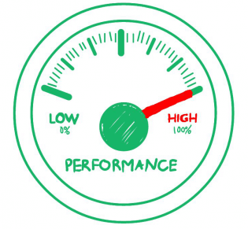

# 耐力测试教程：过程、工具和实例

## 耐力测试是什么？

耐力测试是一种测试技术，当系统负载测试，均在显著的时间量，来分析系统行为的持续使用。

耐力测试是测试一个应用程序或软件具有显着的负载延长了很长一段时间，以评估系统如何在持续使用。

这种类型的测试是在性能运行周期的最后阶段执行的。它确保应用程序能够处理扩展负载，而无需任何响应时间的恶化。

耐力测试是一个长期的过程，有时甚至到了最后的一年。这可以包括施加外部负载，诸如互联网业务或用户动作。这使得耐力测试不同于负载测试，通常在几个小时左右结束。

“ 耐力意味着能力，换句话说，你可以把耐力测试作为能力测试。”

## 耐力测试的目标

- 耐力测试的主要目标是检查内存泄漏。
- 怎样进行持续的系统使用。
- 为了确保在长时间段之后，系统响应时间保持相同或比其更好的测定值。
- 为了确定用户的数目和/或给定交易的系统支持和满足性能目标。
- 为了管理未来的负载，我们需要了解有多少额外的资源（如处理器容量，磁盘容量，内存使用量，或网络带宽）是必要的，以支持未来的使用。
- 寿命测试通常是通过使系统过载或通过减少某些资源和评价系统的后果。
- 这被执行以确保没有缺陷或内存泄漏发生后被认为是相对“正常”使用时段。

## 在耐力测试中监控什么

在耐力测试之后的测试。

- **内存泄漏测试** —— 检查验证是否存在存储器泄漏的应用，其可以导致或系统崩溃的问题。
- **测试连接关闭层之间的系统** —— 如果系统层之间的连接没有成功关闭，它可能会拖延一些或所有模块的系统。
- **测试数据库连接成功关闭** —— 如果数据库连接未成功关闭，可能导致系统崩溃
- **测试响应时间** —— 统测试系统的响应时间，作为应用程序变得不太高效，由于系统的长期使用的结果。

## 如何进行耐力测试

以下是耐力测试的基本测试方法

- **测试环境** —— 识别硬件，软件，操作系统所需的耐力测试，分配角色和职责，在团队等环境应准备就绪之前，测试执行。您还需要估计通用数据库的生产规模和年增长率。这是需要这样的，你需要测试你的应用程序将如何回应后一年，两个或五个。
- **创建测试案例，场景** —— 基于测试的性质-手动或自动化或两者的组合，测试用例设计，审查和执行，应计划。测试要强调系统、断点测试等，也应该是测试计划的一部分。测试系统的压力决定了应用程序的中断点。
- **测试估计** —— 提供了多长时间才能完成测试阶段的估计。它应根据所涉及的测试人员数量和所需测试周期的数量进行分析。
- **风险分析** —— 分析风险并采取适当的预防措施。根据风险因素优先考虑测试用例，并确定以下风险和问题测试人员可能在耐力测试阶段。
    - 性能会随时间保持一致吗？
    - 是否有其他未被发现的小问题？
    - 是否有外部干扰没有解决？
    
- **测试时间表** —— 确定预算，交付在时间框架内。**耐力测试**适用于一个巨大的，但自然负载安排的交易系统/应用程序的连续时间。

## 为什么耐力测试很重要

当**压力测试**使测试系统达到极限时，**耐力测试**会随着时间的推移将其应用到极限。

例如，最复杂的问题-内存泄漏，数据库服务器的利用率和反应迟钝的系统-发生在软件运行一段较长的时间。如果跳过耐力测试，那么在部署之前检测这些缺陷的几率非常低。

## 耐力测试工具

- WebLOAD
- LoadComplete
- Apache JMeter
- LoadRunner
- Appvance
- LoadUI
- OpenSTA
- Rational Performance Tester 

## 耐力测试的优点

- 这有助于确定如何在工作负载下的手柄系统。
- 提供准确的数据，客户能够使用以验证或提高它们的基础设施需求。
- 识别性能问题，可以在系统运行期间的高电平周期更长的时间
- 典型的问题，在小目标性能测试，这意味着它仍然可以确保即使在大负荷的跨度时间非常短。
- 该耐力测试也可用于检查是否存在任何性能退化后的长执行周期。

## 耐力测试的缺点

- 通常很难确定有多少应力有较好的应用价值。
- 耐力测试可能导致应用故障和/或网络，则有可能导致严重的环境破坏，如果测试不分离。
- 永久性数据丢失或损坏的发生可以通过系统的应力。
- 资源利用率是非常高的应力消除。
- 一些应用组件没有响应。
- 观察到未处理的异常是由最终用户来完成。

## 总结：

- 耐久性测试是负载测试的一个子集。
- 耐力测试是一个长期的过程，有时甚至到了最后一年。
- 检查验证
    - 内存泄漏测试
    - 测试响应时间
    - 测试数据库连接等。