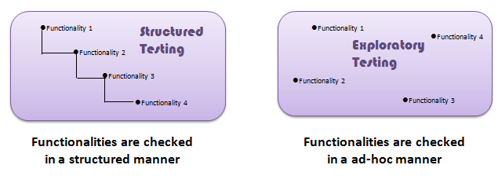
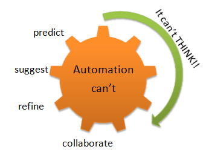

# 探索性测试教程：工艺、技术&amp;实例

## 什么是探索性测试吗？

探索性测试，是关于发现、考察和学习的测试。它强调个人测试员的个人的自由和责任。测试用例不是事先创建的，而是测试员在系统上检查系统.。他们可能记录下在执行测试之前的关于测试的想法。探索性测试的重点是在测试中进行更多的“思维”活动。

在测试脚本中，您设计测试用例并在测试执行之后进行。相反，探索性测试是同时进行的测试设计和测试执行的过程。

 脚本测试通常是没有思维的活动，测试人员执行测试的步骤和将实际结果与预期的结果进行比较。这种自动化测试执行活动可以不需要更多认知技巧。

 尽管当前的趋势是推动自动化测试，探索性测试是一种新的思维方式。自动化有其局限性

 

 这里有一些重大区别并探索性测试脚本：

| 脚本测试 |	探索性测试 |
|---------|-----------|
| 定向要求 	| 测试中的探索和需求|
| 测定在测试用例  | 在测试期间测定的测试用例 |
| 确认测试的要求  | 调查的系统或应用 |
| 强调预测和决策  | 适应能力和学习重点 |
| 包括确认测试 |	涉及调查|
| 为了控制测试 | 为了提高测试设计 |
| 你喜欢读草案演讲 | 正如其自发变换 |
| 该脚本在控制中 |该测试仪是在控制思想 |

探索性测试-

- 它不是随机测试而是以发现缺陷为目的的自测试
- 是结构严谨
- 认知(思维)相比，结构化的测试脚本。这个结构来自宪章、拳击等时间。
- 是高度可控和受教
- 它不是一种技巧而是一种途径。你目前正在做什么决定接下来执行什么动作。

## 探索性测试的准备：

通过以下5个方面进行探索性试验准备，也称为基于会话管理(sbtm 周期测试)：

### 1.创建一个错误分类(分类)
- 在过去的项目发现常见的故障类型
- 分析主要原因，分析存在的问题或故障
- 发现隐患,提出检验申请。
### 2.测试宪章
- 测试宪章应表明
        1.要测试的内容
        2.如何测试
        3.需要什么
- 测试的起点是思想的探索测试
- 测试协议有助于确定如何在端用户可以使用该系统  
### 3.时间箱
- 该方法包括对测试人员一起工作不少于 90 分钟
- 在会话时间 90 分钟中不应该有任何中断
- 时间盒可以延长或缩短 45 分钟
- 本届会议鼓励测试者反应的反应系统的准备和正确结果
### 4.审查结果：
- 缺陷的评价
- 从测试中学习
- 覆盖区域的分析
### 5.汇报：
- 汇编输出结果
- 比较宪章的结果
- 检查是否需要任何附加试验

在执行探索性测试的时候，需要做到以下几点：

- 测试任务应当是非常清楚的
- 记录对应该测试什么，它为什么需要测试和评估产品的质量
- 在探索性测试掐尖跟踪的问题和提出问题时
- 为了更好的对测试人员进行测试
- 我们测试的更多，更容易执行测试案例所需的正确的场景

必须采取以下监测和文档

- 测试覆盖率--我们是否要记录测试用例的覆盖范围和提高软件的质量
- 风险覆盖和风险都很重要？
- 测试执行日志记录的测试执行
- 问题/查询-记录对那个问题进行了探讨

聪明的探索性测试在较少的时间内找出更多的错误。。

## 探索性测试的利弊：

| 利 | 弊 |
|-----------|---------|
| 这个测试是有用的，当需求文件不可用或部分可用，  它涉及到侦查过程，有助于发现比正常测试更多的缺陷  发现缺陷通常忽略其他测试技术  迅速扩大了测试人员的想象，执行测试案例越来越多，最终提高生产效率，  该检测到的最小部分，覆盖了所有应用的要求 这个测试覆盖了所有的测试类型，涵盖了各种场景与案例， 激发创造力和直觉 测试执行期间生成新的想法 |此测试纯粹取决于测试人员的技能 有限域的知识的测试仪 不适合长时间执行 |

## 探索性测试的挑战：

这里有很多探索性测试的挑战，说明如下：

- 学习使用本软件或应用系统是一个挑战
- 失败的复制是困难的
- 确定是否需要使用工具可以挑战
- 确定的最佳测试案例是否执行困难
- 报告测试结果的挑战，报告并没有计划脚本或者案例比较实际结果或结局
- 所有文件的执行期间事件的记录
- 不知道什么时候停止测试，已明确作为探索性测试的测试方案来执行。

## 什么时候使用探索性测试？

探索性测试可以广泛使用，当

- 测试人员在测试团队经验丰富
- 早期迭代
- 有一个关键应用
- 新测试人员进入团队

结论：

执行探索性测试是针对测试脚本。它有助于提高测试用例。它用于学习和适应性。