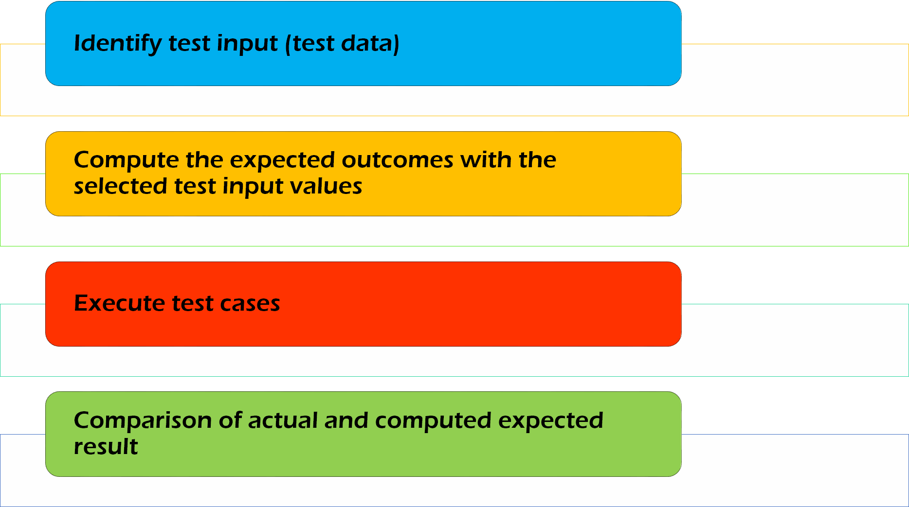

# 功能性测试

## 什么是功能测试？

功能测试是验证应用软件的每个功能与需求规范是否一致的一种测试。该测试主要涉及黑盒测试，不涉及应用程序的源代码。

通过提供适当的输入，来验证输出。通过比较软件实际的运行结果与预期的运行结果，对每一个系统功能进行测试。该测试包括：检查用户界面、API、数据库、安全性、客户机/服务器应用程序以及被测应用程序的功能。该测试可以手动或自动化进行。

## 功能测试都测什么？

功能测试的主要目的是检查软件系统的功能。它主要集中在：
- 主流功能：测试应用中的主要功能  
- 基本可用性：它包括测试系统的基本可用性。它检查用户是否可以没有任何困难的自由使用软件。  
- 可达性：检查系统对用户的可访问性  
- 错误条件：利用测试技术来检测错误条件。检查错误消息是否被适当的显示。  

## 功能测试过程

对应用程序做功能测试，必须遵循以下步骤：

- 了解需求  
- 识别测试输入数据  
- 用特定的测试输入值计算预期结果 
- 执行测试案例  
- 比较软件实际的结果和计算的预期结果是否相符  

## 功能性和非功能性测试

| 功能测试  | 非功能性测试 |
| :-----: | :-----:|
| 功能测试使用客户提供的功能需求规范来验证系统的功能是否正确。| 非功能性测试用来检查软件系统的性能、可靠性、可伸缩性和其他非功能方面。|
| 功能测试首先被执行  | 功能测试完成后才进行非功能性测试 |
| 手工测试或自动化工具都可以用于功能性测试 | 只有使用工具才可以有效地进行非功能性测试 |
| 功能测试的输入是业务需求  |	性能参数，如：运行速度、可扩展性，等，是非功能性测试的输入 |
| 功能测试描述产品做什么  | 非功能性测试描述产品工作的如何好 |
| 容易进行手动测试 | 手工很难测试 |
| 功能测试的类型有:   单元测试   冒烟测试  可用性测试   集成测试   白盒测试   黑盒测试   用户验收测试   回归测试 | 非功能性测试的类型有:   性能测试   负载测试   容量测试   压力测试   安全测试   安装测试  渗透测试   兼容性测试    迁移测试 |

## 功能测试工具：

有几个常用的工具用于执行功能测试。如下列表所示：

- [Selenium](http://www.guru99.com/selenium-tutorial.html) - 流行的开源功能测试工具  
- [QTP](http://www.guru99.com/quick-test-professional-qtp-tutorial.html) - HP 公司推出的界面友好的功能测试工具  
- [JUnit](http://www.guru99.com/junit-tutorial.html) - 主要用于 Java 应用程序，也可以用在单元测试和系统测试  
- [soapUI](http://www.guru99.com/soapui-tutorial.html) - 这是一个开源的功能测试工具，主要用于测试  Web 服务。它支持多种协议，例如：HTTP、SOAP 和 JDBC。
- Watir - 这是 Web 应用程序的功能测试工具。它使用 Ruby 脚本语言，在 web 浏览器处执行测试。

## 结论

功能测试是测试系统功能的过程，并确保系统按照业务文档中指定的功能运行。这个测试的目的是检查系统是否功能完善！！！