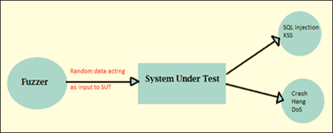

# 模糊测试教程：模糊策略和工具

## 模糊测试是什么？

模糊测试是一种测试自动化或半自动化测试技术，用于发现编码软件，错误和安全漏洞的操作系统或网络，通过输入无效的或随机的数据称为**模糊**的系统。之后对系统进行监视的各种异常，如崩溃的系统或失败的内置代码等。

模糊测试最初是由威斯康星大学的 Barton Miller 在 1989 年提出的。模糊测试或模糊是一个软件测试技术，它是一种**安全测试**。

## 为什么做模糊测试？

- 通常，模糊测试发现最严重的安全缺陷或故障。
- 模糊测试提供了更为有效的结果在黑盒测试中，数据测试和其他的调试方法。
- 模糊测试是用来检查软件的脆弱性。这是非常符合成本效益的测试技术。
- 模糊测试是黑盒测试技术。Fuzzing 是一种常见的方法用于黑客找到漏洞的系统。

## 模糊测试策略

模糊测试的测试的基本步骤-

**步骤 1)** 识别目标系统

**步骤 2)** 确定输入

**步骤 3)** 生成模糊化数据

**步骤 4)** 执行使用模糊数据测试

**步骤 5)** 监控系统行为

**步骤 6)** 记录缺陷

## 模糊测试的测试策略

- **基于突变的模糊器**改变现有的样本数据来创建新的测试数据。这是非常简单和直接的方法，这从协议有效样本和保持每一个字节或文件损坏。

- **基于代沟的模糊器**定义新的数据基于该模型的输入生成。它开始生成输入的划痕的规格的基础上。

- **基于协议的模糊器**，最成功是有知识的详细协议格式。将理解取决于规格。它涉及到写入到阵列的工具规范的模型然后利用测试生成技术并添加到说明书中的数据内容、顺序等。这也被称为句法测试，语法测试、稳定性测试等。fuzzer 能够生成测试用例，从已有的值，或者它们可以使用有效或无效的输入。

有两个限制协议为基础的模糊：

1. 测试无法进行，直至成熟规范。
2. 许多有用的协议的扩展。如果模糊测试是基于已发布的规格、测试新协议覆盖的范围比较有限。

- Fuzzing 技术的最简单形式是随机发送输入到软件或协议作为分组为事件。这种技术是非常强大的随机输入来找碴的许多应用和服务。
- 其他技术也可用，并且很容易实现。为了实现这些技术，我们只需要改变现有的投入。我们可以通过互换输入位变化的输入。

## 通过模糊测试检测缺陷类型

- **断言失败和内存泄漏**这种方法被广泛用于大型应用的 bug 影响的安全的存储器，这是个严重漏洞。
    
- **输入无效**
   在模糊测试，模糊器是用来生成一个无效的输入，用于测试错误处理例程，这是重要的，不控制其输入软件。简单模糊可以被称为负面测试方式。
    
- **正确的错误**
    模糊也可以用来检测某些类型的“正确性”的错误。如损坏的数据库，搜索结果不好等。
    
## 模糊测试的工具

这是用于网络安全工具，可广泛应用于模糊测试如 Burp Suite、Peach Fuzzer 等。

- **Peach Fuzzer**  
    Peach Fuzzer 提供了更强大和安全的覆盖比扫描仪。其他测试工具可以只搜索已知的线程，而 Peach Fuzzer 使用户找到已知和未知的线索。

- **尖峰代理**  
    它是一款专业级工具寻找应用级别的漏洞在 Web 应用程序中。尖峰代理包含，例如 SQL 注入和跨站点脚本，但它是完全开放的 Python 基础设施。秒杀代理可用于 Linux 和 Windows。

- **Webscarab**  
    Webscarab 是用 java 写的，移植到很多平台。应用 Webscarab 分析框架，使用 HTTP 和 HTTPS 协议。

    **例**：Webscarab 的作品作为一个拦截代理服务器，它允许操作员检查修改了浏览器在服务器收到的请求。允许在浏览器接收到服务器之前生成并更新响应。这样，如果 Webscarab 发现任何漏洞，它将制作报道的问题清单。

    
- **Burp**  
    Burp 用于 java web 应用安全工具。Burp 是用来对应用程序包括Web应用安全漏洞，如缓冲区溢出测试过程攻击，跨站脚本、SQL注入等。
    
- **OWASP WSFuzzer**  
    OWASP WSFuzzer 是 GPL 程序，用 Python 写的。GPL 程序的当前目标 Web 服务。在OWASP WSFuzzer HTTP 的当前版本基于 SOAP 服务的主要目标。
    
- **AppScan**  
   AppScan 的扫描和所有常见的 Web 应用程序的漏洞，如 SQL 注入测试，跨站点脚本，和缓冲区溢出。

## 模糊测试的优点和缺点

### 优势

- 模糊测试来提高软件安全性测试。
- 在错误发现起毛有时是严重的并且大多数时间被黑客利用，包括崩溃、内存泄漏、异常情况等。
- 如果有任何的错误，没能注意到测试人员限于时间和资源，这些 bug 也存在于模糊测试。

### 缺点

- 模糊测试不能提供全面的安全威胁和漏洞的完整画面。
- 模糊测试应对安全威胁，不会导致程序崩溃是不太有效的，如某些病毒、蠕虫、木马，等等。
- 模糊测试仅能够检测到简单故障或者威胁。
- 要有效地执行，将需要显着的时间。
- 设置随机输入的边界值条件是非常有问题的，但现在使用确定性算法的基础上用户输入的大多数测试人员解决这个问题。

## 总结：

模糊测试显示了在应用中存在的 bug。模糊可以保证检测不完全的 bug。但通过使用模糊技术，保证了应用程序的健壮性和安全，因为这种技术有助于使大多数的常见漏洞。