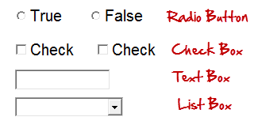
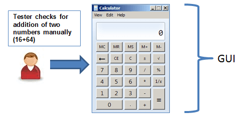
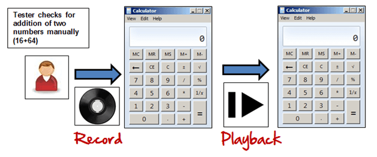
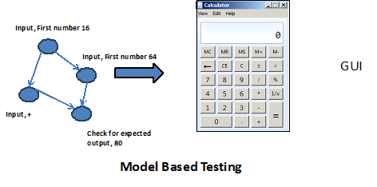

# GUI 测试：完全指南

让我们先了解了解 GUI 测试！！！

## 什么是 GUI？

有两种类型的接口用于计算机的应用程序。

命令行界面是在键入文本和计算机指令时做出响应。

GUI 代表图形用户接口，您使用图像而不是文本与计算机交互。

以下是可用于用户之间的交互和应用的 GUI 元素：

GUI测试，就是检查上述元件。

在本教程中，您将学习-

- GUI 测试是什么？
- GUI 测试的需要
- 你在 GUI 测试中做什么检查？
- GUI 测试的方法
- GUI 测试用例
- 演示：如何进行 GUI 测试
- GUI 测试的挑战 

## GUI 测试是什么？

GUI 测试是测试被测试应用程序的图形用户界面的过程。GUI 测试包括使用菜单、按钮、图标和所有类型的工具栏、工具栏、菜单栏、对话框和窗口等控件检查屏幕。

用户界面是用户所看到的。说如果你去 guru99.com 你将看到什么说主页是 GUI（图形用户界面）的网站。一个用户看不到源代码。用户界面是可见的。特别的，设计结构的重点是，想象他们是否正常工作。

在上述示例中，如果我们要做 GUI 测试，我们首先检查，所述图像在不同浏览器中完全可见。

此外，链路可用，并且当点击这个按钮时应该工作。

此外，如果在用户调整屏幕，图像内容也应该既不收缩或改变或重叠。

## GUI 测试的需要

现在 GUI 测试的基本的概念是明确的。一些问题将由你来思考

- 为什么进行 GUI 测试?
- 真的需要进行 GUI 测试吗？
- 测试的功能和逻辑的应用是不是足够的？？为什么要把时间浪费在 UI 测试。

像一个用户或者不是一个用户思考来获得答案。用户不必知道任何 XYZ 软件/应用。它是应用程序的 UI，这决定了用户将要使用的进一步应用。

一个普通的用户首先观察的设计和外观和是否容易让他了解用户界面。如果用户不舒服的接口或发现应用程序复杂的理解，他永远不会再使用该应用程序。这就是为什么，GUI 是一个值得关注的问题，并进行适当的测试，以确保 GUI 是免费的错误。

## 你在 GUI 测试做什么检查？

### 以下将清单将确保详细的 GUI 测试。

- 检查所有 GUI 元素的大小、位置、宽度、长度和可接受的字符或数字。例如，你必须能够提供输入到输入栏。
- 检查您可以使用 GUI 执行得应用程序的预期功能.
- 检查错误消息没有显示正确
- 检查清楚划分的屏幕的不同部分
- 检查应用程序中使用字体是可读
- 检查对中的文本是正确的
- 检查字体、颜色美观的警告信息
- 检查的图像具有良好的透明度
- 检查图像被正确地对齐
- 检查定位不同的 GUI 元素的屏幕分辨率。

## GUI测试的方法

GUI测试可通过三种方式：

### 基于手动的测试

根据这种方法，图形屏幕由测试人员手动检查符合所述要求的商业需求文档。

### 记录和重放

GUI测试可以用自动化工具完成。这是做了 2 个部分。在记录过程中，测试步骤由自动化工具捕获。在回放过程中，所记录的测试步骤在被测试的应用程序上执行.。这样的工具-例如 [QTP](http://www.guru99.com/quick-test-professional-qtp-tutorial.html)。

### 基于模型的测试

一个模型是描述系统的行为。它帮助我们了解并预测系统行为。在生成的模型有助于高效利用系统的要求。基于模型的测试需要考虑以下几点：

- 模型的建立
- 确定输入到模型
- 计算模型的预期输出。
- 运行测试
- 比较实际输出与预期输出
- 决定模型进一步的行动

一些测试用例建模技术，从中可以导出：

- 图表-描绘了检查系统的状态并在输入后检查状态
- 决策表-用于确定每个输入的结果的表

基于模型的测试是一个演变中的技术来产生测试用例的需求。其主要优点在于，相比于上述两种方法，可以确定不期望状态的 GUI。

### 以下是可用来进行 GUI 测试的开源工具。

| 产品 | 许可下 |
|--------|-----|
| AutoHotkey | GPL | 
| [Selenium ](http://www.guru99.com/selenium-tutorial.html)	| [Apache](http://www.guru99.com/apache.html) |
| sikuli | MIT |
| Robot Framework | Apache  |
| Water 	 | BSD |
| Dojo Toolkit | BSD |

## GUI测试用例

### GUI测试主要包括

1.测试元件的大小、位置、宽度、高度。  
2.测试被显示的错误信息。  
3.测试了不同的画面。  
4.所述测试的字体是否可读。  
5.测试在不同分辨率的画面的缩放，例如 640 x 480,600 x 800 等。  
6.测试取向的文本和其他元素（比如图标、按钮等或不在适当位置。  
7.测试所述的字体颜色。  
8.测试错误消息、警告消息的颜色。    
9.测试图像是否具有良好的透明度。  
10.测试图像的对准。  
11.测试拼写。  
12.使用系统接口时用户必须不沮丧。  
13.测试该接口是否有吸引力。  
14.测试根据滚动条的大小的页面。  
15.如果禁用测试的任何字段。  
16.测试的图像的大小。  
17.测试标题是否被正确地对准或不对准。  
18.测试超链接的颜色。  

## 演示：如何进行 GUI 测试

在这里，我们将使用一些样品测试以下画面。

以下是测试用例的示例，包括 UI 和可用性测试场景。

TC 01-验证拥有标签“Source Folder”的文本框准确地对准。

TC 02-验证拥有标签“Package”文本框准确地对准。

TC 03-验证标签的名称为“Browse”的按钮位于名称为“Source Folder”的文本框的一端。

TC 04-确认标签名称为“Browse”的按钮位于名称为“Package”的文本框的端侧。

TC 05-验证拥有标签“Name”的文本框准确地对准。

TC 06-验证标签“Modifiers”由 4 个单选按钮的名称组成，缺省的、私有的、受保护的。

TC 07-验证标签“Modifiers”由 4 个单选按钮按一行对齐。

TC 08-验证标签“Superclass”标签下的“Modifiers”，由一个下拉必须正确对齐。

TC 09-验证标签“Superclass”包括一个带有标签 “Browse”，它必须被正确对准。

TC 10-验证单击任何单选按钮，默认鼠标指针必须更改为鼠标指针。

TC 11-确认用户必须能够在不被下拉的“Superclass”类型

TC 12-验证如果有错误的选择，必须产生适当的错误。

TC 13-验证在任何必要的地方都必须生成红色的错误。

TC 14–验证标签必须使用适当的错误消息。

TC 15-验证每次单选时必须默认选择单选按钮。

TC 16-验证选项卡按钮必须正常工作，同时也在其他领域靠近。

TC 17–验证所有页面都必须包含正确的标题。

TC 18-验证页面文本必须被正确对准。

TC 19–验证更新后的任何字段必须显示适当的确认消息。

TC 20-验证只有 1 个单选按钮必须选择和多单复选框可以选择。

## GUI 测试的挑战

在进行回归测试时，最常见的问题是应用程序界面经常发生变化。这是非常困难的测试和识别是否是一个问题或增强。当您没有任何关于GUI更改的文档时，问题就体现出来了。

## GUI 测试工具

- Selenium
-[QTP](http://www.guru99.com/quick-test-professional-qtp-tutorial.html)
-[Cucumber](http://www.guru99.com/cucumber-tutorials.html)
- SilkTest
- TestComplete
- Watir

单击此处了解[Selenium](http://www.guru99.com/selenium-tutorial.html)，[QTP](http://www.guru99.com/quick-test-professional-qtp-tutorial.html)和[Cucumber](http://www.guru99.com/cucumber-tutorials.html)。

## 结论：

一个软件产品的成功很大程度上取决于 GUI 如何与用户交互，并易于使用其各种特性。因此，图形界面测试是非常重要的。手动 GUI 测试有时会重复和无聊，因此容易出错。GUI 测试非常推荐自动化。

