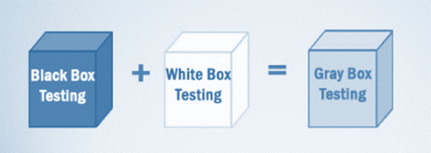

# 灰盒测试：工艺、技术、战略、挑战

## 灰盒测试是什么？

灰盒测试是一种测试软件产品或应用程序的部分知识的内部工作原理的应用程序。

在此过程中，特定错误的上下文相关的 Web 系统都是常见的。将它浓缩而提高了测试覆盖范围上所有层的任何复杂系统。

灰盒测试是的软件测试方法，组合两个白盒测试和黑盒测试的方法。

- 在白盒测试内部结构（代码）是已知的
- 黑盒测试内部结构（代码）未知
- 在灰盒测试内部结构（代码）是部分已知的

灰盒测试给出了测试应用程序、表示层以及代码部分的能力。它主要用于集成测试和渗透测试。

**灰盒测试的例子：**当测试特征像孤儿链接或网站链接，如果测试遇到的这些链接有问题，那么他可以在 HTML 代码进行更改，可以直接实时检查。

## 为什么灰盒测试

灰盒测试是由于以下原因，

- 它提供了组合黑盒测试和白盒测试这两者的优点
- 它结合了开发者和测试人员的输入，提高了产品的整体质量
- 它减少了测试功能和非功能类型的进程的开销
- 它提供足够的自由时间用于开发人员修复缺陷
- 测试从用户的角度，而不是设计者的观点

## 灰盒测试策略

若要执行灰盒测试，测试人员没有必要访问源代码。测试是基于算法、体系结构、内部状态或其他高层次的程序行为描述而设计的。

执行灰盒测试-

- 它直接应用的黑盒测试技术
- 它是基于需求的测试用例生成，因此它预设的所有条件在程序的断言的测试方法。

灰盒测试技术-

- **矩阵测试：**这种测试技术包括定义程序中存在的所有变量。
- **回归测试：**检查是否在先前的版本改变倒退了其他方面的程序的新版本。它将通过测试策略，如重测所有，复试危险的用例，重测防火墙内。
- **正交数组测试或 OAT：**它提供了最小测试用例的最大代码覆盖率。
- **模式测试：**该测试是在以前的系统缺陷的历史数据。与黑盒测试不同的是，灰盒测试在代码中挖掘并确定失败的原因

通常，灰箱方法使用软件自动化测试工具进行测试。驱动程序和存根模块是创建以减轻测试人员手工生成的代码。

## 灰盒测试执行步骤为：

- **步骤 1：**确认输入
- **步骤 2：**确认输出
- **步骤 3：**确定主要路径
- **步骤 4：**识别功能
- **步骤 5：**开发输入子功能
- **步骤 6：**开发输出功能
- **步骤 7：**执行测试案例的子函数
- **步骤 8：**验证结果正确的子函数
- **步骤 9：**重复步骤 4 & 8 的其他子函数
- **步骤 10：**重复步骤 7 & 8 的其他功能

灰盒测试的测试用例包括 GUI 相关、安全相关、数据库相关、浏览器相关、操作系统相关等。

## 灰盒测试挑战

- 当被测部件遇到某种故障时，可能会导致正在进行的操作流产
- 当测试执行完整，但结果的内容是不正确的。

## 总结：

- 系统缺陷的整体成本可以减少，并防止进一步通过灰盒测试
- 灰色框中是更适合的 GUI 测试，性能测试、安全评估、Web 应用、Web 服务等。
- 灰盒测试技术
    - 矩阵测试
    - 回归测试
    - OAT 或正交阵列测试
    - 模式测试