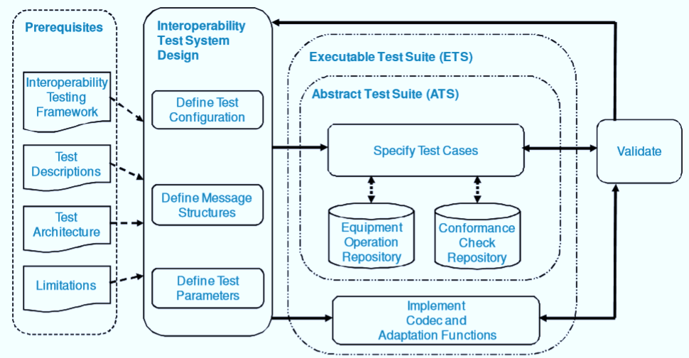

# 互操作性测试在软件测试中的应用

## 互操作测试是什么？

互操作性测试是一种测试软件是否可以与其他软件组件、软件或系统进行交互操作的测试类型。

互操作性测试的目标是证明端对端功能之间的两个通信系统要求采用标准的那些系统。

例如，互操作性测试之间检查到智能手机和平板电脑通过蓝牙数据传输。

互操作性测试风险

由于缺乏互操作性测试相关的风险

- 数据丢失
- 不可靠的性能
- 不可靠的操作
- 误操作
- 可维护性低

在本教程中，您将学习-

- 不同层次的软件互操作性

- 为什么要进行互操作性测试

- 互操作测试的测试过程

- 互操作性测试中的挑战

- 一致性测试和互操作性测试的差异

## 不同层次的软件互操作性

有不同层次的互操作性测试，

- 物理互操作性
- 数据互操作性型
- 规范级别互操作性
- 语义互操作性

## 为什么要进行互操作性测试

进行互操作性测试是因为，

- 它确保了端到端服务提供跨两个或更多个不同供应商的产品
- 软件产品应能够与其他组件或设备的兼容性问题

## 互操作测试的测试过程

用于互操作测试的测试过程包括以下步骤

**步骤 1：**项目推出

- 形式化定义和声明的工作管理基础设施项目。

**步骤 2：**建立测试实验室

- 确认所有必要的技能和建立的自动化工具的测试活动
- 使用自动化工具与测试用例最小化重新使用测试用例
- 维护数据库的配置文件
- 用于记录和分析度量项目
- 记录不成功的测试基准配置和分析

**步骤 3：**制定试验计划

- 编写测试方案
- 定义测试案例和程序
- 设置必要的监控设备的维护。

**步骤 4：**测试执行计划

- 执行测试案例
- 与测试团队分析故障根源

**步骤 5：**文件结果

- 使用测试执行工作日志，记录笔记

**步骤 6：**释放资源和评价业绩，

- 用自动化工具的测试结果分析

## 互操作性测试的测试策略

互操作性测试的测试策略包括

- 连接两个或多个来自不同厂商的设备
- 检查设备之间的连通性
- 检查设备彼此可以发送或接收分组/帧
- 检查数据是否在网络和设备层正确处理
- 检查算法是否正确工作
- 结果确定：检查下一个结果
- 结果不正常：使用监控工具来检测误差源。
- 测试结果报告的报告工具。

## 互操作性测试挑战

互操作性测试中的挑战

- 确定缺陷的根本原因
- 准确测量
- 测试的可伸缩性
- 网络复杂性
- 测试的测试设备
- 记录测试结果和经验
- 需求不足

## 互操作性测试与一致性测试

| 互用性测试 | 一致性测试 |
|-----------|----------|
| 这确保了将产品或软件互操作性的认证的产品没有任何问题 |确保产品符合要求的标准和规格 |

## 总结：

- 互操作性测试只不过是检查软件是否可以与另一个软件组件进行交互操作
- 它确保软件产品应该能够与其他组件或设备进行通信，而不存在任何兼容性问题。