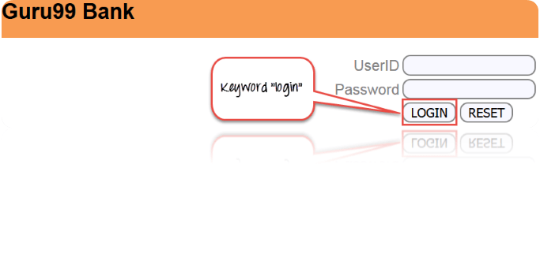

# 关键字驱动框架测试 — 完整教程

## 关键字驱动框架是什么？

关键字驱动的框架是一个表驱动的测试或行动字为基础的测试。它是一种适合于手工和自动化测试的软件测试方法。

## 关键字驱动测试是什么？

关键字驱动测试是一种脚本技术，它使用数据文件包含与正在测试的应用程序相关的关键字。这些关键字描述了执行特定步骤所需的操作集。

关键字驱动测试包括高和低级别的关键字，包括关键字参数，它是用来描述一个测试用例的动作。

在关键字驱动测试中，首先识别一组关键字，然后将与这些关键字相关的动作（或函数）关联起来。在这里，每一个测试动作像打开或关闭浏览器，点击鼠标，键盘，等等的关键词如 **openbrowser，单击描述，Typtext** 等。

### 例如：

1. **登录**“guru99”网站–关键字“登录”将用于我们的自动化框架，以测试登入的功能或动作。
2. **注销**“guru99”网站-关键词“注销”将用于我们的自动化测试框架，要测试注销功能或动作。

我们还将看到更多例子。

### 关键词的例子

| 关键字	| 描述 |
|-------|-------|
| 注册	| 登录到演示站点 guru99 银行|
| 电子邮件	| 发送电子邮件 |
| 注销	| 从现场演示guru99银行| 
| 通知	| 找到未读通知 |

为了创建关键字驱动框架，你需要以下方面：

1. **Excel 表格** — 识别关键字并将它们存储在 Excel 表中
2. **函数库** — 函数库包括业务流程的函数（任何网站的登录按钮），所以在执行测试时，它会从 Excel 表中读取关键字并相应调用函数
3. **数据表** — 数据表用于存储将在应用程序中使用的测试数据
4. **对象存储库** — 基于关键字驱动的框架，可以使用对象库
5. **测试脚本** — 基于框架的设计，可以为每个手动测试用例或单个驱动程序脚本编写测试脚本。

## 为什么要做关键字驱动测试

关键字驱动测试是由于以下原因

- 标准库处理的通用组件
- 使用这种方法测试可以以更抽象的方式书写
- 高程度的重用
- 细节的脚本是隐藏于用户
- 用户不具有使用脚本语言
- 测试是简洁、可维护和灵活的

## 如何进行关键字驱动测试

基于关键字的检测可以以两种方式，手动和自动。但通常，它是使用自动化测试。

基于关键字的测试自动化的目标是

- 这有助于减少维护成本
- 避免重复规格
- 功能脚本的重用
- 更好的测试支持和可移植性
- 用更少或相同的努力达到更多的测试

通过关键字驱动测试，您可以在开发的早期阶段创建一个简单的功能测试，一步一个地测试应用程序。编写关键字驱动测试的最简单方法是记录它们。记录后，测试可以根据要求修改和定制。

每一个关键词需要至少一个命令连接，测试脚本或函数，从而实现对关键字相关的行动。

当执行测试用例时，关键字由测试库解释，该测试库由测试自动化框架调用。

关键字驱动测试所涉及的主要活动是

**步骤 1：**识别低级别和高级别关键字

**步骤 2：**实现关键字作为可执行文件

**步骤 3：**创建测试用例

**步骤 4：**创建驱动脚本

**步骤 5：**执行自动化测试脚本

## 用于关键字驱动测试的工具

用于关键字驱动测试的工具很少。

- HP QTP
- Selenium

## 关键字驱动测试的好处

- 它允许功能测试人员在应用程序准备就绪之前计划测试自动化
- 测试可以开发没有编程知识
- 它不依赖于特定的编程语言或工具
- 兼容任何可用的自动化工具在市场上

## 测试案例样品

1. TC_01：guru99 登录到演示站点，发现许多交易是如何进行
2. TC_02：guru99 登录到演示站点，发送一封电子邮件给你的一个客户然后退出
3. TC_03：guru99 登录到演示站点，并检查是否接收到任何通知

## 总结：

- 关键字驱动测试是一种脚本技术，它使用数据文件包含与正在测试的应用程序相关的关键字
- 关键字驱动测试通常由自动化测试。
- 测试可以开发没有编程知识
- 测试与市场上可用的任何自动化工具兼容