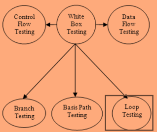
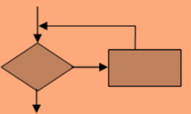

# 循环测试教程 —— 类型，策略，限制和例子

## 循环测试是什么？

循环测试是完全集中于循环结构的有效性的测试的变体。它是控制结构测试的一部分（路径测试，数据验证测试，状态测试）。

循环测试是一个白盒测试。该技术被用于测试循环的程序。

## 循环测试的类型

循环测试的类型有

- 简单回路
- 嵌套循环
- 级联循环
- 非结构化的循环

## 为什么要循环测试？

循环测试有如下原因

- 测试可以修复循环重复问题
- 循环测试可以显示性能/容量瓶颈
- 通过测试回路，回路中的未初始化的变量的确定
- 它有助于确定循环初始化问题。

## 循环测试的测试策略

循环测试时，必须检查三个不同的级别：

- 输入循环时
- 在执行期间
- 当循环离开

对所有这些循环测试策略如下

### 简单回路

一个简单的循环测试如下方式：

1. 跳过整个循环
2. 使 1 个通过循环
3. 使 2 个通过循环
4. 通过使一个回路在 a < b，n 是通过循环的最大数目
5. 使 b、b-1；b1 通过环路，其中“b”通过回路允许的最大路径数。

### 嵌套循环

对于嵌套循环，您需要遵循以下步骤。

1. 将所有其他循环设置为最小值，并在最内层循环开始
2. 对于最内层循环，执行一个简单的循环测试，并以最小迭代参数值保存外循环
3. 执行下一个循环测试并向外工作。
4. 继续，直到最外层循环已测试。

### 级联循环

在级联循环中，如果两个循环彼此独立，则使用简单循环进行测试，或者用嵌套循环测试它们。

但是，如果一个循环的循环计数器被用作其他的初始值，那么它将不被认为是一个独立的循环。

### 非结构循环

对于非结构化的循环，它需要重组的设计，以反映使用结构化的编程结构。

### 回路测试的限制

- 循环错误主要出现在低级软件中
- 在循环测试中发现的错误不是很微妙
- 许多错误可能会被操作系统发现，因为它们会导致内存边界的侵犯，检测到的指针错误等。

## 总结：

- 回路测试是白盒测试。该技术被用于在测试循环的程序。
- 循环测试可以显示性能/容量瓶颈
- 循环错误主要出现在低级软件中