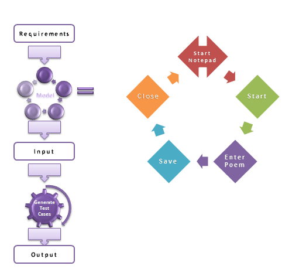
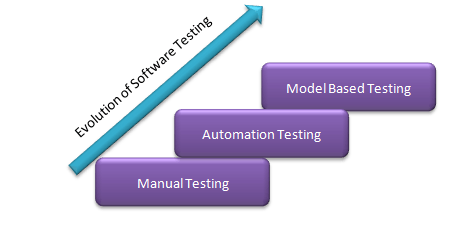
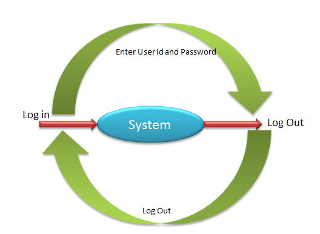
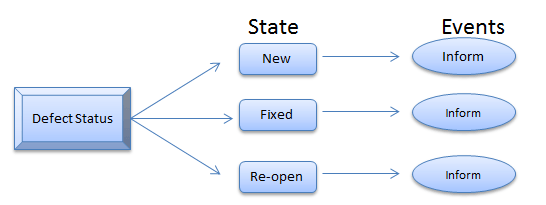
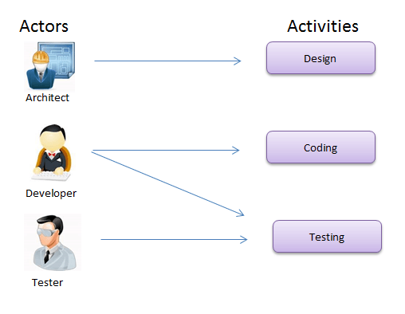

# 基于模型的测试——你必须知道的东西！

在进行基于模型的测试之前，先让我们了解模型是什么—

## 什么是模型？

模型是对系统行为的描述。行为可以描述输入序列，动作，条件，输出和数据流从输入到输出。它实际上应该是可以理解的，可重复使用；共享必须在测试系统的精确描述。

这有许多可供选择的方面并且描述了不同的系统行为。该模型的实例是：

- 数据流
- 控制流
- 依赖图
- 决策表
- 状态转换机

## 基于模型的测试

基于模型的测试是一种运行时行为的测试软件检查的由正式规范或模型。
预测的测试技术。在其他方法中，它描述了系统如何响应动作（由模型决定）的行为。如果系统响应于预期，则提供。
它是一个轻量级形式化方法来验证系统。该测试可以用于测试硬件和软件。

上面的模型解释了记事本中写诗的简化方法以及可能涉及到的每一步的操作。对于每个动作(如启动、入诗，保存)，测试案例生成和输出可以被验证。

基于模型的测试是一种新的软件测试方法。软件测试的演变如下所示—

## MBT 的类型：

这里有两种类型的基于模型的测试。

1.脱机/先验：生成之前执行的测试套件。测试套件是一组测试案例。  
2.在线/在线：测试执行期间测试套件的生成

## 测试的不同模型：

为了理解 MBT，需要了解一些有关模型解释如下。让我们逐一通过：

### 有限状态机

该模型帮助测试者评估结果以取决于所选择的输入。可以有各种组合的输入相应的系统状态。

该系统将具有特定状态和当前状态，这由测试人员给出的输入集控制。

举个例子-

有一种系统，它允许员工登入到应用中。现在，员工的当前状态是“出去”，成为“中”标志后进入系统。在“进”状态，员工在系统中可以查看、打印、扫描文件。

### 状态图

它是有限状态机的扩展，可用于复杂和实时系统。状态图是用来描述系统的各种行为。它有一定数量的状态。系统的行为进行了分析，并表示在每个国家的事件的形式。

例如-

缺陷在缺陷管理状态作为新的工具。一旦开发者已经改变到固定状态。如果缺陷是不固定的变化状态来重新打开。状态图表应这样来设计，即它应呼吁每个事件的状态。

## 统一建模语言(UML)

统一建模语言( UML )是一个标准化的通用建模语言。UML 包括一组图形符号技术创造视觉模型来描述复杂的系统行为。

UML 有这样的描述：

- 活动  
- 演员
- 业务处理
- 组件
- 程序语言

## 基于模型的测试的挑战：

 MBT 在每个组织中部署显然需要大量的投资和努力。
 
 MBT 的缺点如下：

- 测试员必备的技能 
- 学习时间会更多
- 该模型本身难以理解

## 模型测试的好处：

 MBT 的优点是：

- 简单的测试套件/套件的维护 
- 减少成本
- 提高测试覆盖率
- 可以在多个不同的机器上运行
- 早期缺陷检测
- 增加的缺陷计数
- 节约时间
- 提高测试人员工作满意度

## 结论

测试人员在测试过程中建立心理模型。这些心理模型可以转化为纸质模型。这有助于测试人员实现可读性和可重用性。