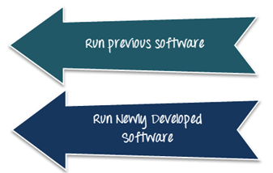

# 并行测试教程：在 5 分钟内学会

## 并行测试是什么？

并行测试是同时测试一个或多个应用程序的应用程序以缩短测试时间。

当任何组织从旧系统转移到新系统时，遗留数据是一个重要的组成部分。传输这些数据是一个复杂的过程。

在软件测试中，验证新开发的系统与旧系统的兼容性是通过“并行测试”。

在并行测试中，测试人员同时运行两个不同版本的软件。目的是找出遗产制度和新制度是否相同或不同。它确保新系统能够有效地运行软件。

下图演示了并行测试。

## 为什么要做并行测试

并行测试是由于以下原因，

- 确保应用程序的新版本正确执行
- 为了确保新老版本之间的一致性是相同的
- 检查两个版本之间的数据格式是否已更改
- 检查新应用程序的完整性

例如，目前用户使用 1.0 版本的应用程序，并从3月份到另一用户正在使用的应用程序的版本、比如版本 1.1。

在这种情况下，测试人员需要进行并行测试，以评估数据迁移是否成功完成。还检查新版本中的更改是否不影响系统功能。测试人员必须验证更改是否正确执行，用户根据要求获得所需的输出。

## 什么时候做并行测试

并行测试可以广泛使用当

- 公司由旧体制向新体制转变
- 在两个系统上执行同步时
- 从一个系统导入到另一个系统的遗留数据
- 所有结果应更精确地定义。例如，金融领域或保险领域的计算是一个主要功能的系统。

## 并行测试的测试策略

对于执行并行测试，您可以简单地创建几个项目，将测试应用程序的不同部分（从属项目）和一个项目（主项目），将运行这些项目。

并行测试有两级标准。

1. **并行测试输入准则**

    并行测试输入条件定义了并行测试能够有效执行之前必须满足的任务。
    
2. **并行测试退出准则**

    并行测试退出标准定义了并行测试阶段的成功结论。

在执行并行测试之前，有几个条件必须被满足。

- 并行测试不能开始，直到环境设置完成。
- 所有的先决条件和方案应首先定义
- 必须成功迁移遗留数据和新数据
- 直到所有的退出标准得到满足，并行测试才完成

要执行并行测试，应遵循以下步骤

**步骤 1：**对新开发的系统运行旧系统

**步骤 2：**了解两个系统之间的不同

**步骤 3：**使用相同输入去完成循环

**步骤 4：**测量新开发的系统与旧系统的输出

**步骤 5：**如果发现 Bug，报告原因

## 并行测试的良好实践

执行并行测试这里有一些技巧和诀窍，这可能会有用。

- **并行测试中识别的典型错误**

内部逻辑改变

产品流动变化

主要功能是修饰

- **需要多少周期**

测试周期的多少取决于模块的复杂性。

使用预先定义的测试数据运行多个场景周期，这是以前的系统通过的

- **分类差异**

    当我们运行并行测试周期时，无论是新的还是遗留系统的结果都应该用差异化的方法进行在线测量。我们捕获的每一个差异都应该根据错误的类型来定义。
    在循环过程中发生的错误类型

    错误测试者在执行并行测试时应注意以下事项。
    - 输入错误
    - 旧系统错误
    - 或可接受的不同解释
    - 意外的错误

## 什么不是并行测试

|　它是并行测试　| 它不是并行测试 |
|----------------|-------------|
| 测试更新应用程序对以前的应用程序。 | 使用保留输入条件的新软件运行旧场景。 |
| 目的是根据以前的系统找出结果。 | 对新老系统有一定的了解。 |
| 只测试一个软件。 | 交叉的凉亭或跨平台测试。 |
| 目的是找出设计问题。 |  知道差异不是必需的。  |

## 并行测试的挑战

- 需要完整的产品知识。
- 每一个结果都应该测试
- 需要专注于产品的数据输入和流程

## 总结：

- 并行测试多个被测试应用或应用子组件中的一个，同时减少测试时间。
- 这确保了新系统能够足够有效地运行的软件。