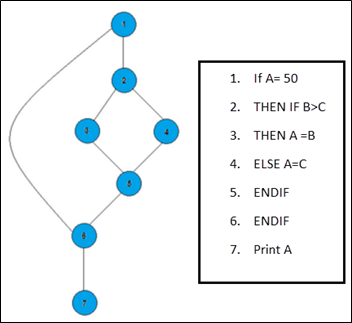

# 路径和基本路径测试

## 路径测试是什么？

路径测试是测试结构的方法，该方法涉及使用一个程序的源代码中找到所有可能的执行路径。它有助于以确定在所有故障的代码。该方法被设计为执行所有或选择的路径的计算机程序。

任何软件程序包括多个入口点和出口点。这些测试的每个点是一个具有挑战性和耗时的。为了减少冗余测试和测试覆盖率达到最大，使用基本路径测试。

## 基本路径测试是什么？

基本路径测试是相同的，但它是基于白盒测试的方法，定义了基于流的逻辑路径，或者可以通过程序。基本路径测试可能涉及执行所有块中的最大与最小路径覆盖的测试用例。它是一种混合的分支路径测试和测试方法。

基本路径测试的目的是限定数量的独立的路径，这样测试用例的数量需要最大化（可以明确定义每个测试案例的覆盖)。

这里我们将以一个简单的例子，以更好地了解哪些是包括基本路径测试

在上面的例子中，我们可以看到有几个条件语句根据不同的条件执行。这里有3个路径或条件，需要进行测试，以获得输出，

- **路径 1**：1，2，3，4，5，6，7
- **路径 2**：1、7
- **路径 3**：1、6、7

## 基本路径测试的步骤

基本路径测试中涉及的基本步骤包括

- 绘制控制图（确定不同的程序路径）
- 计算圈复杂度（指标确定独立路径数）
- 依据设定的路径
- 生成测试用例以执行每个路径

## 基本路径测试的好处

- 这能够减少冗余测试
- 可以把注意力集中在程序逻辑
- 它有助于促进与任意设计案例解析
- 测试用例集锻炼基础，将执行语句在程序每一次

## 结论：

基本路径测试有助于确定所有故障代码。