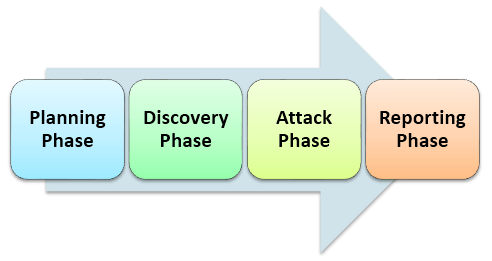

# 渗透测试教程：学习手动和自动类型渗透测试

## 什么是渗透测试？

渗透测试是一种用于测试系统或应用程序不安全区域的安全测试。这个测试的目标是找到所有正在测试的系统中存在的安全漏洞。漏洞是攻击者可以破坏或获得授权访问系统或其内部的任何数据的风险。它也被称为 pen testing 或 pen test 。

漏洞通常是在软件开发和实施阶段意外地引入。常见漏洞包括设计错误、配置错误、软件错误等。

## 为什么渗透测试？

 

渗透是企业必不可少的—

- 金融部门，如银行，投资银行，股票交易交易所希望他们的数据是安全的，渗透测试是必不可少的，以确保安全
- 在软件的情况下，如果系统已经被黑客攻击并组织以确定是否有任何威胁仍然存在于所述系统，以避免未来的攻击。
- 主动渗透测试是防范黑客的最佳保障

## 渗透测试的类型：

渗透测试的类型通常取决于范围和组织是否想模拟攻击的员工，网络管理员（内部来源）或由外部来源。渗透测试有三种类型，它们是

- 黑盒测试
- 白盒渗透测试
- 灰盒渗透测试

在黑盒渗透测试，测试人员不了解被测试的系统。他负责收集有关目标网络或系统的信息。

在一个白盒渗透测试，测试人员通常是具备对网络或系统的一个完整的信息进行测试，包括 IP 地址模式，源代码、操作系统等细节，这可以被视为一个模拟的任何内部消息攻击（一个组织的员工）。

在灰盒渗透测试，测试人员提供了部分知识的系统。它可以被认为是一个外部黑客谁获得了非法访问一个组织的网络基础设施文件的攻击。

## 渗透测试过程：

以下是执行渗透测试所需的活动—

### 1. 规划阶段
1. 确定的范围和战略的任务   
2. 现有的用于定义与范围的安全策略、标准
### 2. 发现阶段  
1. 收集尽可能多的信息，该系统包括在系统数据、用户名称和密码。这也被称为 FINGERPRINTING
2. 端口扫描与探测
3. 检查是否有漏洞的系统
### 3. 发作阶段
1. 找到你需要利用各种漏洞利用特权所必需安全系统
### 4. 报告阶段
1. 报告必须包含详细调查结果
2. 发现漏洞的风险及其对业务的影响
3. 建议和解决方案

在渗透测试的主要任务是收集系统信息。有两种方式收集信息-

- “一对一”或“一对多”模式与主机：测试人员执行技术，以线性方式对任何一个目标主机或逻辑分组的目标主机（如子网）。
- “多对一”或“多对多”模型：测试人员利用多个主机执行信息采集技术，在一个随机的，有限的速度，并在非线性。

## 渗透测试的工具：

有多种工具中使用的渗透测试和工具是重要的：

1. [NMap](https://nmap.org/) - 这个工具被用来进行端口扫描、OS 的识别、跟踪路由以及漏洞扫描。
2. [Nessus](http://www.tenable.com/products/nessus-vulnerability-scanner) - 这个是传统的基于网络的脆弱性的工具。
3. Pass-The-Hash - 通过这一工具主要用于密码破解。
4. [Cain and Abel](http://www.oxid.it/) - 这个工具主要用于口令恢复、网络嗅探、扫描无线和 VoIP。

## 测试人员的角色和职责：

测试人员的工作是：

- 测试人员应收集必要信息的来组织渗透测试
- 发现缺陷，使黑客可以攻击一个目标机器
- 笔测试人员应该像真正的黑客只是道德上的。
- 测试人员应完成的工作可再现，所以，开发者就可以很方便地修理它
- 开始日期和结束日期测试的执行应该被预先定义。
- 测试人员应负责任何损失或测试期间的系统信息
- 测试人员应保存机密数据和资料

## 手动对自动化渗透测试：

| 人工渗透测试 | 自动渗透测试 |
|-------------|------------|
| 手动测试需要专业人员运行测试	| 自动化测试工具为经验较少的专业人员提供清晰的报告 |
| 手工测试需要 Excel 和其他工具来跟踪它	| 集中测试自动化工具和标准 |
| 在手动测试，测试间的不同结果	| 在自动化测试结果的情况下，从测试到测试没有变化 |
| 内存清理应该被用户记住	| 自动化测试将全面的清理 |

## 渗透检测的局限性：

渗透测试无法发现系统中的所有漏洞。渗透测试人员的时间、预算、范围、技能有局限性

以下是当我们做渗透测试是的副作用：

- 数据丢失和损坏
- 停机时间
- 增加成本

## 结论：

测试人员应该更像一个真正的黑客，并且测试该应用或系统中，需要检查代码是否被安全地写入。渗透测试的效果将是实现安全性策略。渗透测试策略和方法论上的地方进行渗透测试更有效。