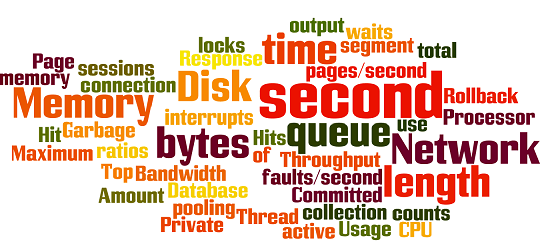

# 性能测试教程：类型、过程和重要指标

## 什么是性能测试?

软件性能测试是质量保证的一种手段（QA）。它涉及测试软件应用程序，以确保他们将在他们预期的工作量。

软件系统支持的特征和功能不是唯一关注的问题。一个软件应用程序的性能像它的响应时间，做的事。性能测试的目标不是找出 bug，而是消除性能瓶颈

性能测试的重点是检查软件程序

- 速度-决定应用程序是否快速响应
- 可扩展性-确定软件应用程序可以处理的最大用户负载。
- 稳定性-确定应用程序在不同负载下是否稳定

## 为什么做性能测试？

性能测试是为了提供利益相关者的信息，有关他们的应用程序的速度，稳定性和可扩展性。更重要的是，性能测试发现需要的产品进入市场前的改进。没有性能测试，软件可能遭受的问题，如：运行缓慢，而多个用户同时使用，在不同的操作系统和可用性差的不一致性。性能测试将决定他们的软件是否满足预期工作负载下的速度、可扩展性和稳定性要求。应用程序发送到市场表现不佳的指标，由于不存在或性能测试不佳，可能会得到一个坏名声，不能达到预期的销售目标。此外，关键任务的应用程序，如航天发射计划或救生医疗设备的性能测试，以确保他们运行了很长一段时间没有偏差。

## 性能测试的类型

- **负载测试**-检查应用程序在预期用户负载下执行的能力。我们的目标是在软件应用程序运行之前识别性能瓶颈。
- **压力测试**-包括测试在极端工作负载下的应用程序，以了解它如何处理高流量或数据处理。我们的目标是确定一个应用程序的断点。
- **耐久性测试**-以便确信在预期软件可以处理的负载。
- **尖峰测试**-测试的软件的反应中的大尖峰负荷突然产生的。
- **测试体积**-在测试大体积的。数据填充的数据库和软件的总体系统的行为进行监控。目的是检查软件在对应用的性能在不同的数据库。
- **可伸缩性测试**-所述可伸缩性测试的目的是确定应用程序的软件的有效性的扩大来支持用户负载的增加。它帮助您计划容量添加到软件体系。

## 常见性能问题

大多数性能问题围绕着速度、响应时间、加载时间和可扩展性较差。速度往往是其中最重要的属性的应用。低速运转的应用就会失去潜在的用户。性能测试保证 APP 的运行得足够快，以保持用户的注意力和兴趣。看看下面列出的常见性能问题，注意速度的常见因素是很多的：

- **负载时间长**-负载时间通常是一个应用程序启动的初始时间。这通常应保持在最低限度。虽然有些应用程序不可能在一分钟内加载，如果可能的话，负载时间应该保持在几秒钟内。
- **可怜的响应时间**-响应时间是用户输入数据到应用程序时所需的时间，直到应用程序对该输入输出响应为止。一般来说这应该很快。再次，如果用户必须等待太久，他们会失去兴趣。
- **可怜的可扩展性**-一个软件产品的可扩展性差时，它不能处理预期的用户数量，或当它不容纳足够宽的用户范围。应该做负载测试以确保应用程序能够处理预期的用户数量。
- **瓶颈**-系统瓶颈堵塞，从而降低整体系统性能。关键是当编码错误或硬件问题导致吞吐量下降在一定载荷。瓶颈通常是由代码的一个故障引起的。固定一个瓶颈问题的关键是找到的一段代码，导致慢下来，试图修复它。瓶颈一般是由固定不运行的进程或添加额外的硬件固定。**常见的性能瓶颈：**  
- CPU利用率
- 内存利用率
- 网络利用率
- 系统操作限制
- 磁盘使用

## 性能测试过程

性能测试采用的方法可以有很大的不同，但性能测试的目标保持不变。它可以帮助演示您的软件系统符合某些预定义的性能标准。或者它可以帮助比较两个软件系统的性能。它也可以帮助识别您的软件系统的部分，降低其性能。

下面是性能测试的通用方法

1. **识别您的测试环境**-了解您的物理测试环境，生产环境和可用的测试工具。了解测试过程中使用的硬件、软件和网络配置的细节，然后再开始测试过程。它将帮助测试人员创建更有效的测试。它也将有助于确定可能的挑战，可能会出现在性能测试过程。
2. **识别性能验收标准**-这包括目标和约束的吞吐量、响应时间和资源分配问题，还需要确定项目成功的标准以外的这些目标和约束。测试人员应有权设定性能标准和目标，因为通常项目规范不包括足够多的性能基准。有时有可能完全没有。当可能找到一个类似的应用程序是比较好的方式来设置性能目标。
3. **计划和设计性能测试**-确定如何使用可能会有所不同最终用户，并确定关键场景测试所有可能的用例。有必要模拟各种最终用户，计划性能测试数据，并概述哪些指标将聚集。
4. **测试的环境配置**-准备测试环境之前执行。此外，配置工具和其他资源。
5. **测试设计的实现**-根据测试设计创建性能测试。
6. **运行测试**-执行和监视测试。
7. **分析、测试和调整**-巩固、分析和共享测试结果。然后再微调和测试，看看是否有改善或减少性能。由于改进的复试一般长得小，停止时引起的瓶颈是 CPU。然后你可以考虑选择增加 CPU 功率。

## 性能监测参数

在性能测试中监测的基本参数包括：

- **处理器使用**-处理器执行非空闲线程的时间量。
- **存储器使用量**-在计算机上处理可用的物理存储器。
- **磁盘**-磁盘正忙于执行读或写请求。
- **宽带**-显示网络接口使用的每秒比特数。
- **专用字节**-进程分配的字节数，不能在其他进程间共享。这些是用来测量内存泄漏和使用。
- **内存使用量**-使用的虚拟内存量。
- **内存页/秒**-从磁盘写入或读取的页面数，以解决硬页故障。硬页故障是指从当前工作集中调用的代码不从其他地方调用并从磁盘检索的。
- **页故障/秒**-处理器处理故障页的总速率。当进程需要从其工作集外的代码时，这将再次发生。
- **CPU每秒中断**-是平均数量。硬件中断处理器的数量接收和处理每一秒。
- **磁盘长度**-是平均数。在采样间隔中为选定的磁盘排队的读写请求数。
- **输出队列长度**-网络分组长度的分组的输出队列中。任何两个以上装置的延迟和瓶颈需要停止。
- **网络字节每秒总数**-速率字节发送和接收的接口，包括帧字符。
- **响应时间**-从用户输入的第一字符的请求，直到接收到响应为止。
- **吞吐量**-计算机或网络接收的速率请求。
- **连接池的数量**-由汇集连接满足的用户请求数。池中连接的请求越多，性能越好。
- **最大数目的活动会话**-最大数量的会话可被立刻激活。
- **命中率**-这样的 SQL 语句，通过缓存数据代替昂贵的 I/O 操作处理数。这是开始解决瓶颈问题的好地方。
- **每秒命中**-在负载测试的每一秒钟内 web 服务器上的命中次数。
- **回滚段**-可以在任何时间点回滚的数据量。
- **数据库锁**-表和数据库的锁定需要监视和仔细调整。
- **顶部等待**-在处理如何从内存中检索数据时，可以监视哪些等待时间可以被缩短
- **线程数**-应用程序的健康可以通过运行和当前活动的线程数来衡量。
- **垃圾回收**-它必须将未使用的内存返回到系统中。垃圾收集需要监控效率。

## 性能测试工具

有各种各样的性能测试工具可在市场上。您选择的测试工具将取决于许多因素，如类型的协议支持，许可证成本，硬件要求，平台支持等。下面是一个列表中常用的测试工具。

- [HP LoadRunner](http://www.guru99.com/loadrunner-v12-tutorials.html)-是最常用的性能测试工具市场。该工具是能够模拟成千上万的用户，在现实生活中应用负载以确定其行为预期的负载。LoadRunner 的虚拟用户生成器所模拟的用户动作。
- [HTTP 负载](http://www.acme.com/software/http_load/)-一种测试吞吐量工具旨在测试 Web 服务器的 HTTP 或 HTTPS 上运行多个同时读取，以确定如何处理服务器的工作量。
- [代理嗅探器](http://www.proxy-sniffer.com/)-领先的负载测试的工具和 Web 应用程序服务器。它是基于云的工具，它能够模拟成千上万的用户。

## 结论

在销售任何软件产品之前，性能测试是必要的。确保客户满意，保护投资者对产品失败的投资。性能测试的成本通常超过了改进的客户满意度，忠诚度和保留。