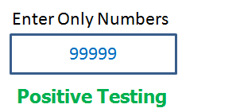
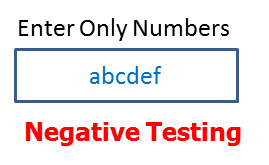
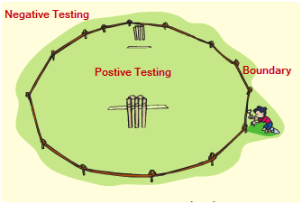
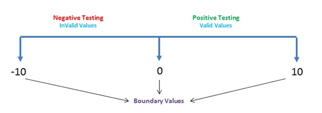
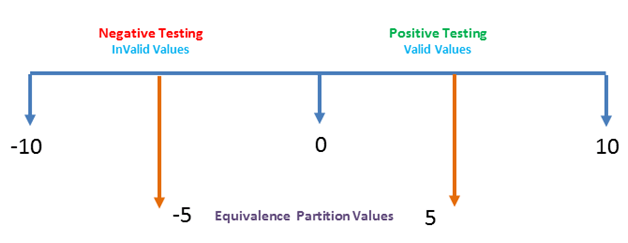

# 正面测试与负面测试

软件测试是对软件或应用进行验证和验证的过程，并检查其是否按照预期运行。目的是发现缺陷，提高产品质量。测试软件有两种方法，即正面测试和负面测试。

## 正面测试是什么？

正面测试是通过提供有效数据作为输入，在系统上执行的 PF 类型测试。它检查应用程序是否与预期的输入一致。这是测试检查应用程序做什么，它应该这样做

例如-

有一个文本框在一个应用程序，它只能接受数字。输入值高达 99999 将是可以接受的系统和任何其他价值观除了这不应该是可以接受的。要进行正面测试，将有效输入值从 0 设为 99999，检查系统是否接受值。

## 负面测试是什么？

负面测试是通过提供无效数据作为输入而在系统上执行的测试的一种变体。它检查应用程序是否与预期的负输入行为。这是测试的应用程序，不做任何事情，它不应该这样做。例如-

 

在上例中，负面测试可以通过测试输入字母字符从 A 到 Z 或从 Z 到 A 。文本框系统不应该接受的价值观，否则它也会引发错误消息的这些无效输入数据。

在该测试中需要考虑：

- 输入诸元
- 需要执行哪些动作
- 输出结果

## 用于正面和负面测试的测试技术：

以下技术用于正面和负面测试的验证：

- 边界值分析
- 等价类划分

### 边界值分析：

这是一个软件测试技术，其中的测试用例的设计，包括边界值。如果输入数据在边界值限制内使用，则称为正面测试。如果输入数据在边界值限制之外被选中，则称为负面测试。

例如-

系统可以接受从 0 到 10 数值的数字。所有其他的数字都是无效的值。在这种技术下，边界值 0，10和 -10 将被测试。

### 等价类划分：

这是一种将输入日期分成多个分区的软件测试技术，每个分区的值至少要测试一次。有效值分区用于正面测试。而无效值分区则用于负面测试。

例如-

数值 0~10 可以划分为两个(或三个)分隔。在我们的例子中，我们有两个分区 -10~1 和 0~10。可以从每个部分抽取样本值（5 和 -5）来测试场景。

## 结论：

测试有助于提供高质量的软件应用程序，并确保软件在软件启动之前是无故障的。对于有效的测试，使用正面和负面的测试，在软件的质量给予足够的信心。实时用户可以在发布前输入任何值来进行测试。