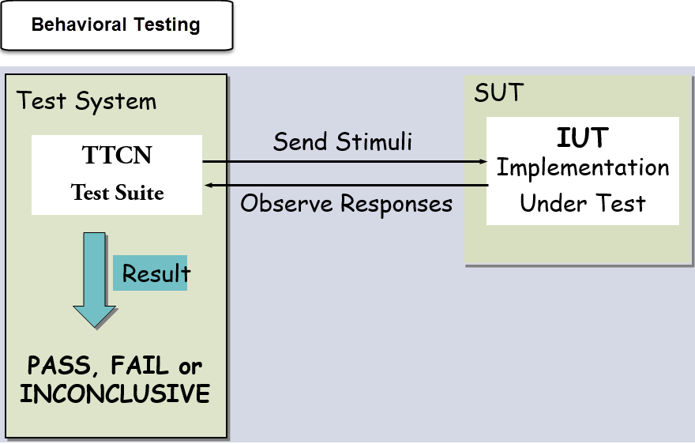

# 协议测试

## 协议测试是什么？

协议测试是公司在通信行业中使用的通用术语，测试在不同协议域的**交换、无线、VoIP、路由、交换、**等。

## 什么是软件行业的协议？

当计算机相互通信时，每台计算机都有一套通用的规则和条件。换句话说，协议确定数据是如何在计算设备和网络之间传输的。

协议被分成两类。**被路由协议** 和 **路由协议**

- **被路由协议**：被路由协议可以用来将用户数据从一个网络发送到另一个网络。它承载的用户业务如电子邮件、网站流量、文件传输、路由协议等 IP，IPX 和 AppleTalk。
- **路由协议**：路由协议是确定路由器路由的网络协议。它只用于路由器之间。例如 RIP、IGRP、EIGRP 等。

简单来说，**路由器就像一个用于运输的总线，而路由协议是道路上的信号。**

基于通信的类型使用不同的协议。

公司如 Cisco、Juniper、Alcatel 生产网络设备，如路由器、调制解调器、无线接入点等，它们使用不同协议的通信，例如，使用 Cisco 使用 EIGRP、OSPF 等。

协议测试是检查 EIGRP (增强内部网关路由协议)或 OSPF (开放最短路径优先)或任何其它协议，按照各自的工作标准。

## 计算机协议的类型

| 协议的类型 | 协议的目的 |
|----------|-----------|
| TCP/IP | 它是用来在互联网上发送小包信息 |
| UDP/ICMP	| 它被用于在互联网中发送少量的数据信息包 |
| POP3 和 SMTP |	它是用于发送和接收邮件
| 超文本传输协议 | 它被用于传输 HTML 页面以加密形式提供到安全性敏感的数据  |
| FTP |	它是用于通过网络从一个节点到另一个传送文件 |

**TCP/IP** - 传输控制协议/因特网协议  
**UDP/ICMP** - 用户数据报协议/因特网控制消息协议  
**POP3/SMTP** - 邮局协议/简单邮件传输协议  
**HTTP** - 超文本传输协议  
**FTP** - 文件传输协议  

## 不同类型的网络通信协议( L2 和 L3 )

OSI 模型共有 7 层网络通信，其中2层和3层是非常关键的。

- **2层：**它是一个数据链路层。MAC 地址、以太网、令牌环和帧中继都是数据链路层的例子。
- **3层：**它是一个网络层，它决定了网络中可用的最佳通信路径。IP 地址是第三层的例子。

## 协议测试过程

- 在对协议进行测试时，您需要**协议分析仪和仿真器**
- 协议分析器可确保正确的解码和分析呼叫会话。尽管模拟器模拟不同的网络元件实体。
- 通常是通过进行协议测试 DUT（被测设备）其他设备如交换机和路由器并配置协议
- 然后检查该分组发送的分组的结构的装置
- 它由 lxnetworks，scapy 和  Wireshark 检查可伸缩性、性能、协议算法等的装置

## 协议测试的测试类型

协议测试包括测试的功能、性能、协议栈、互操作性等。在协议测试基本上是做三项检查。

- **准确度：**我们当我们预期接收分组 X
- **滞后时间：**一个数据包需要多长时间传送系统
- **带宽：**我们每秒可以发送多少数据包

测试协议可分成两个类别。压力与可靠性测试及功能性测试。压力和可靠性测试包括负载测试、压力测试、性能测试等。而功能测试包括负测试、一致性测试、互操作性测试等。

- **一致性测试：**协议实现对产品进行测试，遵循 IEEE、RFC 等
- **互用性测试：**对不同厂商的互操作性进行测试。这个测试是在适当的平台上完成一致性测试之后完成的
- **网络特性测试：**对网络产品的功能进行测试的功能，参照设计文件。例如功能可以在一个交换机端口安全，ACL 在路由器等。

## 网络设备协议测试的示例测试用例

这里是路由器的测试用例示例

| 测试名称 | 测试案例 |
|---------|---------|
| 1. 一个开关一个 VLAN | 构建两个不同的 VLAN。检查位于不同 VLAN 主机之间可见性 |
| 2. 一个开关的三个对称 VLAN | 创建三个不同的非对称 VLAN。检查两个主机之间的可视性 |
| 3. 生成树：根路径成本变化 | 如何检查根路径成本变化后的拓扑变化 |
| 4. 生成树：阻塞端口 | 检查生成树协议如何避免网络中的循环形成，阻断冗余链路，在 VLAN 内也存在。 |
| 5. 不同的 MSTI 中的不同 Root Bridge| 结果显示，每个MSTI可以具有不同的 Root Bridge |
| 6. STP 不同区域之间的可见性 | 同一 VLAN 检查不同地区之间的可见性的 STP |
| 7. 电话开关性能 | 产生1000个电话，检查电话开关是否仍工作或其性能下降 |
| 8. 设置负测试 | 输入错误的密钥并检查用户进行身份验证。它不允许用户访问 |
| 9. 线速度 | 检查设备在10Gbps速度操作，利用所有可用的带宽来处理传入的交通 |
| 10. 协议会话速率 | 在两设备之间跟踪一个TCP会话和验证每个设备从事的正确行为 |
| 11. 会话初始化响应时间 | 测量设备对会话启动请求的响应时间 |

## 测试协议的工具

让我们讨论用于验证协议的最重要的测试工具

### 分组制作 Scapy

scapy 分组是功能强大的交互式节目操作。它使你能够

- 创建包
- 网络上的分组解码
- 捕获和分析包
- 分组注入到网络中

所以，基本上 scapy 主要做两件事情：**分组发送和接收答案。**定义数据包，发送数据包，接收答案，与答案匹配请求，返回包对夫妇列表和不匹配的数据包列表。

它还可以处理其他事情，如跟踪路由，单元测试，攻击或网络发现，开发新的协议，探测等。

scapy 使我们能够编写 Python 脚本，它允许用户执行一个任务或嗅探分组发送和接收分组。例如，数据分组可以嗅到 scapy 使用 Python 脚本。该命令打开 getdit 编辑器输入

  #gedit scapysniff.py

  #!/usr/bin/env python

  from scapy.all import*

a= sniff(count=10)

a.nsummary()

save, and change the mode of the file into an executable form

  #chmod+x scapysniff.py

  # ./scaotsbuff.py

将嗅探分组 10 包，并立即将它打印分组嗅探 10 包的概要。scapy 也为一系列的命令的发送和接收分组的时间

[下载 scapy](http://www.secdev.org/projects/scapy/)

### Wireshark 工具的分析

协议测试时使用的工具 —— Wireshark。它允许捕捉和实时显示在人类可读形式。它使您能够深入的分组检查网络流量、通过使用各个彩色编码和过滤器。

Wireshark 捕获的数据包，有助于确定会话时得到了准确的数据，多长时间数据发送一次，等等。

Wireshark拥有一组丰富的特性，包括

- 彻底检查数以百计的协议，更多的是不断增加的时间
- 实况捕获和离线分析
- 丰富 VoIP 的分析
- 标准三窗格包装浏览器
- 运行在多平台，如 Windows、Linux、OSX 等
- 捕获网络数据可以经由 GUI 浏览
- 解密支持许多协议如 IPsec、ISAKMP、SSL/TLS
- 实况数据可以从 Ethernet, ATM, Bluetooth, USB, token 等等获得。
- 输出可以导出到 CSV、XML、纯文本等。

[下载 Wireshark](https://www.wireshark.org/download.html)

### TTCN

TTCN 是测试标准语言，用于定义和实施测试场景，协议测试。TTCN 的测试套件包括许多测试用例写在 TTCN 语言编程，用于**测试反应系统或行为测试。**

例如，一个咖啡自动售货机，给你咖啡插入一美元硬币，但不回应，如果不少于美元插入。这种程序以机器 TTCN3 语言使用。为了使咖啡投入硬币时，机器响应我们写 TTCN-3 成分，作为咖啡机器。它允许我们执行我们的测试之前，机器是咖啡实际作为产品提供。一旦完成后我们会将 TTCN3 测试套件的外部装置。

在测试系统(硬币)刺激的发射和接收响应(咖啡)。适配器的刺激获得的刺激的试验系统，并把它们传递到正在测试的系统。该适配器用于响应的响应等待系统测试，并将其传递到测试系统。

TTCN3 可以用于各种领域如

- 移动通信系统(LTE、WiMAX、3G 等）
- 宽带技术(ATM、DSL)
- 中间件平台(WebServices ，CORBA 等)
-  因特网协议(SIP，IMS, IPv6)
- 智能卡
- 汽车(AutoSAR, MOST, CAN)

在 TTCN 中我们可以定义

- 测试套件
- 测试案例
- 测试步骤
- 声明变量
- 声明定时器
- 创建 PDU 等

TTCN 可集成到其它类型的系统语言一样，如 ASN.1 ，XML，C/C++。TTCN3 核心语言文本中存在格式与其他格式，例如表格、图表和演示。