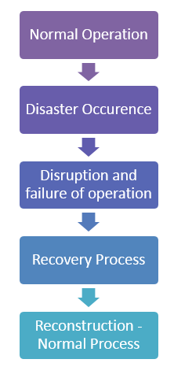

# 软件测试中的恢复测试：真实测试

## 恢复测试是什么？

进行恢复测试以确定灾难后或系统完整性丢失后是否可以继续操作。

它涉及到还原到系统的完整性，然后再被交易到故障点。

## 为什么恢复测试？

### 目的：

恢复测试的目的是验证系统的能力，从不同的故障点恢复。

### 例如：

当应用程序从网络接收数据时，拔下连接电缆。

- 一段时间之后，将电缆插入并分析应用程序继续从网络连接断开点接收数据的能力。
- 重新启动系统，而浏览器有一定数量的会话打开，并检查浏览器是否能够全部恢复。

恢复测试是一种非功能性测试(非测试涉及功能的软件，可以不涉及特定用户动作或功能，例如安全性或可伸缩性。）

恢复时间取决于：

- 重新启动的点的数目
- 应用的体积
- 培训和技能的人进行恢复活动和工具可用于恢复。

当有数量的故障，而不是照顾所有的故障，恢复测试应该在一个结构化的方式，这意味着恢复测试应该装置测试的一部分，然后另一个。

它是由专业测试人员。在恢复测试，备份数据被保持在适当位置固定。这保证在操作时也能够继续进行救援。

在寿命周期的恢复过程可以分为以下五个步骤：

1. 正常运转
2. 灾害发生
3. 混乱和失败的操作
4. 间隙通过灾难恢复过程
5. 重建过程的所有信息和整个系统将移动到正常操作

让我们来讨论这些步骤的细节-5

1. 一个系统组成的硬件，软件和固件集成，以实现一个共同的目标，用于执行一个明确的和既定的目标。该系统被称为执行正常操作，以执行所设计的工作没有任何中断在规定的时间内。

2. 中断可能由于软件故障，由于各种原因，如启动输入故障、软件崩溃由于硬件故障、因火灾、盗窃和袭击。

3. 最痛苦的阶段事中断，导致业务损失、关系破裂、机会损失、损失工时总财务和商誉损失。每一个机构都应该有用于灾难恢复计划，使中断相位是最小的。

4. 如果在遇到灾难和破坏之前，备份计划和风险缓解过程处于正确的位置，那么就可以在不损失时间、精力和精力的情况下进行恢复。一个指定的个人，连同他的团队的每个人的分配角色应被定义为修复的责任，并帮助组织从长期中断期间保存。

5. 重建可涉及多个操作来重建会话的所有文件夹以及配置文件。要有正确文件的正确的重建和恢复过程。

## 恢复策略

救援小组应有自己独特的策略用于检索的代码和重要数据，使操作机构返回到正常状态。

该策略可以基于对每个组织唯一的所述系统的处理。

该策略可能对关键系统可以如下理解：

1. 有单一或多于一个备份
2. 具有多个支承在一个地方或不同地方
3. 脱机备份或联机备份
4. 所述备份可以基于策略或手动自动完成？
5. 具有独立恢复团队或开发团队自身也可被用于工作

这些策略中的每一个具有与其关联的成本因子和多个资源所需的备份可能消耗更多的物理资源、或可能需要一个独立的团队。

许多公司可能会受到影响，由于他们的数据和代码依赖于有关的开发机构。例如，如果亚马逊 AWS 下去其关闭 25 的互联网。独立恢复在这种情况下是至关重要的。

## 现实测试

在执行恢复测试应该考虑以下方面。

- 我们必须创建一个测试床尽可能接近实际情况的部署。如果不在相同的条件，在改变接口、协议、固件、硬件和软件应接近实际情况。
- 虽然详尽地测试可能是耗时和昂贵的事情，同样的配置，并完全应验。
- 如果可能，应进行测试的硬件上，我们终于要恢复。特别是,当我们恢复到不同的机器上，创建了一个备份。
- 某些备份系统预计将硬盘大小是完全一样的作为一个备份。
- 淘汰，驱动技术进步，社会在飞速发展，旧硬盘不兼容。一个方法是问题还原到虚拟机。虚拟化软件供应商 VMwar e虚拟机可以配置为模拟现有硬件，包括磁盘和其它配置。
- 在线备份系统也不例外。大多数的在线备份服务商能通过使用容错存储系统保护我们免于直接暴露于介质问题。
- 尽管在线备份系统非常可靠，必须在还原侧的测试系统，以确保没有任何问题的检索功能、安全或加密。

## 修复后测试程序

大多数大公司都有独立审计师来进行恢复测试。

维护和测试一个全面的灾难恢复计划的费用可能是巨大的，它可能是小企业望而却步的。

较小的风险可以依靠非现场备份和数据存储计划，以拯救他们的灾难。

文件夹和文件被恢复之后，可以进行以下检查，以确保文件恢复：

- 重命名损坏的文档文件夹
- 计算恢复文件夹中的文件并与现有文件夹进行匹配。
- 打开的文件，并确保它们的访问。一定要打开应用，通常使用它们。并确保你可以浏览数据、更新数据或不管你做什么。
- 最好打开几个不同类型的文件、图片、MP3 文件和一些大的、一些小的。
- 大多数操作系统都提供了设施，您可以使用它来比较文件和目录。

## 总结：

在本教程中，我们学到了各方面的恢复测试，有助于了解系统是否满足其要求或程序之后失效。