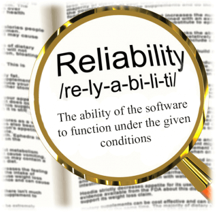
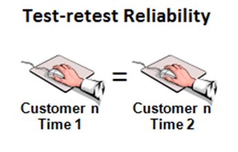
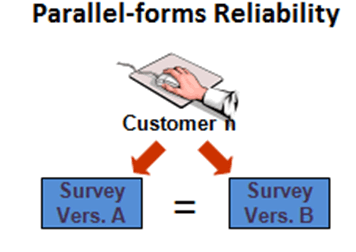

# 可靠性测试教程：在 5 分钟学会

## 可靠性测试是什么？

可靠性测试是一种测试，以验证软件能够在指定的环境中在指定的时间内执行无故障操作。

可靠性意味着“得到同样的结果”，换句话说，“可靠”一词意味着某些东西是可靠的，而且每次都会得到相同的结果。

可靠性测试也是如此。软件中的可靠性测试保证了产品的无故障，并为其预期的目的是可靠的。

**例如：**这种概率是被存储在 PC 的启动和运行 8 小时而 99% 不崩溃，这被称为可靠性。

可靠性测试可分为 3 段，

- 建模
- 测量
- 改进

将以下公式用于计算故障概率。

**概率＝失败病例/考虑的总病例数**

## 影响软件可靠性的因素：

1. 软件中出现故障的数量
2. 用户操作该系统的方法

- 可靠性测试是提高软件质量的关键之一。这个测试有助于发现软件设计和功能中的许多问题。
- 可靠性测试的主要目的是检查软件是否符合客户的可靠性要求。
- 可靠性测试将在几个层次进行。复杂系统将在单元、装配、子系统和系统级进行测试。

## 为什么要进行可靠性测试

在给定的条件下进行可靠性测试，测试软件的性能。

进行可靠性测试的目的是，

1. 查找重复故障的结构。

2. 在指定的时间找出故障发生的数量。

3. 发现失败的主要原因

4. 固定缺陷后对软件应用的各个模块进行性能测试

产品发布之后，我们也可以减少缺陷出现的可能性，从而提高软件的可靠性。一些有用的工具是趋势分析、正交缺陷分类与形式化方法等等。

## 可靠性测试的类型

可靠性测试包括特征测试、负载测试和回归测试

### 特征测试：

特征测试：检查软件提供的功能，并在以下步骤中进行：

- 每个操作在软件中被至少执行一次。
- 减少两个操作之间的相互作用。
- 每个操作必须检查其正确执行。

### 负载测试：

通常情况下，该软件将更好地执行在开始的过程和之后，它会开始降级。在最大工作负载下进行负载测试以检查软件的性能。

### 回归测试：

回归测试主要用于检查是否有任何新的缺陷已经被引入，因为在定影之前的错误。回归测试是每一个变化或更新的软件的特点和功能后进行。

## 可靠性测试的测试计划

与其他类型的测试相比，可靠性测试是昂贵的。因此在进行可靠性测试时，需要进行适当的规划和管理。这包括要实现的测试过程、测试环境的数据、测试进度、测试点等。

 首先，可靠性测试，测试人员必须遵守下列事项， 

- 建立可靠性目标
- 操作概图开发
- 计划和执行测试
- 使用测试结果来驱动决策

如前所述，我们可以进行可靠性测试，**建模、测量和改进**三类。

可靠性测试中涉及的关键参数是：

- 无故障运行概率
- 无故障运行时间长度
- 执行它的环境

### 步骤  1) 建模

软件建模技术可以分成两类：

**1. 预测建模**  
**2. 估计建模**

- 应用合适的模型，可以得到有意义的结果。
- 抽象和假设可以简化问题并没有单一的模式将适用于所有情况。
    两种模型的主要区别是：

| 问题 | 预测模型 	| 估计模型 |
|:----|---------|--------:|
| **参考数据**  | 它使用历史数据	 | 它使用当前数据从软件开发。 |
| **在开发周期中使用时** | 它通常会在开发或测试阶段之前创建。 | 它通常用于软件开发生命周期的后期。 |
| **帧象周期**  | 它将预测未来的可靠性。 |	它将预测的可靠性，无论是在当前或未来的时间。 |

### 步骤 2)  测量

软件可靠性不能直接测量，因此，其他相关因素的考虑，以估计软件的可靠性。目前软件可靠性度量的实践分为四类：

1. **产品度量：**

    产品度量的度量组合的 4 种类型：

    - **软件大小：**代码行（LOC）是一个直观的初始测量软件的大小的方法。只有源代码在这个度量中被计算，注释和其他非可执行语句将不被计数。
    - **功能点度量功能：**功能点度量：功能点度量是衡量软件开发功能的方法。它将考虑输入、输出、主文件等的计数。它测量传递给用户的功能，并且与编程语言无关。
    - **复杂性：**它直接关系到软件的可靠性，因此表示复杂性是很重要的。面向复杂性度量是一种程序的控制结构的复杂性的确定方法，通过简化成图形表示的代码。
    - **测试覆盖度量：**它是通过执行软件产品的完整测试来估计故障和可靠性的一种方法。软件可靠性是指确定系统已被完全验证和测试的功能。

2. **项目度量管理**

    研究人员已经意识到良好的管理能带来更好的产品。
    一个好的管理，可以使用更高的开发过程，风险管理流程，配置管理过程等，实现更高的可靠性。

3. **过程度量**

产品的质量与工艺有直接关系。过程度量可以用来估计、监视和提高软件的可靠性和质量。

**4. 故障和故障度量**

故障和故障度量主要用于检查系统是否完全无故障。无论是在测试过程中发现的故障类型（即交货前），以及故障后，用户交付后收集，总结和分析，以实现这一目标。

软件可靠性是衡量的**平均时间间隔（MTBF）**。平均故障时间间隔包括

- 平均故障（MTTF）：这是两个连续的故障之间的时间差
- 平均修复时间（MTTR）：它需要修复失败的时间

**MTBF = MTTF + MTTR**

好软件的可靠性是 **0 到 1** 之间的数字。

当程序中的错误或漏洞移除时，可靠性增加。

### 步骤  3)  改进

改进完全取决于应用程序或系统中出现的问题，或者软件的特性。根据软件模块的复杂性，改进的方式也会有所不同。两个主要约束时间和预算，这将限制的努力投入到软件可靠性改进。

## 可靠性测试方法

可靠性测试是关于执行应用程序，以便在系统部署之前发现并移除故障。

主要有三种方法用于可靠性测试

- 重测信度
- 平行形式信度
- 决策一致性

下面我们用一个例子来解释这一切。

### 重测信度

估计重测信度，一组考生将执行测试过程只有几天或几个星期分开。时间应足够短，以便在地区考生技能进行评估。通过统计相关性，估计了两个不同管理部门的考生成绩之间的关系。这种类型的可靠性演示了在何种程度上测试能够产生稳定的，一致的分数跨越时间。

### 平行形式信度

许多具有多种格式的考试试题、考试的形式提供这种平行

安全。平行形式的可靠性管理的考试形式相同的估计

组的考生。考生的成绩测试两种形式的确定

两种测试形式的功能如何相似。这个可靠性估计是一个如何一致的措施

考生分数可预期形成测试。

### 决策一致性

在重测信度、复本信度，我们将得到一个结果，考生通过或失败。这是分类决策的可靠性，估计决策一致性可靠性。

可靠性测试的重要性

为了提高软件产品和过程的性能，需要进行全面的可靠性评估。软件可靠性测试将在很大程度上帮助软件管理者和实践者。

通过测试来检查软件的可靠性：

1. 大量的测试用例应该在很长一段时间内被执行，以了解该软件在没有失败的情况下执行多长时间。
2. 测试用例的分布应与软件的实际或计划的业务配置相匹配。软件执行的功能越频繁，应该分配给该函数或子集的测试用例的百分比越大。

## 可靠性测试工具

一些用于软件可靠性的工具是

1. WEIBULL++：可靠性寿命数据分析

2. RGA：可靠性增长分析

3. RCM：以可靠性为中心的维修

## 总结：

可靠性测试是可靠性工程程序的重要组成部分。更准确地说，它是可靠性工程的灵魂。

此外，可靠性测试的主要目的是发现特定的故障模式和其他问题，在软件测试。

可靠性测试可分为三个部分，

- 建模
- 测量
- 改进

影响软件可靠性的因素

- 软件中出现故障的数量
- 用户操作系统的方式