# 基于风险的测试:方法、矩阵图、过程和实例

## 什么是基于风险的测试？

基于风险测试的排序特征的、模块功能和测试应用程序的基于失效影响和可能性。它涉及评估风险的复杂性、业务重要性、使用频率、可见区域、缺陷易发地区等。

风险是不确定事件的发生，对项目的可测量成功标准有积极或消极的影响。它可能是发生在过去或当前事件或可能发生在未来的事件。

这些不确定事件可能会影响成本、业务、技术和质量的目标的项目。

风险可以是正或负。

- **正风险**被称为企业永续发展的机会和帮助。
    例如投资一个新项目，改变商业流程、开发新产品。
- **负风险**被称为威胁和建议，以减少或消除他们必须实施项目的成功。

在本教程中，您将学习-

- 何时实施基于风险的测试

- 风险管理过程

- 基于风险的测试方法

- 基于风险的测试系统测试方法

- 基于风险的测试过程

- 优先排序和风险评估矩阵

- 基于风险的测试的通用检查表

- 基于风险的测试结果报告和指标

- 固有风险和剩余风险评估

- 基于风险的测试的好处

## 何时实施基于风险的测试

基于风险的测试可以在

- 项目具有时间、资源、预算约束等。
- 项目风险分析可用于检测漏洞 SQL 注入攻击。
- 在云计算环境中进行安全性测试。
- 新项目的高危险因素，如缺乏使用经验与技术，缺乏业务领域知识。
- 增量和迭代模型等。

## 风险管理过程

我们现在了解的风险管理过程中涉及的步骤

### 1. 风险界定

风险识别风险可以通过研讨会、清单、头脑风暴法、访谈法、德菲法、因果图、以往项目的经验教训，分析问题产生的原因，接触不同领域的专家和行业专家组成。

**风险登记表**是一个电子表格，其中列出了识别的风险，潜在的反应和根本原因。它是用来监测和跟踪项目的整个生命周期的风险（威胁和机会）。风险应对策略可以用来管理正面和负面的风险。

风险分解结构在风险规划中占有重要地位。风险分解结构将有助于识别容易发生风险的地区，并有助于在项目过程中进行有效的评估和风险监控。它有助于提供足够的时间和资源的风险管理活动。它也有助于将许多来源项目风险出现的可能。

#### 风险分解结构样品

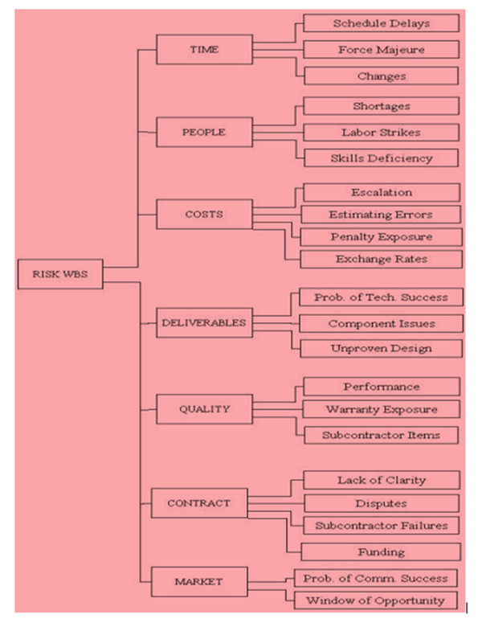

### 2. 风险分析（包括定量和定性的分析)

一旦潜在风险的名单已经确定，下一步就是分析和过滤风险的意义。定性风险分析的一个技术是利用风险矩阵(在下一节给出)。这种技术被用于确定概率、影响的风险。

### 3. 风险响应规划

基于该分析，我们可以决定，如果风险需要响应。例如，一些风险需要在项目计划中进行响应，有些则需要在项目监控中进行响应，有些则根本不需要任何响应。

风险所有者负责识别选项以减少分配风险的概率和影响。

**风险缓解**是一种风险应对方法，用于减少可能威胁的不利影响。这可以通过消除风险或将它们降低到可接受的水平来完成。

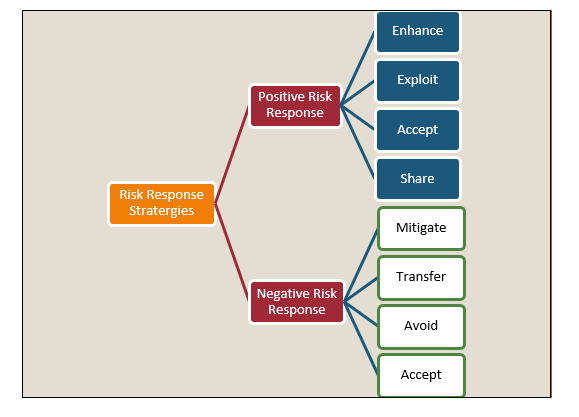

#### 风险应急

应急可以被描述为一个不确定的事件的可能性，但影响是未知的或不可预知的。应急计划也被称为最坏情况下的行动计划/备份计划。换句话说，当一个不可预知的事件发生时，它决定可以采取什么步骤。

### 4. 风险监测与控制 

风险控制和监测方法来跟踪已识别的风险，监控残余风险、风险识别，更新风险登记册，分析原因，执行风险应对计划和风险监控触发等。评价这些配方药物可有效降低风险。

这可以通过风险评估、风险审计、方差、趋势分析、性能测试技术、状态更新会议和回顾会议来实现。

下表给出了有关的信息

| 风险监控的输入  | 风险监控的工具和技术 | 风险监控输出 |
|:-------------|--------------------|------------:|
| 风险管理计划 |	项目审计风险应对	| 解决计划 |
| 风险响应计划 |	定期审查风险项目	| 修正行动 |
| 项目沟通计划 |	挣值分析法	    | 项目变更请求 |
| 额外的风险识别与分析 | 技术性能测量 | 对风险应对计划和风险识别检查表更新 |
| 范围变更 | 风险响应规划	| 风险数据库 |

我们需要记住，风险随着技术的变化、项目的规模、项目的长度（项目期限的延长）、赞助机构的数量、项目估算、努力和适当技能的短缺而增加。

## 基于风险的测试方法

1. 分析需求。
2. 文件( SRS、FRS、usecases )被检验。这个活动的目的是发现和消除差错和歧义。
3. 要求签署的是风险的分散技术用于避免引入到项目后期变化。任何更改后的文件将涉及基线变更控制过程和后续批准。
4. 在进行风险评估的计算的可能性和影响要求对每个项目的定义的标准，如成本、进度、资源、范围、安全技术性能、可靠性、复杂性等因素。
5. 在确定故障概率和高危险地区。这可以利用风险评估矩阵。
6. 使用寄存器列表中设置风险识别的风险。更新，定期跟踪风险监测和定期间隔。
7. 风险描述需要了解在这个阶段进行风险能力水平和风险承受能力。
8. 基于优先等级的要求。
9. 基于风险的测试过程的定义
10. 高风险和中等风险可以考虑缓解规划，实施，进度监测。低风险可以被视为一个表。
11. 风险数据质量评估是为了分析数据的质量
12. 对计划和定义测试评级
13. 采用适当的测试方法和测试设计技术，以最高风险项目进行测试的方式设计测试用例。高风险的项目可以测试的资源具有良好的领域知识的经验。
14. 可以使用不同的测试设计技术，例如：使用决策表技术在高风险的测试项目，并使用“只”等价分区低风险的测试项目。
15. 测试用例被设计成覆盖多个功能性和端到端业务场景。
16. 制备试验数据和试验条件和试验装置。
17. 审核测试计划、测试策略、测试用例、测试报告或测试团队创建的其他文档。
18. 同行评审是缺陷识别和降低风险的重要步骤。
19. 执行干燥运行和质量检查的结果
20. 测试用例根据风险项的优先级执行。
21. 保持风险项目之间的可追踪性，覆盖测试，这些测试的结果，以及在测试过程中发现的缺陷。所有测试策略执行得当将降低质量风险。
22.基于风险的测试可用于每个级别的测试，如组件、集成、系统和验收测试。
23. 在系统层面，我们需要关注应用程序中什么是最重要的。这可以通过查看功能的可见性，在使用频率和在可能的故障成本来确定。
24. 评估退出准则。所有高危险地区的充分检验，只有很少的残余风险尚无着落实。
25. 基于风险测试结果和分析报告。
26. 评估现有的风险事件和基于关键风险指标的风险事件。
27. 风险记录更新。
28. 应急计划-这是高暴露风险的应急计划/急救计划。
29. 缺陷分析和缺陷预防。
30. 重新测试和回归测试来验证缺陷修复的基础上预先计算的风险分析。
 高风险地区应覆盖最密集。
31. 基于风险的自动化测试（如果可行）
32. 残余风险计算
33. 风险监测与控制
34. 完成退出标准或准则可被用于不同的风险水平。所有关键风险都已经过适当的措施或应急预案。风险级别处于或低于商定的项目。
35. 风险分析和评估客户的反馈。

## 基于风险的测试系统测试方法

1. 技术系统测试 —— 这被称为环境测试和集成测试。环境测试包括测试在开发、测试和生产环境。
2. 功能系统测试 —— 所有测试的功能、特点、程序、模块。本测试旨在评估该系统满足特定要求。
3. 非功能系统测试 —— 非功能性需求的测试、负载测试、压力测试、配置测试、安全测试、备份和恢复文件(系统、操作和安装文档)。

下图给出了上述过程的清晰概述

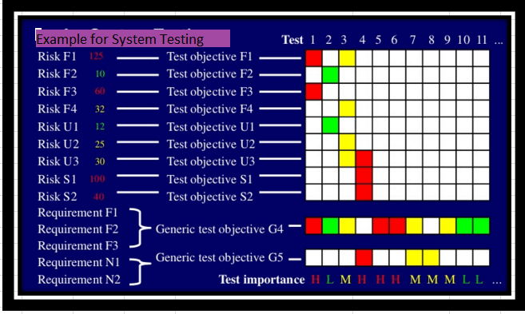

系统测试包括功能测试和非功能测试。

功能测试确保产品/应用满足客户和业务需求。另一方面，非功能测试，以验证产品是否符合客户的期望，在质量，可靠性，可用性，性能，兼容性等

## 基于风险的测试过程

本节涵盖、基于风险的测试过程

1. 风险界定
2. 风险决策
3. 风险响应
4. 测试范围
5. 测试过程定义

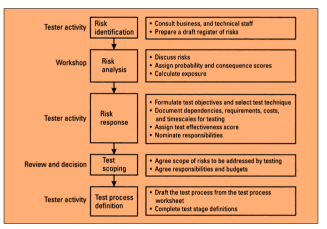

1. 在此过程中，风险的识别和归类、登记的风险，编制风险排序，确定重大风险。
2. 风险应对包括将制定目标测试的风险和选择适当的技术来证实活性试验/测试技术与测试目标。
3. 依赖项文件、要求、费用、测试时间等都被认为是测试来计算有效性得分。
4. 测试范围是评审活动，需要所有利益攸关者参与。重要的是要遵守约定的风险范围。这些风险都需要通过测试，所有成员都同意分工和预算分配用于这些活动。
5. 在范围测试完成的测试目标、假设、相关性试验的每个阶段需要编制的标准格式。

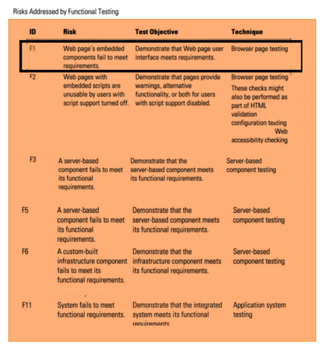

让我们考虑功能的要求 F1、F2、F3 和非功能性要求 N1 和 N2

- **F1的功能要求，R1的风险与F1**
    - 测试目的 1 —— 演示如何使用测试，预计该系统的功能和做工精细的功能，和风险 R1 可以通过功能测试解决
    - **测试** —— 浏览器页面进行测试和验证用户执行重要任务的R1（与F1风险）可以在各种情况下的处理。

- **F2的功能要求，R2的风险与F2**
    - 测试目标 2 —— 使用说明种皮期望的特征和功能的系统运行正常、风险和 R2 可通过功能性测试
    - **测试** —— 浏览器页面进行测试和验证用户执行重要任务的 R2 可以在各种情况下的处理
- **F3的功能要求，R3的风险与F3**
    - 测试目的 3 —— 演示使用测试，预期的功能和系统功能工作正常，且风险 R3 可以通过功能测试解决
    - **测试** —— 浏览器页面进行测试和验证用户执行重要任务 R3 可以在各种情况下的处理
- **N1的非功能性需求，NR1的风险与N1**
    - 测试目的 N1 —— 演示使用测试系统的操作特性优良工程和风险 NR1 可由非功能性测试解决
    - **测试** —— 可用性测试是用来评估用户界面容易使用和验证，NR1 可以通过可用性测试解决方法
- **N2的非功能性需求，NR2的风险与N2**
    - 测试目的 N2 —— 演示使用测试系统的操作特性好，且风险 NR2 可由非功能性测试解决
    - **测试** —— 安全性测试是用来检查应用程序是否有担保或是容易受到攻击的技术，是否有任何信息泄漏和验证可以通过安全测试解决 NR2。

**具体测试目标：**列出的风险和测试目标是针对测试类型的。

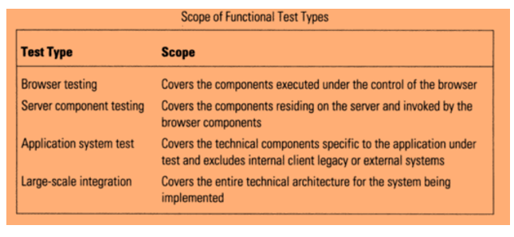

## 设计基于风险的测试过程的程序

- 准备一个风险登记册，记录来自通用风险清单，现有清单，头脑风暴会议的风险。
- 包括相关的风险的系统功能性和非功能性需求（可用性、安全性、性能）
- 每个风险分配的唯一标识符

| COL   序号 | 列标题 | 描述 |
|:---------------|-------|----:|
| 3 | 有力的 | 该系统可能容易出现这样的故障模式 |
| 4 | 后果 | 这种失效模式的影响 |
| 5 | 指数渐变线	| 产品的概率和后果(3 和 4) |
| 6 | 测试有效性	| 是否有信心的，他们能够解决这个风险？ |
| 7 | 测试优先数	| 产品的概率，后果和测试效果（3，4，6) |
| 8 | 测试的目的 | 测试目的将用于应对这类风险 |
| 9 | 测试技术 |	有什么方法或技巧 |
| 10 | 依靠 | 测试人员承担和依靠什么 |
| 11 | 作用力作用 | 需要多少努力测试此 |
| 12 | 时间量程 | 需要多少时间来做这个测试 |
| 13 | 测试阶段 A-单元测试  测试阶段 B-集成测试  测试阶段 C-系统测试 | 做此活动的人或团体的名称  |

每个风险的概率（1 低 - 5 高）和后果（1 低 - 5 高）的评估

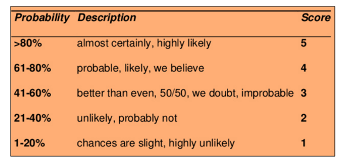
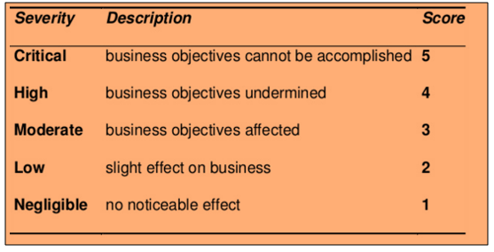

- 测试计算曝光
- 测试人员分析每个风险，并评估风险是否可以测试
- 测试目标定义为可测试的风险
- 测试指定的测试活动，应当有计划地满足测试目的进行（静态审查，检查，系统测试，集成测试，验收测试，HTML 验证，本地化测试，等）
- 这些测试活动可以分为阶段（组件测试/单元测试，集成测试，系统测试，验收测试）
- 有时，风险可能由一个或多个测试阶段来解决
- 确定依赖和假设（可用性的技能，工具，测试环境，资源）
- 测试有效性计算。测试有效性涉及的测试，风险将通过测试明确解决的信心水平。测试有效性评分是一个数字一到五之间。（5-高置信度，1-低置信度）
- 估计的努力，所需的时间，成本，准备和执行这些测试。

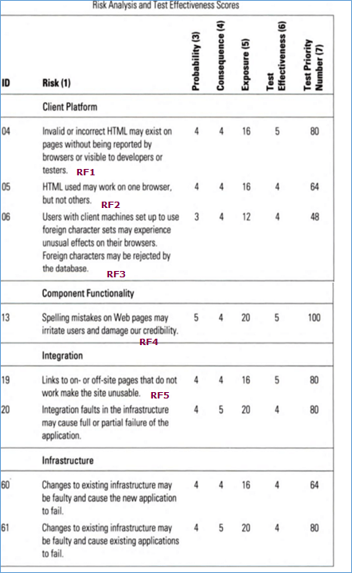
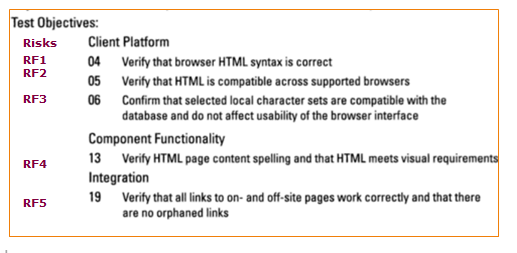

- 测试优先数计算。它是概率、后果和测试有效性分数的乘积。
    - 125 —— 最大 àA 非常严重的风险，测试可检测
    - 1 —— 最小 àA 风险非常低，测试不检测
- 测试优先级的基础上，测试的重要性可以分为高（红色），中（黄色）和低（绿色）。最高风险项目首先进行测试。
- 将测试活动分配到测试阶段，指定将在不同测试阶段（单元测试、集成测试、系统测试、验收测试）中对每个目标进行测试。
- 什么是范围，超出范围的测试是在测试范围阶段决定
- 每个阶段的测试目标、测试组件、责任、环境准入标准、退出条件、工具、技术、项目的定义。

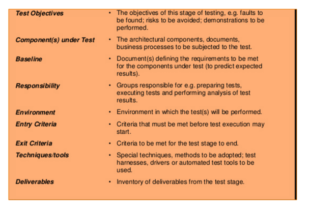

通用测试目标-这些通用目标适用于多个项目和应用程序

- 组件符合要求，并准备在更大的子系统中使用
- 特定的测试类型相关的风险得到解决，并完成测试目标。
- 集成部件的正确组装。确保界面的组分之间相容。
- 该系统满足指定功能性和非功能性需求。
- 满足终端用户需求的产品在目标操作环境
- 风险管理策略，用于识别、分析和缓解风险。
- 该系统满足行业法规要求
- 该系统符合合同义务
- 制度化以及实现其他具体目标如成本、进度和质量目标。
- 制度、流程和人员满足业务需求

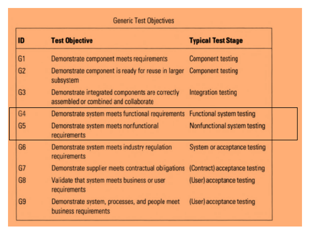

通用测试目标可以定义为不同的测试阶段

- 部件测试
- 综合测试
- 系统测试
- 验收测试

让我们考虑系统测试阶段

1. G4 & G5 演示的系统满足功能(F1、F2、F3)和非功能性要求(N1，N2)。
2. 演示如何使用测试，预计该系统的功能和做工精细的功能和与 F1，F2，F3 的风险，可以通过功能测试解决
3. 演示如何使用测试系统的正常工作运行的特点和相关的风险与 N1，N2 可以解决非功能测试
4. 测试优先级的基础上，测试的重要性可以分为高（红色），中（黄色）和低（绿色）。

## 优先排序和风险评估矩阵

风险评估矩阵是概率影响矩阵。它为项目团队提供了一个快速的风险和优先考虑每一个这些风险需要解决。

### 风险评级 = 严重程度 X 可能性

概率是衡量一个不确定事件发生的机会的尺度。暴露在时间，接近和重复。以百分数表示。

这可以被归类为频繁（A），可能（B），偶然（C），远程（D），不可能（E），消除（F）

- 频繁 —— 它经常发生在大多数情况下(91-100%)
- 可能 —— 可能在大多数情况出现多次(61-90%)
- 偶然 —— 有时候可能发生(41-60%)
- 远程 —— 不易发生/有时会发生(11-40%)
- 不可能 —— 出现的特殊情况(0-10%)
- 消除 —— 不可能发生(0%)

严重程度是指由于不确定事件造成的损害或损失的程度。得分1至4，可以归类为灾难性 = 1，临界 = 2，边际 = 3，可以忽略不计 = 4

- **灾难性** —— 恶劣的后果，使这个项目完全没有活力，甚至导致项目停工。这必须是一个管理风险中的重中之重。
- **临界** —— 大后果，能导致大量损失。项目受到极大的影响。
- **边际** —— 短期损伤仍然可逆的复辟活动。
- **可以忽略不计** —— 很小的或最小的损坏或损失。这可以通过常规的程序监控和管理。

优先级被分为四类，这是映射的严重程度和风险的概率，如下图所示。

- 严重
- 高 
- 中
- 低

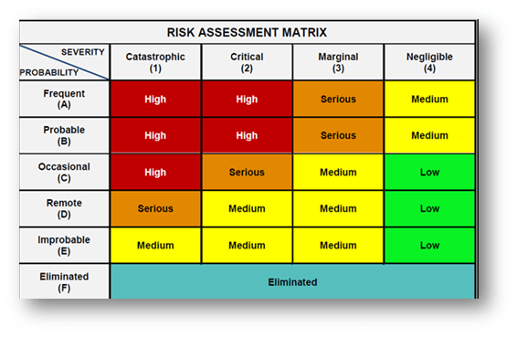

**严重：**属于这一风险类别被标记为橙色。该活动必须停止，必须立即采取行动，以隔离风险。有效控制必须确定和执行。此外，不活动，除非必须将风险降低到低的或中等的水平。

**高：**属于这一风险类别红色标示颜色或 ATE 行动风险管理策略。必须立即采取行动来隔离、消除、替代风险和实施有效的风险控制。如果这些问题不能马上解决，必须限定严格的时间表来解决这些问题。

**中：**属于这一风险类别被标记为黄色。合理和必须采取实际步骤，把风险降到最低。

**低：**属于这一风险类别被标记为绿色，标记可以被忽略，因为它们通常不会带来任何显著的问题。定期复习是必须的以确保控制措施保持有效

## 基于风险的测试的通用检查表

风险测试中应考虑的重要点的全面清单

- 项目中的重要功能。

- 用户可见的功能性项目

- 该功能具有最大安全性影响

- 具有金融功能，对用户影响最大

- 源代码和易错代码的高度复杂的区域

- 特征或功能，可以在开发周期的早期测试。

- 特点或功能加入到产品的设计都是在最后一分钟。

- 类似的因素有关，以前项目/问题/引起问题。

- 问题的主要因素或类似/相关的项目，通过操作和维修费用。

- 不良需求导致较差，设计并测试可以影响项目目标及交付项。

- 在最坏的情况下，可将产品缺陷是无法返工并且必须完全报废，这将严重损害公司声誉。确定哪些问题是关系到产品的目标。

- 诸情况或问题，会造成持久的顾客服务投诉。

- 端对端测试可以容易地集中于多个功能的系统。

- 最佳的测试集，可以最大限度地提高风险范围

- 哪些测试将有最佳的高风险覆盖率所需的时间？

## 基于风险的测试结果报告和指标

1. **准备测试报告**

    报告测试状态是关于有效地将测试结果传达给项目干系人。

    并给出一个清晰的理解，并显示测试结果与测试目标的比较。

    - 计划执行的测试用例数
    - 测试用例数通过/失败
    - 识别的缺陷数及其状态和严重程度
    - 缺陷数目和它们的状态
    - 临界缺陷数仍然打开
    - 停机环境 —— 所有
    - 总结 —— 所有
    
    测试总结报告，测试覆盖报告

2. **制备度量**

    度量是用来比较软件过程、项目和产品的两个或多个度量的组合。

    - 影响与进度变化
    - 测试用例准备效率
    - 测试设计覆盖
    - 测试案例执行效率
    - **风险识别效率 %**
    - **风险减轻效率 %**
    - 测试有效性 ％
    - 测试执行覆盖
    - 测试执行效率
    - 缺陷渗漏 %
    - 缺陷检测效率
    - 需求稳定性指数
    - 质量成本

3. 分析非功能性类别的风险（性能，可靠性和可用性）基于缺陷的现状和一些测试通过/失败状态，他们之间的关系的基础上的风险。
4. 在分析了风险度量的测试功能，测试缺陷状态并通过/失败状态，基于风险的关系。
5. 识别关键领先滞后指标和预警指标
6. 监测和报告风险的领先和滞后指标（关键风险指标）的分析数据的模式、趋势以及相互依赖性。

## 固有风险和剩余风险评估

风险识别与分析还应包括固有风险、剩余风险、次级风险和复发风险。

- **固有风险：**已确定/已经存在的风险在系统中的控制和响应之前实施。固有风险也称为总风险
- **剩余风险：**在控制和响应被执行后遗留的风险。剩余风险称为净风险
- **次要风险：**实施风险应对计划引发的新风险
- **复发风险：**初始风险将发生的可能性。

基于风险的测试结果测量有助于组织了解测试执行过程中质量风险的残留程度，并进行智能发布决策。

## 风险分析和客户反馈

风险分析是考虑风险要求、风险承受能力和风险承受能力，为客户寻找最优投资风险的过程。

1. 需要的风险是客户需要采取的风险水平，以获得满意的回报
2. 风险能力是客户承担的财务风险水平
3. 风险容忍度是客户愿意承担的风险水平

### 客户反馈

收集客户反馈和评论，以完善的业务、产品、服务和体验。

## 基于风险的测试的好处

基于风险的测试的好处如下

- 提高生产力和降低成本
- 改进市场机会（上市时间）和交付时间。
- 服务性能提高
- 质量改进中的所有关键功能的应用进行测试。
- 给出测试覆盖的明确信息。使用这种方法，我们知道什么已经/没有经过测试。
- 测试工作量分配是基于风险评估的最有效的方式以最小化残余风险在释放。
- 基于风险测试测量结果的分析使得能够识别组织的残留水平的测试执行时的质量风险，并做出明智的决定。
- 与高度优化的测试定义风险评估方法。
- 提高客户满意度 —— 客户参与和良好的跟踪和报告进展。
- 早期检测的潜在问题区域。有效的预防性措施来克服这些问题
- 连续监测和风险评估贯穿于项目的整个生命周期中帮助识别和解决风险和问题的解决，反而可能使实现总项目目标和目的。

## 总结：

基于风险的测试是最有效的方法是基于风险导向的项目。

该测试努力有效地组织起来，每个风险级别的优先级的项目进行分级。然后，每个危险相关联的适当的试验活动，测试具有单个风险项目超过一个，则测试被指定为最高风险。

测试是根据风险优先级顺序。在风险监控过程有助于保持跟踪已识别的风险，和降低的残余风险的影响。