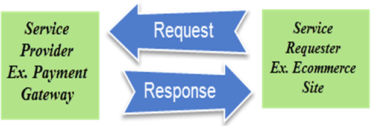
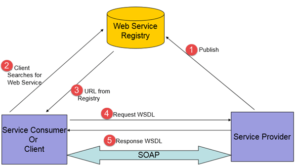
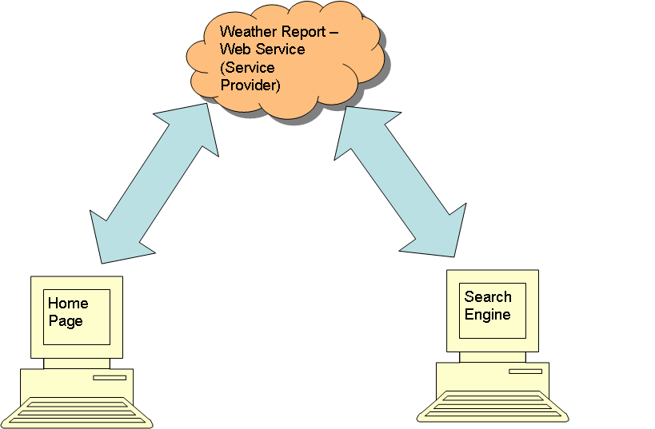
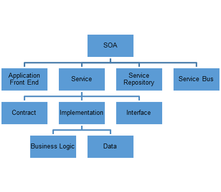
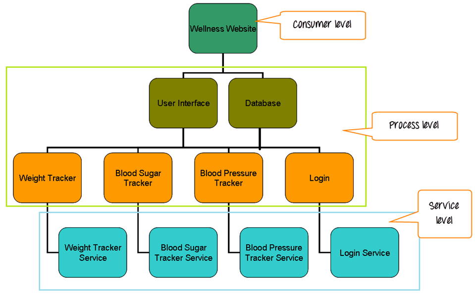
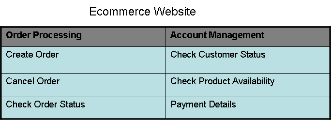

# 了解 SOA 测试

## SOA 测试是什么？

 SOA 测试是面向服务的体系结构(SOA)是一种体系结构风格的应用组件被设计为经由通信协议典型地通过网络的一种测试。

在本教程中，您将学习-

- SOA 是什么？

- 什么是服务？

- SOA 测试

- SOA 测试策略

- SOA 测试方法

- SOA 测试的挑战

- SOA 测试工具

- SOA 测试用例

## SOA 是什么？

SOA 是一种集成的业务应用程序和进程，以满足业务需求。

SOA 提供了敏捷性和灵活性的业务流程。对过程或应用程序的更改可以针对特定组件而不影响整个系统。

在SOA的软件开发商开发或购买服务的程序称为**块**。

## 什么是服务？

- 服务可以是应用程序或业务流程的功能单元，它可以被任何其他应用程序或流程重复使用或重复处理。
  (例如，在上面的图片中，支付网关是一个可以被任何电子商务网站重复使用的服务。每当需要支付，电子商务网站调用/请求支付网关服务。在网关完成支付后，将响应发送到电子商务网站)

- 服务很容易组装且易于重构部件。

- 服务可以与积木相比。他们可以构建任何需要的应用程序。从应用程序或业务流程添加或删除它们是容易的。
    
- 服务的定义更多的是它们所执行的业务函数，而不是代码块。

### Web 服务

 Web 服务是独立的应用程序组件，可在 web 上使用。

他们可以发布，发现可以用网络。他们可以通过互联网交流。

1. 服务提供商向因特网发布服务。
2. 客户端从 web 服务注册表搜索特定的 web 服务
3. URL 和 WSDL 必须被 web 服务返回。
      
      <<使用 WSDL 和 URL，服务提供者和请求者之间的通信是通过 SOAP 消息。 << 
    
4. 当消费者调用 Web 服务，HTTP 连接将被建立到提供者。 SOAP 消息是指示提供商创建用于调用 Web 服务所需的逻辑。

5. 从供应商收到的响应 SOAP 消息将被嵌入到 HTTP 响应。该响应是 HTTP 格式的数据，消费者是可以理解的。

**例子**——网站主页和搜索引擎显示每日天气报告。而不是编码的天气报告部分各地，气象报告服务可以从供应商购买和集成到页面。

## SOA 测试

SOA 是由各种技术组成的。使用 SOA 构建的应用程序有不同的服务是松散耦合的。

SOA测试的重点应放在 3 层

1. **服务层** –
  这种层包括服务、展示的服务的系统的业务功能。

   比如 ——

   考虑一个健康网站，其中包括
    
   1. 权重追踪器
   2. 血糖跟踪器
   3. 血压跟踪器

  跟踪器显示相应的数据和日期记入。服务层由从数据库获取相应数据的服务组成

    - 质量追踪器服务
    - 血糖跟踪器服务
    - 血压追踪服务
    - 登录服务

2. **过程层** –
   过程层包括流程，服务是单一功能的一部分。

   该过程可以在用户接口部分(例如搜索引擎)，ETL 工具的一部分(用于从数据库获得数据)。

   这一层的重点将在用户界面和过程中。

  重量跟踪器的用户界面和它与数据库的集成是主要的焦点。

   以下功能将被考虑
   
    1. 添加新数据
    2. 编辑现有数据
    3.  创建新的跟踪器
    4.  删除数据

3. **消费者层**–
   该层主要包括用户界面。

   基于 SOA 的应用层的测试分为三个层次。

   1. 服务质量
   2. 接口层
   3. 端对端级别

- 自顶向下方法用于测试设计。
- 自下而上方法被用于执行测试。

## SOA 测试策略

### 测试规划方法

- 测试人员应该理解应用程序的完整体系结构。
- 应用程序需要分解成独立的服务（服务有自己的请求和响应结构，并且不依赖于任何其他服务以形成响应）。
- 应用程序结构需要重新划分为三个部分--数据、服务和前端应用程序。
- 所有的部件都需仔细分析，并应制定了业务方案。
- 业务方案应当被分类为共同应用场景和特定场景。
- 一个可追踪性矩阵应被制备，并且所有测试案例都是必须的业务场景。

### 测试执行方法

- 每个服务组件应该被测试。
- 服务组件的集成测试应该通过服务和数据完整性来验证数据流。
- 测试系统的完整模型以验证数据之间流动前端应用和数据库。
- 性能检测应进行微调和优化性能。

## SOA 测试方法

### 基于数据驱动业务场景测试，

- 各种业务有关的方面的系统进行分析。
- 场景应该集成开发
    - 各种 web 服务中的应用
    - Web 服务及应用。
- 数据设置应该是根据上面的情形。
- 数据设置应覆盖端对端方案。

### 短截线

- 虚拟接口创建测试服务。
- 各种输入可以通过这些接口，该输出可以被验证。
- 当应用程序使用的接口的外部服务是第三方服务（测试）、短截线可创建集成测试。

### 回归测试

- 回归测试中的应用需要当存在多个释放以确保稳定性和可用性的系统。
- 全面的回归测试套件将覆盖与服务的重要组成部分。
- 该测试套件可重复利用，多次发布的项目。

### 服务等级测试

服务水平测试包括测试部件的功能性、安全性、性能和互操作性。

每个服务需要首先独立地测试。

### 功能测试

功能测试应在每个服务

- 确保提供适当服务来响应每个请求。
- 正确错误接收用于请求的无效数据，无效数据等。
- 检查每个请求和响应用于每个操作的服务必须在运行时间执行。
- 验证错误消息时发生错误的服务器、客户端或网络级别。
- 验证接收的响应是正确的格式。
- 验证接收的响应数据对应于所请求的数据。

### 安全测试

 Web 服务安全性测试是一个重要方面，在服务级别的 SOA 应用程序测试；这确保了安全性。

在测试过程中下列因素必须被覆盖：

- 行业标准由 WS —— 安全测试的定义应遵循 Web 服务。
- 安全措施应正常工作。
- 数字数据的加密和签名的文件
- 认证和授权
- SQL 注入，XSS，CSRF 的恶意软件，其他的漏洞是在 XML 测试。
- 拒绝服务攻击

### 性能测试

性能测试的服务需要做的，因为服务是可重用的，多个应用程序可能正在使用相同的服务。

在测试期间考虑下述因素：

- 在重载下需要测试服务的性能和功能。
- 服务性能的需要比较,无论是独立工作以及在本申请中结合。
- 负载测试的服务应该被执行
    - 为了验证响应时间
    - 用于检查瓶颈
    - 为了验证利用 CPU 和存储器
    - 预测可伸缩性

### 集成级测试

- 服务级别测试确保单独服务的正常工作，不保证耦合组件的工作。
- 集成测试主要集中在接口。
- 这一阶段涵盖所有可能的业务场景。
- 非功能性测试的应用需要更多时间在这一个阶段。安全性，合规性和性能测试确保系统的可用性和稳定性的各个方面。
- 通信和网络协议应进行测试，以验证服务之间的数据通信的一致性。

### 端对端测试

此阶段确保该应用符合业务要求的功能性和非功能性。

在结束测试期间确保以下项目进行测试

- 所有服务整合后的工作预期
- 异常情况处理
- 应用程序的用户界面
- 适当的数据流经所有部件
- 业务处理

## SOA 测试的挑战

- 缺乏服务接口
- 测试过程跨越多个系统，从而创建复杂的数据需求
- 该应用是一组多样的部件趋于改变。回归测试的需求更频繁。
- 由于多层体系结构，它是难以分离的缺陷。
- 由于服务将在不同接口上，很难预测，因此性能测试规划制造麻烦。
- SOA 是一组异质的技术。一个 SOA 应用的测试需要不同的技能，从而提高规划和执行费用的人。
- 因为此应用程序是一个综合多种业务、安全测试都有它特有的悲哀。认证和授权的验证是非常困难的。

## SOA工具测试

有许多可用的工具，以帮助市场测试人员测试 SOA 应用程序。下面列出了其中的几个。

### SOAP UI

“ SOAP UI ”是一个用于服务和 API 测试的开源功能测试工具。

- 桌面应用
- 支持多种协议 —— SOAP、REST，HTTP，JMS，AMF，JDBC
- Web 服务可以被开发，以及检查调用。
- 还可以使用负载测试、自动化测试、安全性测试
- 短截线由 Mockservices 创建
- Web 服务请求,并自动生成测试可以通过其 Web 服务客户机。
- 具有内置的报表工具
- 由 smartbear 开发

### iTKO LISA

“ LISA ”是一个产品套件，用于分配系统和 SOA 提供了一个功能测试解决方案。

- 还可以用于回归测试、集成测试、负载测试和性能。
- 由 iTKO( CA Technologies )开发
- 可以设计并且执行测试。

### HP 服务测试

“维修测试”是一个功能测试工具，支持 UI 服务和共享测试

- 功能和性能测试的服务可以通过一个单一的脚本。
- 集成 HP QC。
- 对大量数据的服务和管理。
- 通过模拟 JEE 支持互操作性测试、轴线、DotNet 和客户端环境。
- HP 开发的。

### Parasoft SOA 测试

SOA 测试是一种测试和分析工具套件开发的 API 和 API 应用程序测试。

- 支持 Web 服务、REST、JSON、MQ、JMS、TIBCO、HTTP、XML 技术。
- 功能、单元、集成、回归、安全性、互操作性和性能测试是可能的。
- 可以使用 Parasoft 虚拟化创建短截线，它比 SOAP UI 智能。
- 由 Parasoft 开发

## SOA 测试的测试用例

考虑一个电子商务网站，它包含以下功能和子功能：

### 命令处理

**第一阶段** - 在第一阶段的 SOA 测试即测试策略、应用分成和商业服务功能。

下面让我们考虑一下应用程序中的服务。

- 创建订单
- 客户状态检查
- 工程变更通知单状态
- 检查订单状态
- 检查库存

业务功能相同的功能的网站。

**注：**测试策略文档将包含要被测试的服务列表和功能。

**第二阶段** - 测试计划阶段。测试用例为每个级别编写。

1. 端对端水平。在测试用例被撰写为每个用例和业务流。
    下面是测试用例的实例
    
    1. 创建活动用户的订单。
    2. 使用非活动用户创建订单。
    3. 创建可用的产品的订单，产品订单数量 < 可用数量。
    4. 创建可用的产品的订单，产品订单数量 < 可用数量。
    5. 多个项目的订单创建
    6. 完全取消订单。
    7. 取消部分订单。
    
2. 一体化水平。测试用例的编写和集成的用户接口。
    下面是测试用例示例。
    
    1. 创建一个新的单目。验证数据库上创建的订单。
    2. 创建单个项目的新订单。确认为订单计算的价格是正确的。
    3. 创建单个项目的新订单。通过订单数量验证可用产品的数量较少。
    4. 验证在 UI 上显示的订单的状态与数据库上的顺序相同。
    5. 取消订单确认和订单状态修改数据库。
    6. 对于首次付款，付款细节确认输入的 UI 是保存在数据库中。
    7. 返回用于支付、验证付款细节数据库上显示 UI。
    
3. 服务级别。每个服务都测试所有的数据条件。
    下面是几个例子。

    1. 创建命令
    No. of Items = 1 

      订单数量 < 数据库数量

    2. 创建命令
    No. of Items > 1 

      订单数量 < 数据库数量
    
    3. 创建订单
    No. of Items = 1 

      订单数量 > 数据库数量

    4. 检查订单状态

      数据库状态 = 有效
        
    5. 检查订单状态

      数据库状态 = 装运
        
    6. 检查订单状态

        数据库状态 = 取消
        
    7. 检查订单状态

        订单 ID = 无效
        
    8. 产品可用性检查

        产品的数量 > 0
       
    9. 产品可用性检查

        产品的数量 ＝ 0
        
    10. 产品可用性检查

     产品 ID = 无效

**阶段3 —— 测试执行**

测试执行使用自下而上方法即服务级别进行测试，然后集成水平和最后进行端对端测试。

1. **服务质量** —— 我们认为 SOAP UI 工具是测试中的应用。

    WSDL 和 URL 的浏览到 SOAP 测试窗口。
 
        每个服务的请求将显示在请求窗口中。

        通过根据服务级别测试用例修改数据，为每个测试用例创建请求。

    | 测试案例 | 请求 | 期望反应 |
    |:--------|-----|--------:|	
    | 创建命令。No. of Items = 1 订单数量 < 数据库数量 | <productid>x2</productid>  <quantity>2</quantity> | <orderid>o3251</orderid>  <message>Successful</message> |
    | 创建命令。No. of Items > 1 订单数量 < 数据库数量 | <productid>y1</productid>  <quantity>1</quantity>  <productid>y2</productid>  <quantity>3</quantity>  | <orderid>o3251</orderid>  <message>Successful</message> |
    | 创建命令。No. of Items = 1 订单数量 > 数据库数量 |<productid>x23</productid>  <quantity>200</quantity>  |<orderid>null</orderid>  <message>Unsuccessful</message>  |
    | 检查订单状态。数据库状态 = 有效 | <orderid>o9876</orderid> |<status>Active</active>  <message>Successful</message> |
    | 检查订单状态。数据库状态 = 装运 |<orderid>o9656</orderid> |<status>Shipped</active>  <message>Successful</message>  |
    | 检查订单状态。数据库状态 = 取消 |<orderid>y5686</orderid> | <status>null</active>  <message>Unsuccessful</message> |
    | 产品可用性检查。产品的数量 > 0 |<productid>d34</productid> |<quantity>34</quantity>  <available>yes</available>  <message>Successful</message>  |
    | 产品可用性检查。产品的数量 ＝ 0 |<productid>y34</productid>  | <quantity>0</quantity>  <available>no</available>  <message>Successful</message> |
    | 产品可用性检查 。产品 ID = 无效 |<productid>sder</productid>  | <message>Unsuccessful</message> |

2. **集成级别** —— 集成级别的测试用例在用户界面和数据库上执行。

    - 创建一个项目的订单
    - 用户打开网站。
    - 去下单。
    - 选择有效的产品和数量并保存订单。
    - 应该显示成功放置订单的消息。
    - 用户打开数据库并检查订单的详细信息是否与网站上输入的信息相同。

3. **端对端级别** —— 在用户界面上执行业务流程和用例。

    - 创建多个项目的订单
    - 用户打开网站。
    - 去下单。
    - 询问关于有效的产品和数量，将其添加到购物车。
    - 其它有效的产品添加了有效量和订单已保存。通过新的支付方法和支付订单。
    - 应显示“成功放置订单”的消息。
    - 测试应验证整个流程不偏斜的数据。

## 结论：

通过正确的测试策略、资源、工具和合规提供良好服务，SOA 可以提供完全测试和完全测试应用。