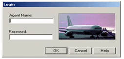
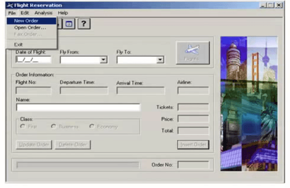
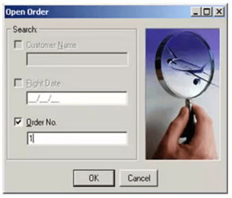
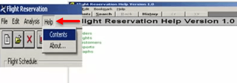
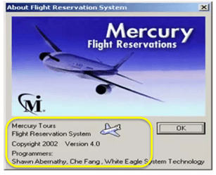

# 测试场景是什么？

## 测试场景是什么？

测试场景可以是任何功能性测试。它也被称为测试条件或测试可能性。作为一名测试人员，你可以把自己放在最终用户的鞋子里，找出现实世界的场景和测试用例的用例。

## 场景测试是什么？

场景测试是软件测试的一种变体，场景用于测试。场景有助于更复杂系统的更简单的测试方法

## 为什么创建测试场景呢？

创建测试场景是出于以下原因，

- 创建测试场景确保完整的测试覆盖率
- 测试场景可以通过各种利益相关者，如业务分析师，开发人员，客户批准，以确保正在测试的应用程序进行彻底测试。它确保软件是最常见的用例。
- 他们作为一个快速的工具，以确定测试工作的努力，并相应地为客户创建一个建议或组织的劳动力。
- 他们帮助确定最重要的端到端交易或实际使用的软件应用程序。
- 研究了端到端运行的程序，测试场景是关键。

## 为什么不创建测试场景？

测试场景可能不会创建时

- 测试下的程序很复杂，不稳定且时间紧迫的项目。
- 项目遵循敏捷方法学，如 Scrum、Kanban 可以不创建测试场景。
- 测试场景可以不创建一个 bug 补丁或者新的回归测试。在这种情况下，测试场景必须已经在以前的测试周期中大量记录。这是特别真实的维护项目。

## 如何创建一个测试场景

作为一名测试人员，您可以遵循以下五个步骤来创建测试场景-

- **步骤 1：**阅读需求文档如 BRS，SRS，FRS，被测系统（SUT）。您也可以参考用例、书籍、手册等应用程序进行测试。
- **步骤 2：**对于每个需求，找出可能的行动和目标用户。确定技术方面的要求。确定可能出现的滥用评估系统、用户和黑客的心态。
- **步骤 3：**在阅读需求文档并做适当的分析后，列出不同的测试场景，以验证软件的每个功能。
- **步骤 4：**一旦你列出了所有可能的测试场景，创建一个可追踪矩阵来验证每个需求都有相应的测试场景
- **步骤 5：**创建的场景由您的主管审查。后来，他们还审查了项目的其他利益相关者。

## 创建测试场景的提示

- 每个测试场景应根据项目方法与一个需求或用户故事进行最少绑定。
- 在创建一个同时验证多个要求的测试场景之前，确保您有一个测试场景，该测试场景在隔离时检查该需求。
- 避免产生过于复杂的测试场景生成多种的需求。
- 场景的数量可能很大，运行它们都很昂贵。根据客户优先级只运行选定的测试场景

## 例 1：飞行预订的测试场景

在航班预订应用程序，一些测试场景

**测试场景 1：**检查登录功能

**测试场景 2：**检查中，可以创建新命令

**测试场景 3：**检查可以打开的现有的命令

**测试场景 4：**检查的用户，可以命令传真

 

**测试场景 5：**检查帮助部分中显示的信息是否正确

**测试场景 6：**检查所显示的信息，关于部分，如版本，程序员姓名，复制权信息是否正确

除了这六种情况，这里是所有其他方案的列表

- 更新顺序
- 删除命令
- 检验报告
- 检查图表等。

接下来，我们已经了解了详尽的测试是不可能的。假设你只有时间来执行这 6 个场景中的 4 个，这两个低优先级的场景，这六个将你消除。认为，现在开始你的时间

我相信你们大多数人会猜到场景 5 和 6，因为它们不是应用程序的核心功能。这只是测试优先级。

## 例 2：银行网站的测试场景 

**测试场景 1：**检查登录和验证功能

**测试场景 2：**检查汇款是否可以完成

**测试场景 3：**检查帐户报表可以查看

**测试场景 4：**检查固定存款/定期存款可以创建

凡此种种，不一而足。