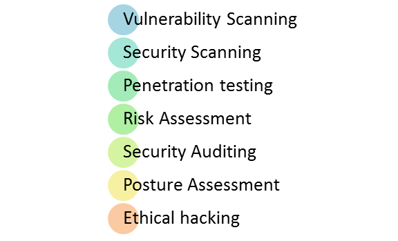
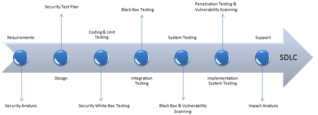

# 什么是安全测试：完整教程

## 什么是安全？

安全是用以对不可预见的行动保护应用程序，导致它停止运作或被剥削的一组措施。不可预见的行为可以是有意的或无意的。

## 安全测试是什么？

安全测试是软件测试的一种变体，它确保了系统和应用程序在组织中没有任何漏洞，可能造成重大损失。任何系统的安全测试都是为了发现系统可能存在的所有漏洞和弱点，这可能会导致该组织的员工或外部人员的信息丢失。

安全测试的目的是为了查明各种威胁，并测量它的系统的潜在弱点。它还有助于检测所有可能的安全风险和帮助系统开发人员在通过编码处理好这些问题。

## 安全测试的类型：

根据开放源代码安全测试方法手册,有七种主要类型的安全测试。它们解释如下：

-漏洞扫描：这是通过自动化软件扫描系统对已知的漏洞做标记。
- 安全扫描：它牵涉到识别网络和系统弱点，并稍后用于减少这些风险提供解决方案。该扫描可以被执行为手动和自动扫描。
- 渗透测试：这种测试模拟恶意黑客的攻击。此测试涉及一个特定系统的分析，以检查外部黑客企图的潜在漏洞.。
- 风险评估：该测试涉及的安全风险分析中观察到的组织。风险分类为低、中和高。该测试建议控制和降低风险措施。
- 安全审计:这是内部检查的应用程序和操作系统的安全缺陷。审计还可以通过逐行地检查代码
- 黑客：这是一个黑客组织。不像恶意黑客用来盗取自己得利，意图是揭示有缺陷的系统。
- 姿态评估：这是结合了安全扫描，道德黑客和风险评估，以显示一个组织的整体安全态势。

## 安全流程与 SDLC 一体化（SDLC）：

它总是同意，成本会更多，如果我们推迟执行软件安全测试后或部署后阶段。因此，有必要在 SDLC 测试涉及安全生命周期中的早期阶段。

我们看一下如何安全处理相应的 SDLC 的各阶段

| SDLC 阶段 | 安全处理 |
|----------|---------|
| 需要 |	安全分析的要求和检查误用/滥用案例 |
| 装置 |	安全设计的风险分析。发展的试验计划，包括安全测试 |
| 编码和单元测试 | 静态和动态测试和安全测试 |
| 综合测试 	| 黑盒测试 |
| 系统试验 | 黑盒测试和漏洞扫描 |
| 装置 | 渗透测试、漏洞扫描 |
| 资助 | 贴片的影响分析 |

测试计划应包括

- 安全相关测试用例或场景
- 测试相关的数据进行安全性测试
- 安全测试所需测试工具
- 分析由不同安全工具输出的各种试验

## 安全测试的样品测试场景：

样品测试场景让你了解的安全测试案例

- 密码应以加密格式
- 应用或系统不应该允许用户无效
- 检查时间的应用会话和 Cookie
- 对于金融行业网站，浏览器 Back 按钮应该不工作。

## 方法

在安全测试中，不同的方法，他们分别是：

- 老虎箱：这个黑客通常是在一个笔记本电脑，收藏了 OSS 和黑客工具做的。这有助于测试人员测试和安全评估测试人员进行漏洞攻击。
- [黑盒](http://www.guru99.com/black-box-testing.html)：测试人员被授权做关于网络拓扑和技术的一切测试。
- 灰色框：部分信息给关于系统的测试人员，它是一个混合的白和黑盒子模型。

## 你必须知道的角色！

- 黑客-访问计算机系统或网络未授权
- 解密高手-闯入系统窃取资料或破坏
- 道德黑客-执行大部分的破坏活动，但经业主许可
- 脚本小子或包猴-没有经验的黑客编程语言技能

## 安全测试的神话与事实：

让我们来谈谈一个有趣的话题，关于安全测试的神话和事实：

 

    神话 #1 我们不需要安全的政策，因为我们有一个小业务

 

事实：每个人、每家公司都需要一个安全政策

 

    神话 #2 没有投资回报的安全性测试

 

事实：安全测试指出可以改进的方面，可以改善效率并减少停机时间，实现最大吞吐量。

 

    神话 #3 只有这样,才能为：拔掉它。

 

事实：只有最好的途径是找到组织的“绝对安全”。完善的安全可通过执行姿势评估，并与企业、行业和法律上的理由。

 

    神话 #4 网络是不安全的。我将购买软件或系统的硬件维护和挽救企业。

 

事实：最大的问题之一，是购买软件和硬件的安全。相反，本组织应该理解安全第一，然后应用它。

## 结论：

安全测试是应用程序最重要的测试，检查机密数据是否保密。在这种类型的测试中，测试员起到了攻击者的作用，并围绕系统展开查找与安全相关的 bug 。这种安全测试在 IT 行业是非常重要的，以保护数据的所有手段。