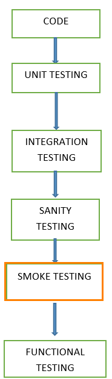
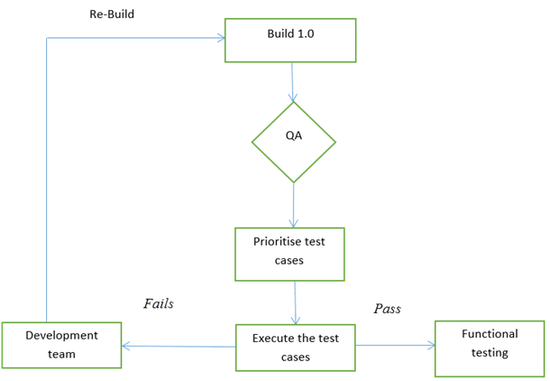

# 冒烟测试的实例学习

## 冒烟测试是什么？

冒烟测试过程是检查部署建立稳定与否的过程，以确认 QA 团队是否可以进行进一步的测试。冒烟测试是在每个构建过程中运行的最小测试集。这里是涉及冒烟测试的循环。

冒烟测试是软件构建和部署到 QA 环境验证的过程，以确保应用的稳定性。它也被称为“验证测试”。

简单来说，我们正在核实是否重要特性的工作并没有很大的建立是根据测试。

它是一种小型、快速回归测试的主要功能。它是一个简单的测试，表明该产品已经准备好测试。这有助于确定构建是否有缺陷，使任何进一步的测试浪费时间和资源。

了解比较[冒烟与健全测试](http://www.guru99.com/smoke-sanity-testing.html)

冒烟测试所构建的用于进一步测试。冒烟测试的主要目的是检测早期重大问题。冒烟测试设计用于显示系统的稳定性和一致性要求。

构建的所有数据包括文件、库、可重用模块中，组件被要求实施一个或多个功能的产品。

## 我们什么时候做冒烟测试

冒烟测试时，新的功能的软件开发和集成与现有的建设，部署在 QA /分期环境。它确保所有关键功能是否正常工作。

在该测试方法中，开发团队在部署建立 QA。测试用例的子集，然后测试人员在测试用例上运行测试用例。QA 团队测试应用程序的关键功能。这些测试用例的设计是为了暴露在构建中的错误。如果这些测试通过，QA 团队继续进行功能测试。

任何故障都表明需要将系统处理回开发团队。每当有变化的建设，我们进行冒烟测试，以确保稳定。

**例：**在登录窗口中添加新的注册按钮，并用新代码部署生成。我们在新建筑上进行冒烟测试。

## 谁会做冒烟测试

发布到 QA 环境后，冒烟测试由 QA 工程师/ QA 领导执行。无论何时存在新建立，QA 团队执行冒烟测试确定了应用的主要功能。QA 团队检查用于暂停正在进行测试的应用程序。

在开发环境中对代码进行测试，以确保在发布到 QA 之前应用程序的正确性，这就是所谓的“健全测试”。通常是窄而深的测试。这是一个验证正在开发的应用程序满足其基本功能需求的过程。

健全测试已完成的判定中，判定是否通过或未通过测试的软件产品。

## 我们为什么做测试烟雾？

冒烟测试在软件开发中起着重要的作用，因为它在初始阶段确保系统的正确性。通过这个，我们可以节省测试工作量。因此，冒烟测试使系统处于良好状态。一旦我们完成冒烟测试，那么我们就开始功能测试。

- 所有示出的止动件中的构建将通过执行冒烟测试确定。
- 冒烟测试完成后的版本被释放到 QA。冒烟测试的帮助下，大部分的缺陷在软件开发的初始阶段被确定。
- 通过冒烟测试，简化了主要缺陷的检测和校正。
- 通过冒烟测试、QA 团队可能会发现应用程序的功能性缺陷，可能出现的新代码。
- 冒烟测试中发现严重缺陷。

   **例 1：**登录窗口：可以移动到下一个窗口，点击提交按钮有效的用户名和密码。

   **例 2：**用户无法从网页上签出。

## 如何执行冒烟测试？

冒烟测试通常是手工完成的，虽然有可能通过实现自动化。它可以因组织而异。

## 冒烟测试手册

一般来说，冒烟测试是手动完成的。它的方法不同，从一个组织到其他。进行冒烟测试，以确保导航的关键路径是预期的，不妨碍功能。一旦构建发布到 QA，高优先级的功能测试用例被采取，并进行测试，以找到系统中的关键缺陷。如果测试通过，我们将继续进行功能测试。如果测试失败，该构建将被拒绝，并送回开发团队进行校正。QA 再次启动冒烟测试与新的版本。冒烟测试是在新的建设，将与旧的建设集成，以保持系统的正确性。在进行冒烟测试之前，QA 团队应该检查正确的版本。

## 冒烟测试的自动化

自动化测试用于回归测试。然而，我们也可以使用一组自动测试用例来运行防烟测试。在自动化测试的帮助下，开发人员可以立即检查构建，只要有一个新的部署准备部署。

在部署新的软件部署时，不进行手动测试，而是对生成的记录冒烟测试用例执行。它验证的主要功能是否仍然正常运作。如果测试失败，那么他们可以正确的建立和部署迅速。通过这种方式，我们可以节省时间，并确保质量建立 QA 环境。

使用自动化工具，测试工程师记录在软件构建中执行的所有手动步骤。

## 冒烟测试循环

下面的流程图显示了冒烟测试是如何执行的。一旦构建部署在 QA 和冒烟测试通过我们进行功能测试。如果冒烟测试失败，我们将退出测试直到生成中的问题被修复。

**冒烟测试循环**

## 冒烟测试的优点

这里有一些冒烟测试的优点。

- 简单执行测试
- 缺陷应在早期阶段。
- 完善系统
- 降低风险
- 进步更容易访问。
- 节省测试时间和努力
- 易于检测的关键错误和纠正错误。
- 它运行快速
- 集成风险最小化

## 如果我们不做冒烟测试会发生什么

如果我们不能在早期阶段执行冒烟测试，缺陷可在稍后阶段，可以成本有效的。所发现的缺陷和后期表现可能影响止动器，可能会影响交付物的释放。

## 冒烟测试测试用例的案例

| 用例序号 |	测试场景 	| 作图 | 测试资料 	| 测试步骤 | 期望结果 	| 实际效果 | 状态 |
|:--------|----------|-------|---------|---------|-----------|---------|------:|
| 1  | 有效的登录凭据	| 测试 Web 应用程序的登录功能，以确保注册用户可以用用户名和密码登录 | **http://example.com** | 1.开始应用 http://example.com1 | 应启动登录应用	| 应用启动成功 |	通过 |
|  |  |  |  |2.登录页面导航 |	登录页面显示与用户名和密码，登录按钮	| 登录页面加载成功 | 通过 |
|  |  |  |	用户名：GURU99    密码：XYZ123 | 3.输入有效用户名	| 用户名字段应当被编辑并接受输入 | 接受输入	| 通过 |
|  |  |  |  | 4.输入有效密码	| 登录域应该是可编辑的和应该接受输入	| 接受输入 | 通过 |
|  |  |  |  | 5.点击登录按钮 | 用户应该能够登录并查看主页窗口 |	 显示主页后点击提交按钮 | 通过 |
| 2 | 添加项功能	| 可以添加商品到购物车 | 1.选择类别列表 |	应该显示列表类别	| 类别列表显示 | 通过 |
|  |  |  |  | 2.将项目添加到购物车 | 用户可以从列表中选择项目 | 用户可以从购物车中选择项目 | 通过 |
|  |  |  |  |  | 要添加项目到购物车 | 无法添加项目到购物车	| 失败 |
| 3 | 注销功能 | 签出功能检查	|  | 1.选择退出按钮	| 用户可以签出 | 用户不能登录	| 失败 |

## 总结：

冒烟测试应进行每一个建立没有失败，因为它有助于发现早期阶段的缺陷。冒烟测试活动是软件构建进入系统阶段之前的最后一步。每个测试的测试必须执行冒烟测试。这适用于新的开发和系统的主要和次要版本。

在执行冒烟测试之前，QA 团队必须确保测试应用程序的正确版本。这是一个简单的过程，它需要一个最小的时间来测试应用程序的稳定性。

冒烟测试可以最大限度地减少测试的努力，并可以提高应用程序的质量。冒烟测试可以手动或自动化，这取决于客户端和组织。