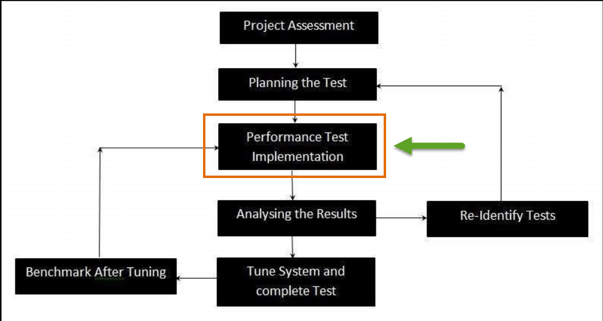

# 浸泡测试是什么？结合实例学习

## 浸泡测试是什么？

浸泡测试是一种非功能测试，系统在负载（SUL）进行测试和验证，它可以承受一段时间的负载量巨大。

浸泡测试只不过是一种性能测试

它是在系统水平的测试，以发现是否系统将承受非常高的容量和使用量，看看会发生什么超出设计预期。

下图描绘了测试周期，显示在哪个阶段浸泡测试（**性能测试类型**）在应用程序上执行。

在这种类型的测试，主要是通过监测存储器使用率的应用的系统。

## 为什么要做浸泡测试？

当系统使用 2 小时时，系统可以正常工作，但当同一系统连续使用超过 10 小时，则可能会失效或表现异常/随机/可能崩溃。要预测这样的故障浸泡测试执行。

## 何时做浸泡测试？

浸泡测试应在以下场景：

1. 在建造之前被部署到客户端之前释放对特定应用的任何平台，它需要通过一系列成功的负载测试或等效的流量水平。**然后执行浸泡测试**。它帮助我们决定如何运行的任何特定应用。如果存储器/内存泄漏问题像腐败的发现即在浸泡时，应当立即报告。
2. 浸泡测试的最佳时间是在周末，作为一个应用程序需要在运行状态，只要超过一天或一晚。这完全取决于测试情况的局限性。浸泡测试是最重要的合规要求之一，需要每一个公司严格遵守。

## 浸泡测试策略

### 长期浸泡测试会话是系统在较长时间内处于负载状态下的一种策略。

一个简单的示例是其中用户登录到系统，用于保持许多小时执行许多商业交易。以这种方式，很多数据被创建。可以有许多的系统负载，服务器/数据库可导致失速坠落系统/数据库/服务器。

在长时间的浸泡测试会话中，多天（例如 30 天）的活动在限定的时间内进行（比如说 2 天）。该约束时间内的交易数应匹配或超过数天的交易价值。重点应该是处理的事务数，浸泡测试最重要的部分是检查 CPU 中可用的内存和内存的使用量。我们需要记录浸泡测试开始和结束时的内存使用情况。如果有必要，再比如 java 虚拟机也很重要，需要监控设备的内存使用。

以下是一些更多的检查，需要由任何用户/测试人员互相配合，在他们开始浸泡测试之前：

a) 监控数据库资源的消耗。

b) 监视服务器的资源消耗（CPU 使用）。

c) 浸泡测试应运行与现实用户并发。

## 浸泡测试的特点

标准浸泡测试方法应具有以下特点：

- 大多数浸泡测试的持续时间通常由可用时间决定。
- 任何应用程序必须运行而没有任何中断，如果它需要延长的时间。
- 它应该涵盖所有由利益相关者商定的方案。
- 几乎每个系统具有规则的维护时间周期窗口与窗口之间的时间周期是用于确定范围的浸泡测试。

## 浸泡测试的实例

- 在银行领域当有大量的数据赖在商人，测试人员将把系统连续负荷 70 到 150 小时检查应用程序如何用在装载过程期间。
- 假设有 33000 登录，需要通过该系统时，它表示七天半的活动。在这种情况下，，一个 60-70 小时浸泡试验可以在星期五晚上6点左右，可以在星期一上午早上 6 点完成。只有这样的测试，将有可能观察到任何降解性能在受控条件下。
- 在视频游戏、移动应用等情况，包括离开游戏或应用程序在运行状态的时间延长的时期，在各种操作模式-如空转，停在标题画面等发现应用程序是否能处理连续的预期负荷。

## 浸泡测试期间观察到的共同问题

1. 分配存储器（内存泄漏，最终导致危机的记忆或舍入误差，仅显示时间过程)。
2. 数据库资源利用（不关闭数据库游标的一些条件，最终将导致整个系统停止)。
3. 它也可导致性能劣化，即保证的响应时间后的长时期的持续活动是很好的测试。
4. 失效关闭连接的各层之间的多层系统可能在某些情况下，停止一些或所有模块的系统。
5. 逐步降解的函数的响应时间的一些内部数据结构变得不太有效的测试。

## 总结

浸泡测试，以确定被测应用可以维持连续的负荷。

- **它是一种类型的性能测试。**
- 它有助于该系统确定它是否会经受非常高的容积的使用
- 在这种类型的测试，主要是通过监测存储器使用率的一个系统中的应用
- 检查，需要做任何用户/测试人员开始浸泡测试之前，包括
    - 监控数据库资源消耗。
    - 监视服务器的资源消耗（CPU 使用）。
    - 浸泡测试应运行与现实用户并发。