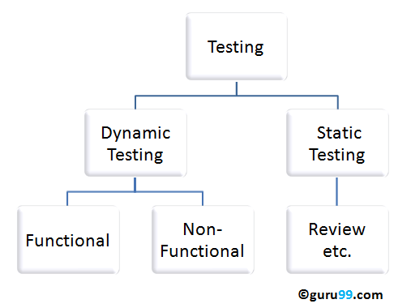
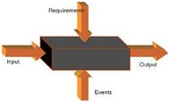

# 静态测试与动态测试

静态测试代码不执行。相反，它手动检查代码、需求文档和设计文档来查找错误。因此，被称为“静态”。

 该测试的主要目的是通过在开发周期的早期发现错误来提高软件产品的质量。这种测试也称为非执行技术或验证测试。

静态测试涉及文档的手工或自动评论.。这个评论，早在 STLC 初期捕捉了测试缺陷。它检查工作文件，并提供审查意见

工作文档如下：

- 需求规格书
- 设计文件
- 源指令码
- 测试计划
- 测试案例
- 测试脚本
- 帮助文档或用户
- Web 页面内容

代码在动态测试下被执行。动态测试用于检查系统功能性的软件，存储器/ CPU 的使用和整体性能。因此称为“动态”

该测试的主要目的是确认软件工作产品的一致性与业务需求。这种测试又称为执行技术或验证测试。

动态测试执行软件，并验证输出与预期的结果。动态测试是在所有级别的测试并且它可以是黑盒或白盒测试。

## 静态测试技术：

- 非正式的评论：这种类型的审查，没有按照任何过程以找到文件中的错误。根据这种技术，你只是非正式文件,并提出了审查意见。
- 技术审核：你的同龄人组成的团队，审查了技术规格并检查其是否适合该项目。他们试图以不一致的规范和标准。本综述对相关技术文档等软件的测试策略,测试计划及要求规范文件。
- 演练：作者解释了他的产品到产品团队。如果任何参与者可提问。会议由作者。划线记录的审核意见
- 检查：其主要目的是寻找缺陷和会议是由训练有素的主持人。这种类型的审查是形式审查，严格遵循过程以找出缺陷。清单审评工作。他们记录了参与者的缺陷通知与纠正这些错误。
- 代码静态检查：这就是系统评价软件的源代码，而不执行该代码。它检查代码的语法，标准编码、码优化，等等。这种技术也称为白盒测试。这种审查可以在任何点。

## 动态测试技术：

- 检测单元：在单元测试中，单独的单元或模块中。它是测试的源代码的开发者。
- 集成测试：各个模块组合在一起并进行测试。其目的是确定该模块的预期一旦形成一体。
- 系统测试：系统测试整个系统是否满足系统应用的要求或规范文件。

 此外，非功能性测试等性能，安全性测试属于动态测试的范畴。
 
## 区别静态和动态测试：

| 静态测试 | 动态测试 |
|---------|---------|
| 不执行程序的测试 |	通过执行程序进行的测试 |
| 此测试执行验证过程 | 动态测试执行验证过程|
| 静态测试是关于缺陷的预防 |动态测试是关于发现和修复缺陷 |
| 静态测试给出代码和文档评估| 动态测试中给出错误的软件/系统中的瓶颈|
| 静态测试包括清单和过程 | 动态测试涉及执行的测试用例 |
| 此测试可被执行之前编译 | 编译后执行动态测试 |
| 静态测试涵盖结构和语句覆盖测试 | 动态测试涵盖可执行文件的代码|
| 发现和修复缺陷的成本较少| 发现和修复缺陷的代价很高 |
| 在早期阶段投资回报率会很高  | 投资回报率低，因为这个过程涉及发展阶段后 |
| 更多质量好的评论被推荐 | 高度推荐更多的缺陷 |
| 需要大量的会议 | 需要较少的会议 |

## 结论：

验证和确认是用来检查软件产品是否符合需求规格的两项措施.。静态测试涉及验证，而动态测试涉及确认。他们一起帮助提高软件质量。[在此处了解更多关于验证和确认](http://www.guru99.com/verification-v-s-validation-in-a-software-testing.html)
