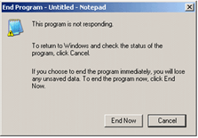
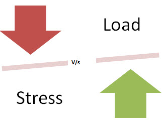
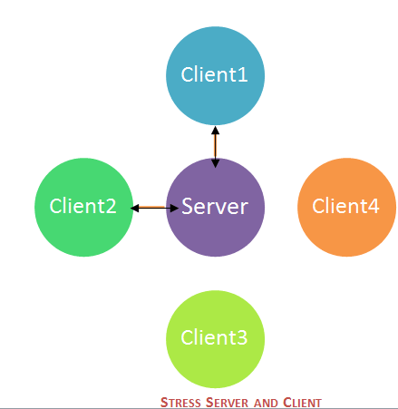

# 什么是软件测试中的压力测试：工具、需要和类型

## 什么是压力测试？

压力测试是用于测试系统稳定性和可靠性的一种测试。本测试主要确定了系统的健壮性和在极其繁重的负载条件下的错误处理。

它甚至测试超出正常工作点，并评估系统如何工作，在这些极端条件下。压力测试是为了在紧缩的情况下确保系统不会崩溃。

压力测试也被称为耐久性测试。压力测试下，AUT 强调短期利益而知道其耐受能力。**最著名的使用压力测试是为了确定极限，在该系统的硬件或软件或硬件断裂。**它还检查系统是否显示在极端条件下有效的错误管理。 

在测试应用程序时将强调 5GB 的流量是从网站复制并粘贴在记事本。记事本是在胁迫下并且给出错误消息“未响应”。

## 压力测试的需要

考虑以下情形─

- 春节期间，可以见证网上购物网站的访问量或出售量上升。
- 当一家博客在一家主要报纸被提及时，它的流量突然激增。

必须进行压力测试，以适应此类异常流量高峰。不适应这种突然故障，可能导致业务损失的收入和声誉。

压力测试也是极有价值的，原因如下：

- 检查该系统是否在异常条件下工作。
- 显示适当的错误消息，当系统处于压力下。
- 系统失效的极端条件下可能导致收入损失巨大
- 它是更好的准备极端条件下执行压力测试。

## 压力测试的目标：

压力测试的目标是分析故障后的系统行为。压力测试是成功的，系统应在极端条件下显示适当的出错消息是。

进行压力测试，有时，可以使用大量的数据集可能会丢失在压力测试。测试人员在做压力测试时不应该丢失这个安全相关的数据。

压力测试的主要目的是确保在故障之后恢复系统，即**可恢复性**。

## 负载测试vs压力测试

| 负载测试 | 压力测试 |
|---------|---------|
| 负载测试是在正常工作条件下测试系统的行为，测试或模拟的实际工作量 |	压力测试是在极端条件下测试系统的行为，直到系统失效。 |
| 负载测试不破坏系统	| 压力测试试图通过测试压倒性的数据或资源来打破系统。 |

## 压力测试的类型：

压力测试的类型及其解释如下：

### 分布压力测试：

 

在分布式客户机服务器系统中，测试从服务器的所有客户端完成。压力服务器的作用是向所有压力客户分发一组压力测试并跟踪客户端的状态。客户端接触服务器后，服务器添加客户端的名称，并开始发送用于测试的数据。

同时，客户端机器发送的信号或心跳，它与服务器连接。如果服务器没有从客户端机器接收任何信号，则需要对其进行进一步的调试。从图中，可以用 2 个客户端连接服务器（客户端 1和客户端 2），但它不能发送或从客户端接收信号的 3 和 4。

夜间运行是运行这些压力测试方案的最佳选择。大型服务器群，需要更有效的方法来确定哪个计算机具有压力故障，需要进一步调查。

### 应用压力测试：

这个测试集中在查找与数据锁定和阻塞相关的缺陷，网络问题和应用程序的性能瓶颈。

### 事务性压力测试：

它对两个或多个应用程序之间的一个或多个事务进行压力测试。它用于微调和优化系统。
### 系统性压力测试：

这是集成的压力测试，可以测试在同一服务器上运行的多个系统。它被用来发现一个应用程序数据块阻塞另一个应用程序的缺陷。

### 探索性压力测试：

这种类型的压力测试用来测试系统或与异常参数条件，就不会出现在真实情景中。它用于查找缺陷周围意想不到的场景

1. 大量用户同时登录
2. 如果病毒扫描器在所有机器上同时开始
3. 如果数据库离线时被访问的网站，
4. 当将大量的数据插入到数据库中

## 压力测试的推荐工具：

### [LoadRunner](http://www.guru99.com/loadrunner-v12-tutorials.html)

LoadRunner 从 HP 是一种广泛使用的负载测试工具。负载测试结果由 LoadRunner 作为一个基准。

### [JMeter](http://www.guru99.com/jmeter-tutorials.html)

JMeter 是一个开源测试工具。这是一个纯 java 应用程序的压力和性能测试。JMeter 的目的是覆盖测试负载类型的功能，应力，等它需要 JDK 5 或更高的功能。

### 应力检测仪

本工具提供丰富的 Web 应用性能分析，结果以图形格式提供，并且很容易使用。没有哪个脚本是需要的，产生了良好的投资回报。

### Neo-负载

这个工具以测试 Web 和移动应用。这个工具可以模拟数千个用户评价应用性能和载荷下的响应时间。它还支持云积分性能、负载和强度测试。它使用简便，成本低，而且提供良好的可扩展性。

## 压力测试的度量

度量有助于评估系统的性能和一般的压力测试结束时研究。常用的指标是—

### 测量性能可伸缩性&amp;

- 每秒页数：衡量有多少页被请求/秒
- 吞吐量：基本度量-响应数据大小/秒
- 回合次数：测试场景已被计划与客户执行的次数

### 应用程序响应

- 击中时间：检索图像或页面的平均时间
- 第一字节的时间：返回数据或信息的第一个字节的时间
- 页面时间:时间来检索所有信息的页面

### 周折

- 连接失败:帐号的连接拒绝由客户端（微信号）
- 失败的请求：失败的回合数，
- 命中失败：失败的尝试的系统（断开链接或看不见图像)

## 结论

压力测试的目的是在极端条件下检查系统。它监视系统资源，如内存，处理器，网络等，并检查系统恢复到正常状态的能力。它在压力下检查系统是否显示适当的错误消息。